# Monospace Typefaces for Coding

## Freely Available

233 typefaces listed here.

-   [0xProto](https://github.com/0xType/0xProto)
    -   Previews:
        -   0xProto-Regular 
            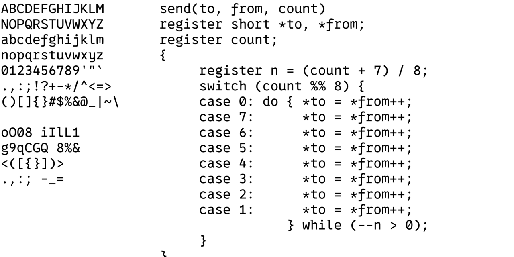
        -   0xProto-Italic 
            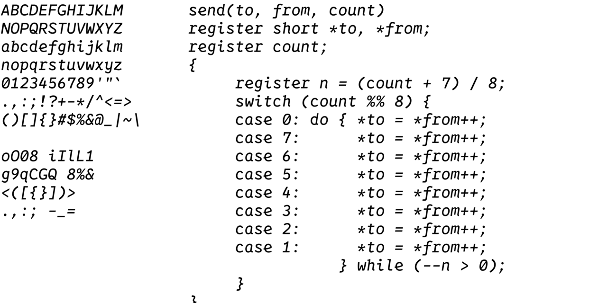
-   [3270font](https://github.com/rbanffy/3270font)
    -   Previews:
        -   3270-Regular 
            
        -   3270SemiCondensed-Regular 
            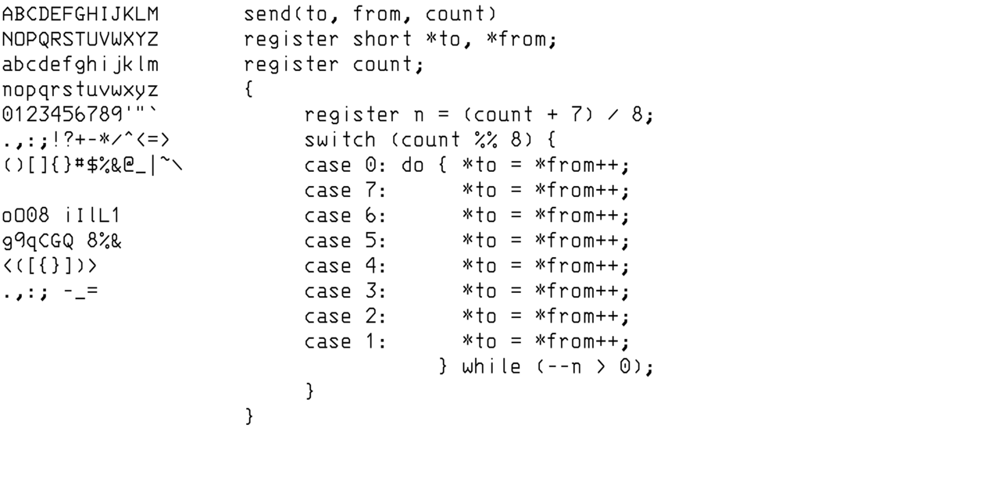
        -   3270Condensed-Regular 
            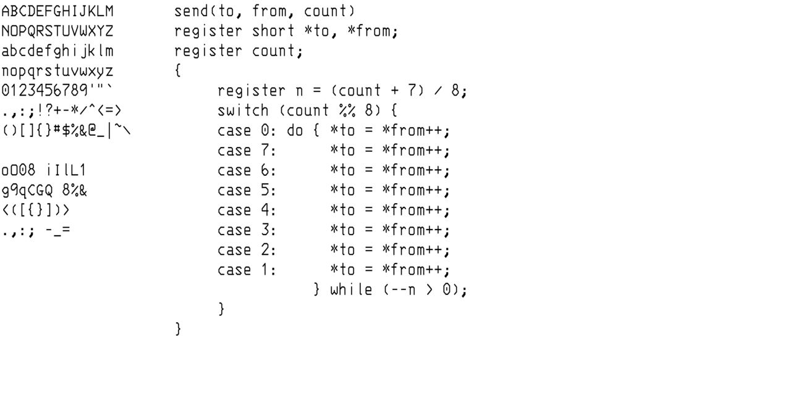
-   [Aardvark Fixed](https://fontlibrary.org/en/font/aardvark-sans)
    -   Previews:
        -   aardvark-fixed-regular 
            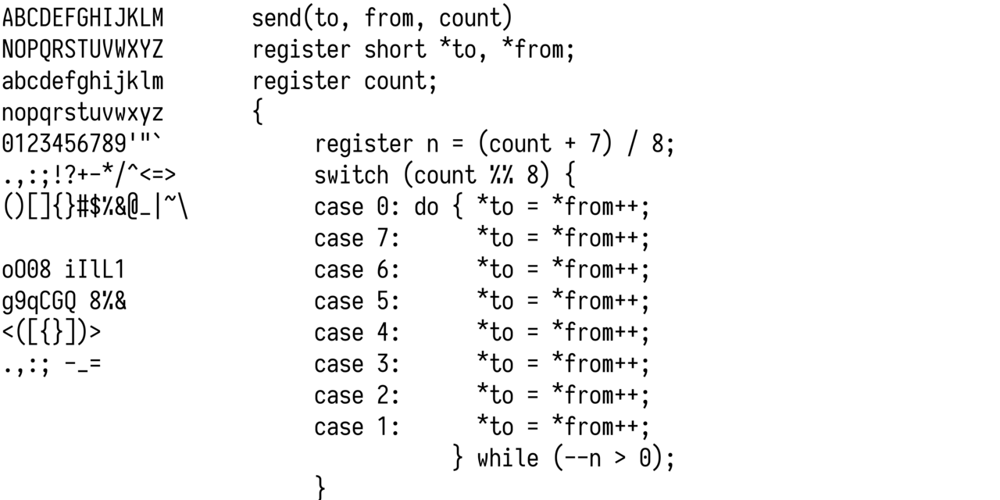
        -   aardvark-fixed-italic 
            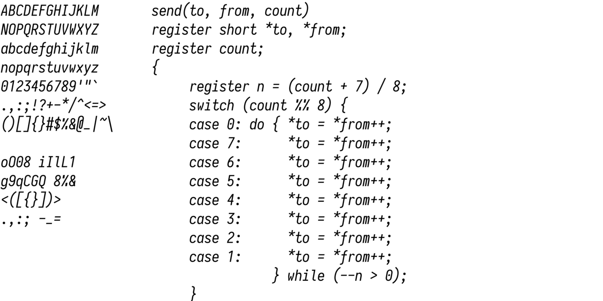
-   [Acevedo](https://fontlibrary.org/en/font/acevedo)
    -   Previews:
        -   acevedo 
            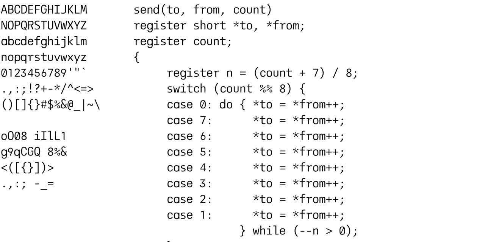
-   [Agave](https://b.agaric.net/page/agave)
    -   Previews:
        -   Agave-Regular 
            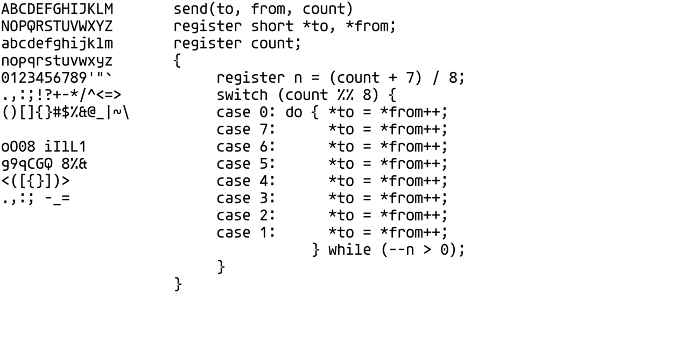
        -   Agave-Regular-slashed 
            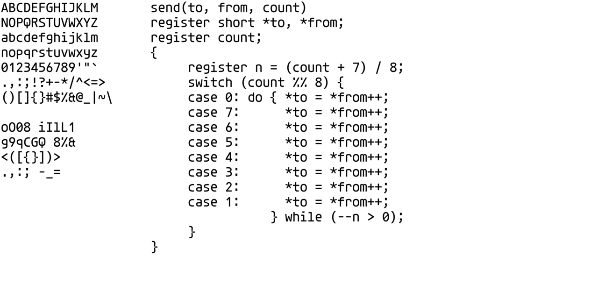
-   [Alto Mono (damieng)](https://damieng.com/blog/2008/08/25/the-xerox-alto-mono-spaced-font-rises-again/)
    -   Notes:
        -   not related to Thiemich's paid [Alto Mono](https://www.typeby.com/fonts/alto-mono)
    -   Previews:
        -   AltoMono 
            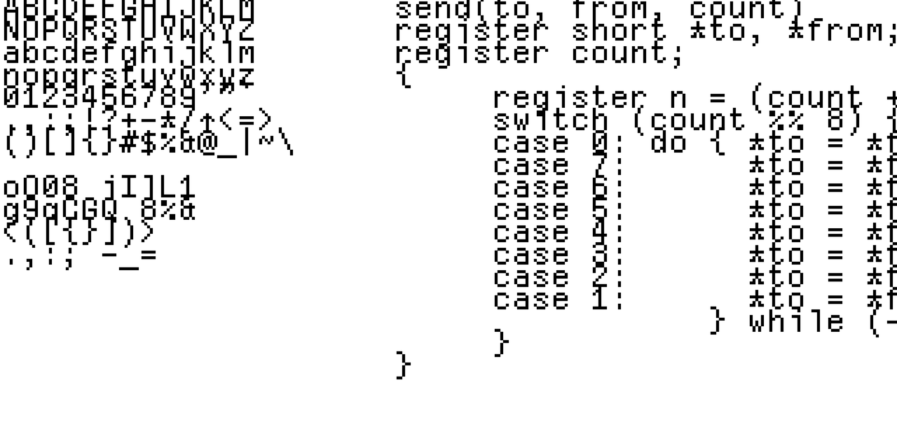
-   [Amazon Ember Mono](https://developer.amazon.com/en-US/alexa/branding/echo-guidelines/identity-guidelines/typography)
    -   Previews:
        -   AmazonEmberMono_Rg 
            
-   [Anka/Coder](https://usemodify.com/fonts/anka-coder/)
    -   [fontlibrary](https://fontlibrary.org/en/font/anka-coder)
    -   [googlefonts](https://code.google.com/p/anka-coder-fonts/)
    -   Previews:
        -   AnkaCoder-r 
            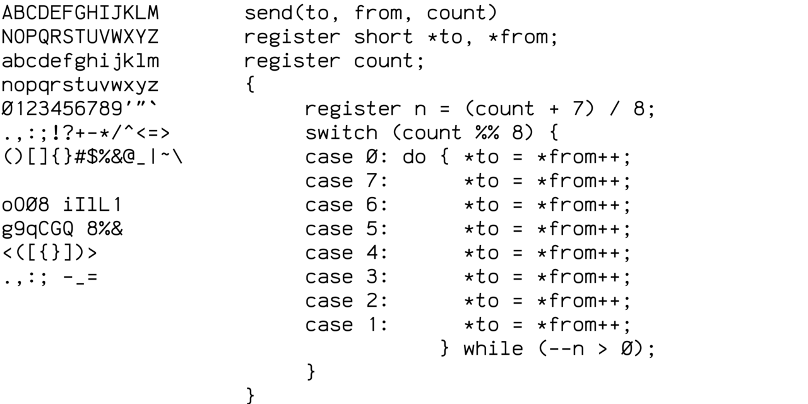
        -   AnkaCoder-i 
            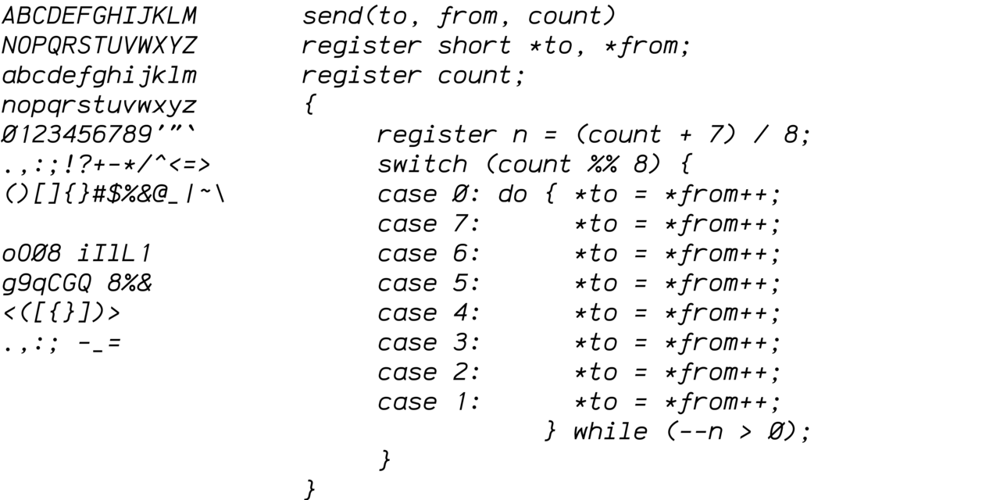
        -   AnkaCoder-C87-r 
            
        -   AnkaCoder-C75-r 
            
-   [Anomaly Mono](https://github.com/benbusby/anomaly-mono)
    -   Previews:
        -   AnomalyMono-Regular 
            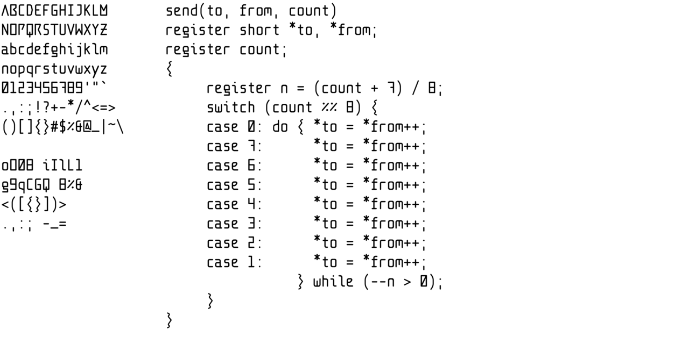
-   [Anonymous Pro](https://www.marksimonson.com/fonts/view/anonymous-pro)
    -   [googlefonts](https://fonts.google.com/specimen/Anonymous+Pro)
    -   Previews:
        -   anonymous-pro 
            
        -   anonymous-pro-i 
            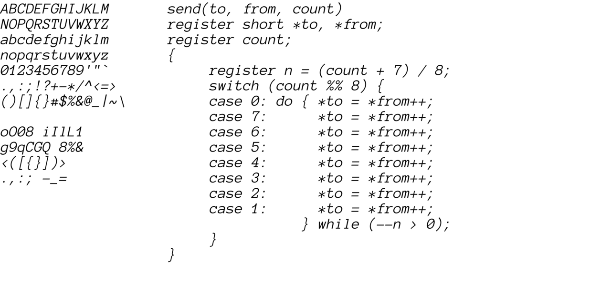
-   [Another Man's Treasure](https://www.kreativekorp.com/software/fonts/trs80/)
-   [APL2741](https://apl385.com/fonts/)
    -   Previews:
        -   apl2741 
            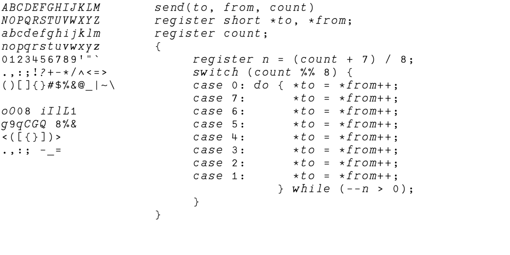
-   [APL385](https://apl385.com/fonts/)
    -   Previews:
        -   apl385 
            
-   [APL386](https://abrudz.github.io/APL386/)
    -   Previews:
        -   APL386 
            
-   [APLX](https://www.dyalog.com/aplx.htm)
    -   Previews:
        -   aplx_unicode_mac 
            
        -   aplx_unicode 
            
-   [Astigmata](https://medium.com/codex/astigmata-my-monospace-programming-font-b28ccfa9b025)
    -   Previews:
        -   astigmata-regular 
            
-   [Atari ST](http://www.modelb.bbcmicro.com/retro-fonts.html)
-   [Atarist](https://github.com/ntwk/atarist-font)
-   [Teletext](http://www.modelb.bbcmicro.com/retro-fonts.html)
-   [Atkinson Hyperlegible Mono](https://www.brailleinstitute.org/freefont/)
    -   Notes:
        -   Designed for people with visual impairments.
    -   [googlefonts](https://fonts.google.com/specimen/Atkinson+Hyperlegible+Mono)
    -   Previews:
        -   AtkinsonHyperlegibleMono-Regular 
            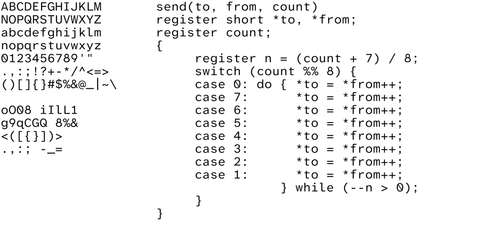
        -   AtkinsonHyperlegibleMono-RegularItalic 
            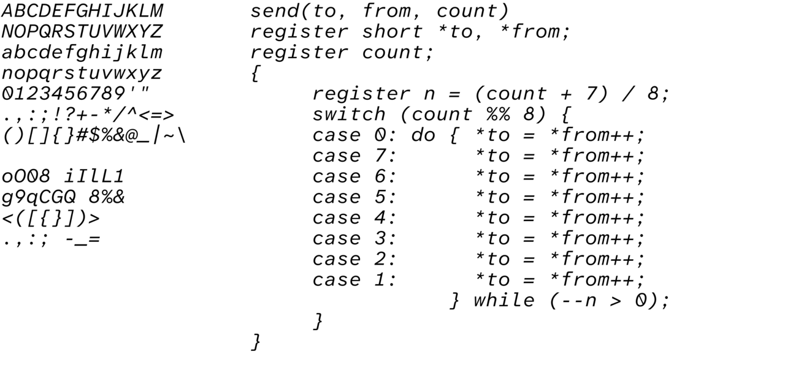
-   [AudioLink Mono](https://audiolink.dev/)
    -   Previews:
        -   AudioLinkConsole-Regular 
            
        -   AudioLinkMono-Regular 
            
-   [Aurulent Sans Mono](https://www.dafont.com/aurulent-sans-mono.font)
    -   Previews:
        -   AurulentSansMono-Regular 
            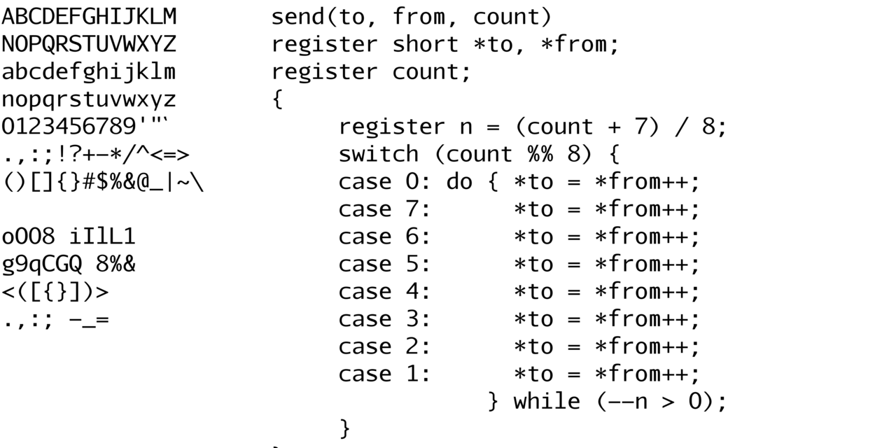
-   [Basically A Mono](https://experi.mentallydesigned.com/type/bam/)
    -   [uncut](https://uncut.wtf/monospace/basically-a-mono/)
    -   Previews:
        -   BasicallyAMono-Regular 
            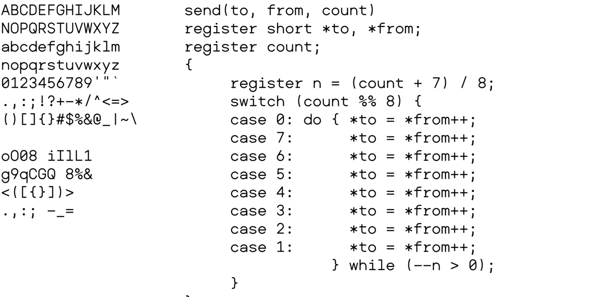
-   [Binchotan](https://rvklein.me/proj/binchotan/)
    -   Previews:
        -   binchotan-sharp 
            
-   [Bizcat](https://robey.lag.net/2020/02/09/bizcat-bitmap-font.html)
-   [Bmono](https://github.com/NNBnh/bmono)
    -   Previews:
        -   bmono-regular 
            
        -   bmono-italic 
            
-   [Borg Sans Mono](https://github.com/marnen/borg-sans-mono)
    -   Previews:
        -   BorgSansMono 
            
-   [BPmono](https://backpacker.gr/fonts/5)
    -   Previews:
        -   BPmono 
            
        -   BPmonoStencil 
            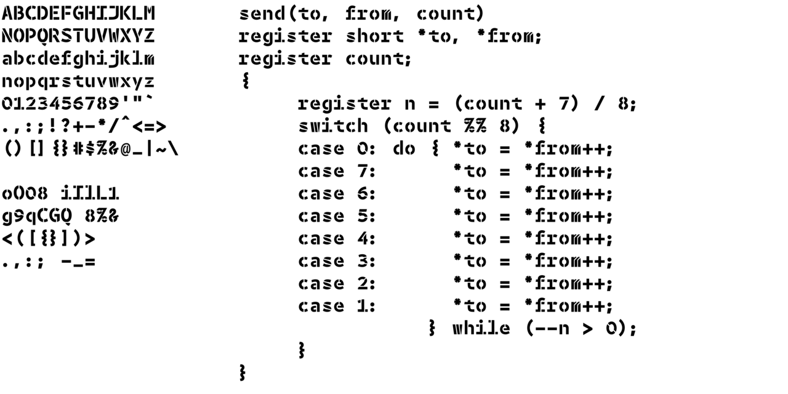
-   [BPtypewrite](https://backpacker.gr/fonts/10)
    -   Previews:
        -   BPtypewrite 
            
        -   BPtypewriteItalic 
            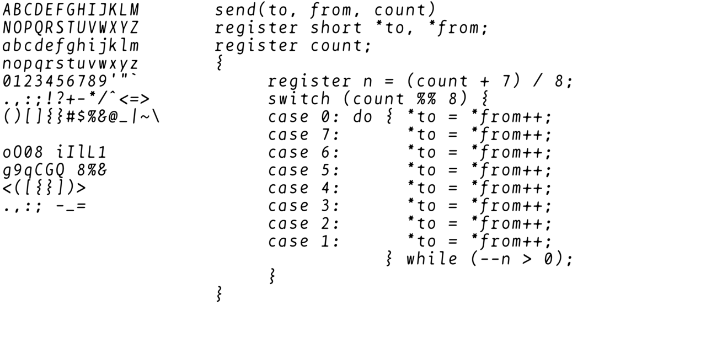
-   [Brass Mono](https://github.com/fonsecapeter/brass_mono)
    -   Notes:
        -   Do you like Routed Gothic?
    -   Previews:
        -   BrassMono-Regular 
            
        -   BrassMono-Italic 
            
-   BSU-Kermit
    -   [download](https://www.lowing.org/fonts/Free/BSU_Kermit.FON)
-   [Brutalist Mono](https://github.com/BRUTALISM/Brutalist)
    -   Previews:
        -   BrutalistMono 
            
-   [Camingo Code](https://janfromm.de/typefaces/camingocode/)
    -   Previews:
        -   CamingoCode-Regular 
            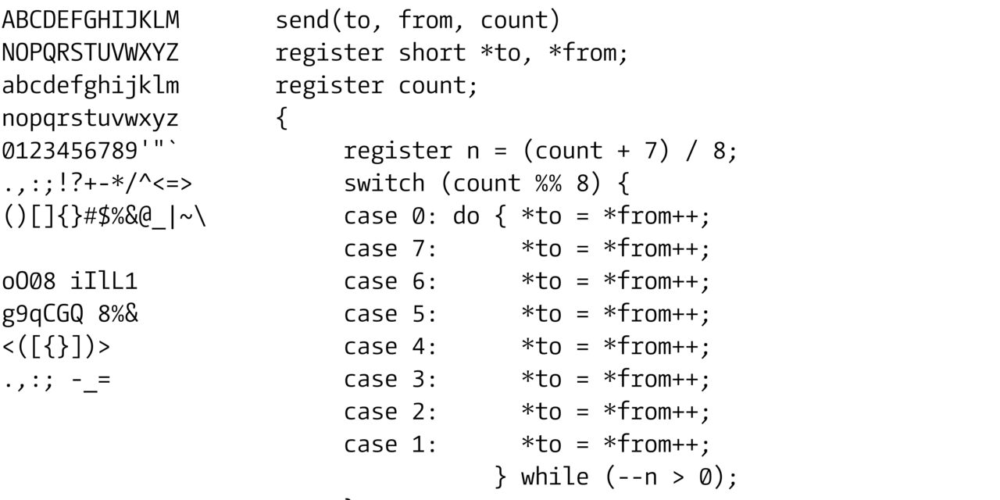
        -   CamingoCode-Italic 
            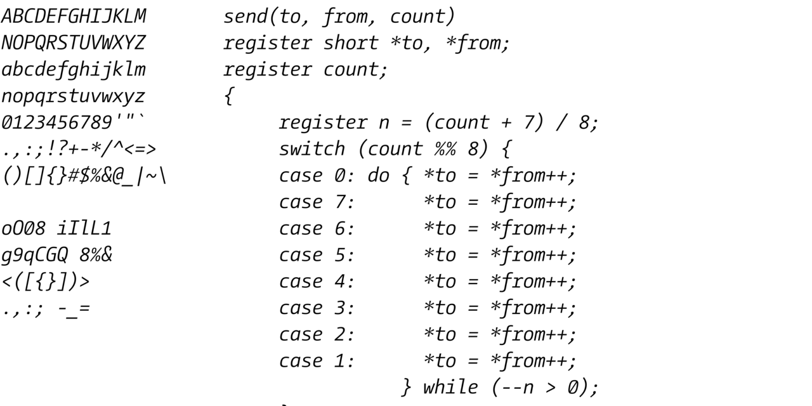
-   [Canton Typewriter Bitmap](https://github.com/dse/font-canton-typewriter-bitmap)
-   [Cascadia Code](https://github.com/microsoft/cascadia-code)
    -   [googlefonts](https://fonts.google.com/specimen/Cascadia+Code)
-   [Cascadia Mono](https://fonts.google.com/specimen/Cascadia+Mono)
-   [Chivo Mono](https://github.com/Omnibus-Type/Chivo)
    you probably want the Nerd Font linked from therein.
    -   [googlefonts](https://fonts.google.com/specimen/Chivo+Mono)
    -   Previews:
        -   ChivoMono-Regular 
            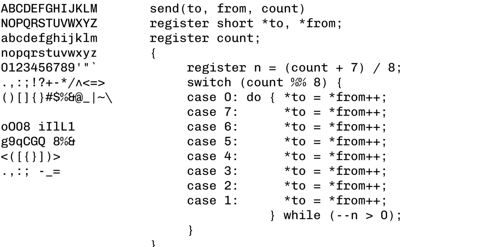
        -   ChivoMono-Italic 
            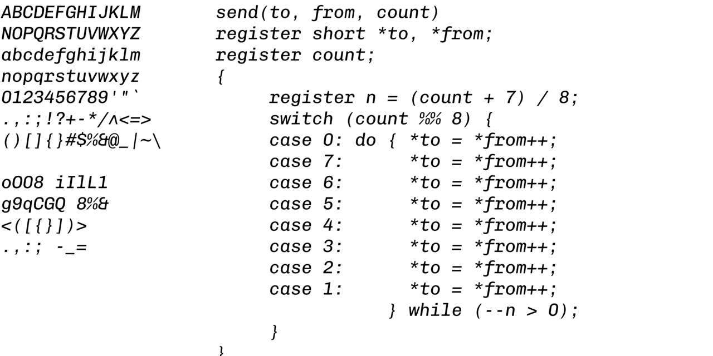
-   [Classic Console Neue](https://webdraft.eu/fonts/classic-console/)
    -   Notes:
        -   8x16 bitmap IBM style font
    -   Previews:
        -   clacon2 
            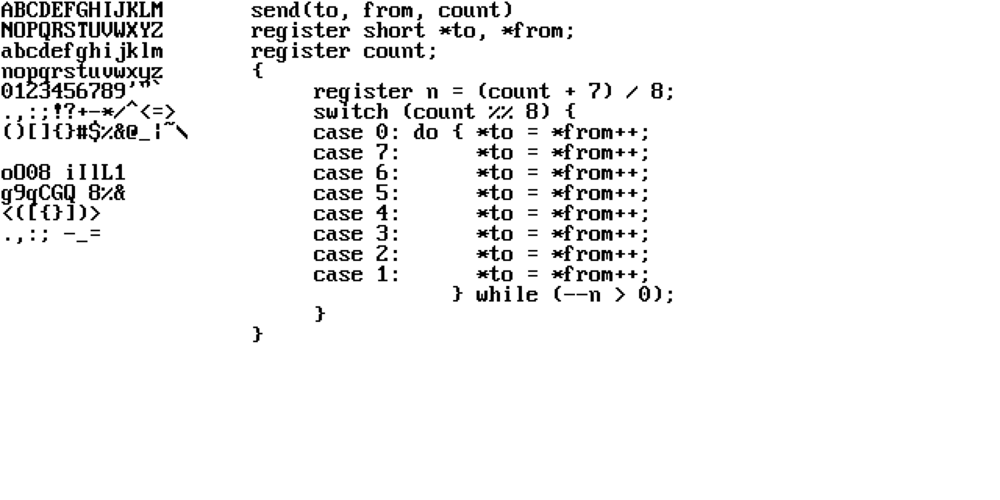
-   [Code New Roman](https://www.dafont.com/code-new-roman.font)
    -   Previews:
        -   Code_New_Roman 
            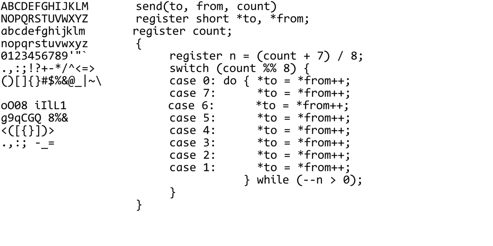
        -   Code_New_Roman_i 
            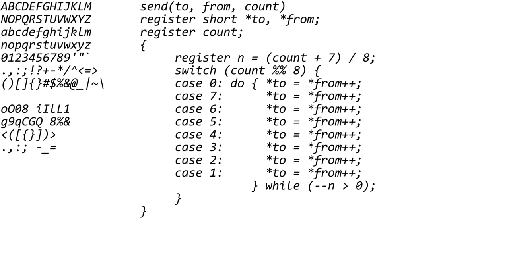
-   [Comic Mono](https://dtinth.github.io/comic-mono-font/)
    -   Notes:
        -   forked from [comic shanns](https://github.com/shannpersand/comic-shanns)
    -   Previews:
        -   ComicMono 
            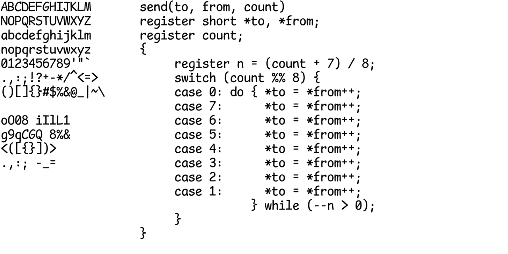
-   Comic Shanns
    -   Notes:
        -   V2 released with support for accented characters, math symbols, and other symbols.
    -   [github](https://github.com/shannpersand/comic-shanns)
    -   Previews:
        -   comic-shanns-2 
            
-   Comic Shanns Mono
    -   Notes:
        -   Based on Comic Shanns v2 with metrics adjusted and even more additional characters.
    -   [github](https://github.com/jesusmgg/comic-shanns-mono)
    -   Previews:
        -   ComicShannsMono-Regular 
            
-   [Commit Mono](https://commitmono.com/)
    -   Previews:
        -   CommitMono-400-Regular 
            
        -   CommitMono-400-Italic 
            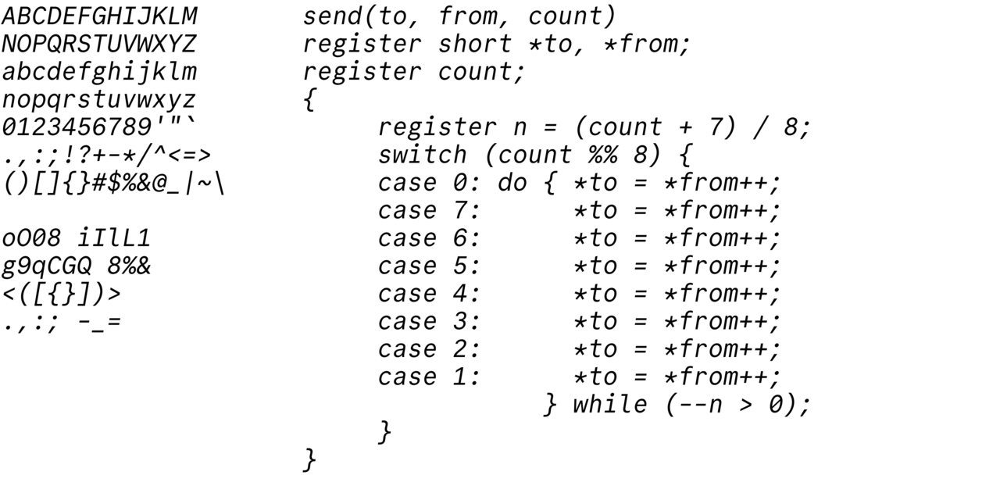
-   [Consola Mono](https://fontlibrary.org/en/font/consolamono)
    -   Previews:
        -   ConsolaMono 
            
-   [Conta](https://fontesk.com/conta-typeface/)
    -   Previews:
        -   Conta-Regular 
            
        -   Conta-Italic 
            
        -   ContaMono-Regular 
            
        -   ContaMono-Italic 
            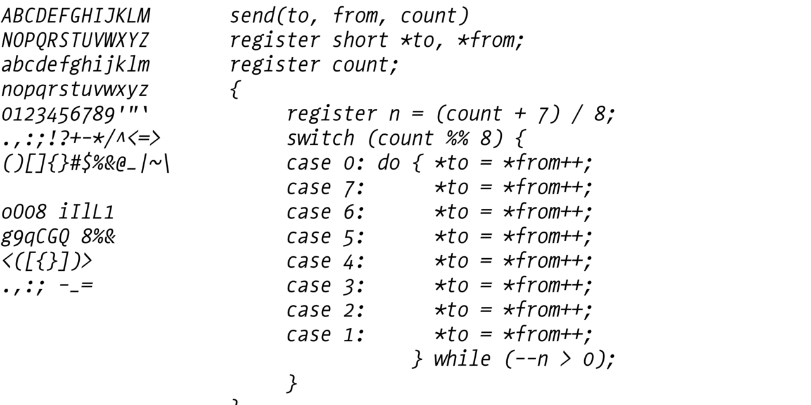
        -   ContaPixel-Regular 
            
        -   ContaPixel-Italic 
            
-   [Corbi Mono S](https://fontlibrary.org/fr/font/corbi-mono-s)
-   [Courier Code](https://fontlibrary.org/en/font/courier-code)
-   [Courier Prime Code](https://quoteunquoteapps.com/courierprime/)
    -   [googlefonts](https://fonts.google.com/specimen/Courier+Prime)
    -   Previews:
        -   Courier_Prime_Code 
            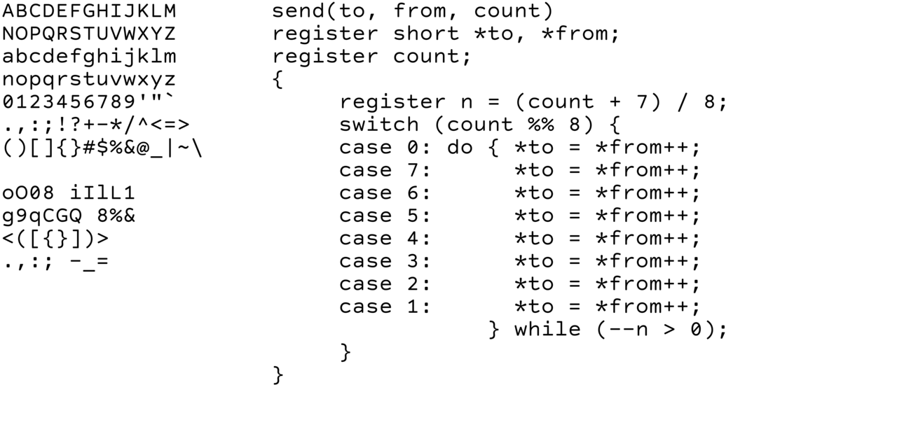
-   [Cousine](https://fonts.google.com/specimen/Cousine)
    -   Previews:
        -   Cousine-Regular 
            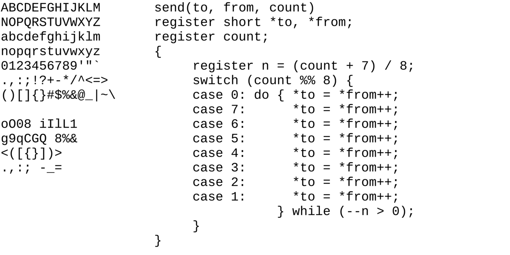
        -   Cousine-Italic 
            
-   [Cozette](https://github.com/slavfox/Cozette)
-   [CP Mono](https://github.com/chrissimpkins/codeface/tree/master/fonts/cp-mono)
    -   Previews:
        -   CPMono_v07_Plain 
            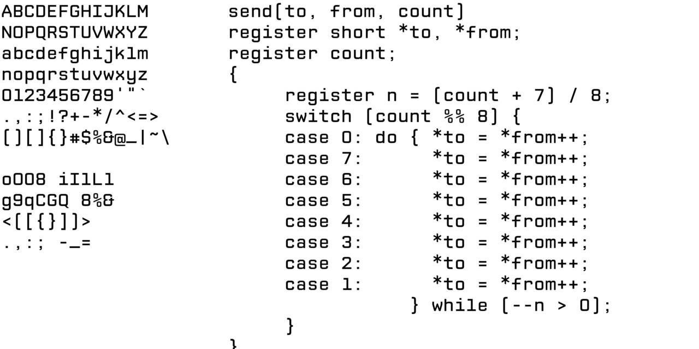
-   [Creep](https://github.com/romeovs/creep)
-   [Creep2](https://github.com/raymond-w-ko/creep2)
-   [D2 Coding](https://github.com/Joungkyun/font-d2coding)
    -   Previews:
        -   D2Coding 
            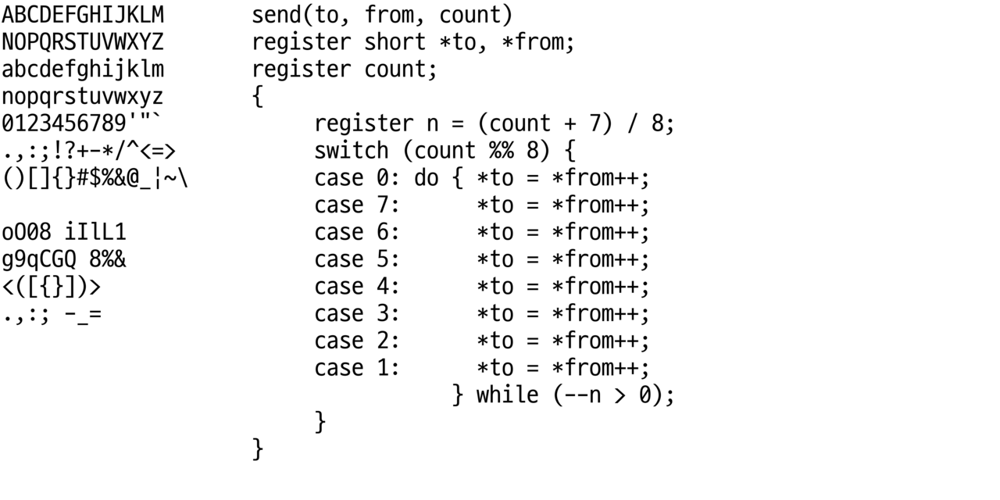
-   [DM Mono](https://github.com/googlefonts/dm-mono)
    -   [googlefonts](https://fonts.google.com/specimen/DM+Mono)
-   [DaddyTimeMono](https://github.com/BourgeoisBear/DaddyTimeMono)
    -   Previews:
        -   DaddyTimeMono 
            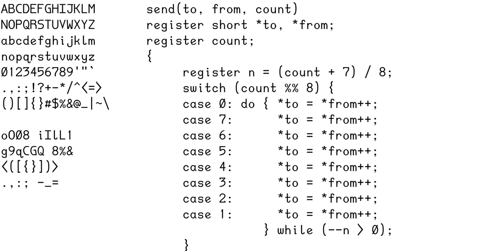
-   [Dave](https://github.com/i-e-b/Dave)
    -   Previews:
        -   dave 
            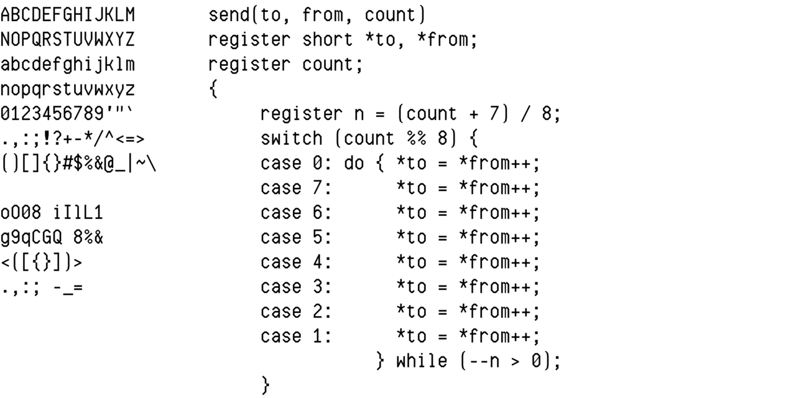
        -   Dave_italic 
            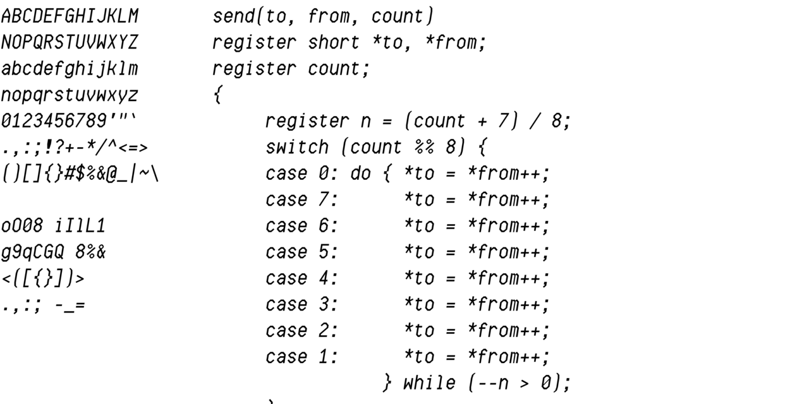
-   [DEC Terminal Modern](https://www.dafont.com/dec-terminal-modern.font)
    -   Previews:
        -   dec_terminal_modern 
            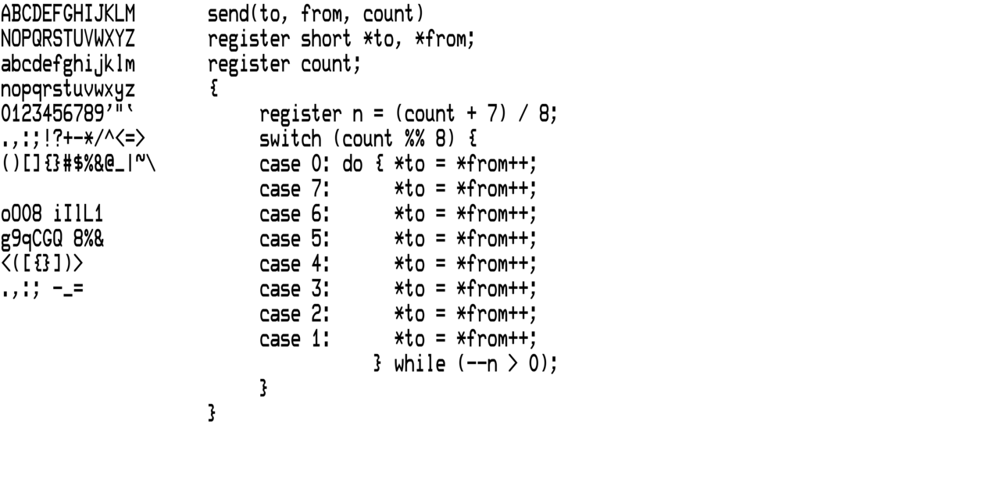
-   [Deferral](https://github.com/brianbruggeman/Deferral)
    -   Previews:
        -   Deferral-Narrow 
            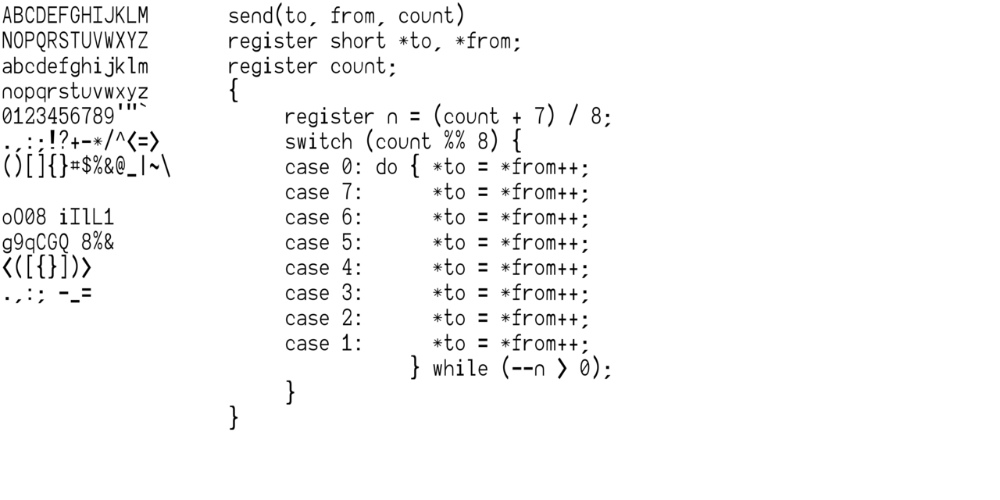
        -   Deferral-Regular 
            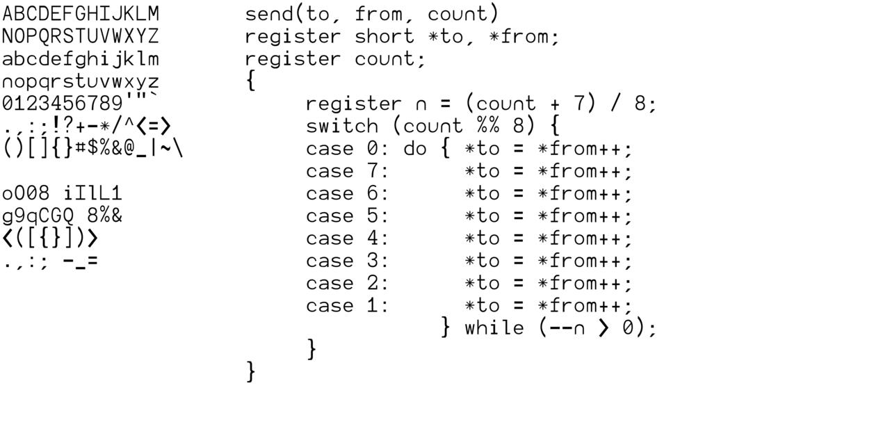
        -   Deferral-Square 
            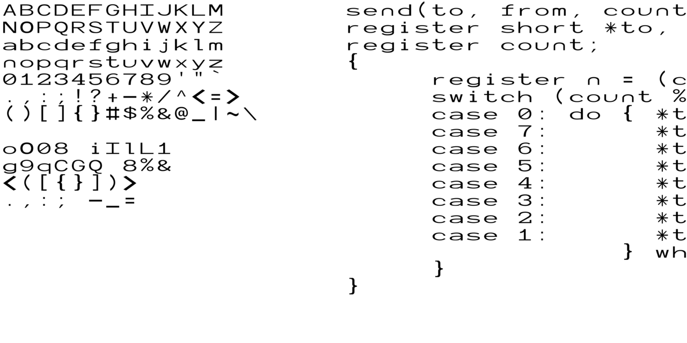
-   [Deja Vu Sans Code](https://github.com/SSNikolaevich/DejaVuSansCode)
    -   Previews:
        -   DejaVuSansCode 
            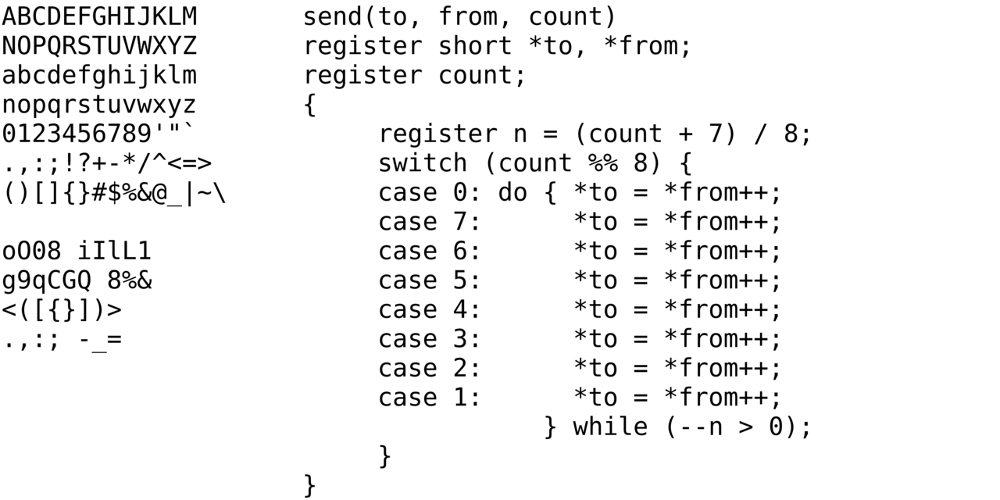
-   [Deja Vu Sans Mono](https://dejavu-fonts.github.io/)
    -   Notes:
        -   based on [Bitstream Vera Fonts](https://download.gnome.org/sources/ttf-bitstream-vera/1.10/)
    -   Previews:
        -   DejaVuSansMono 
            
-   [Departure Mono](https://departuremono.com/)
    -   [github](https://github.com/rektdeckard/departure-mono)
    -   Previews:
        -   DepartureMono-Regular 
            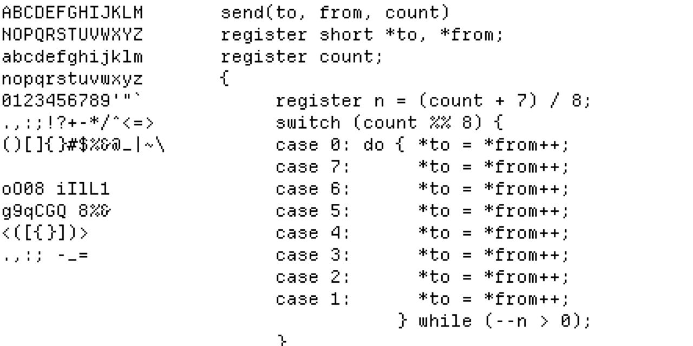
-   [Dina Bitmap](https://www.dcmembers.com/jibsen/download/61/)
-   [Dina Remastered (Dina Bitmap in TTF)](https://github.com/zshoals/Dina-Font-TTF-Remastered)
    -   Previews:
        -   DinaRemaster-Regular 
            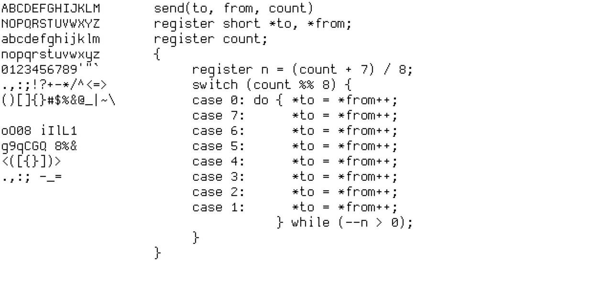
        -   DinaRemasterII 
            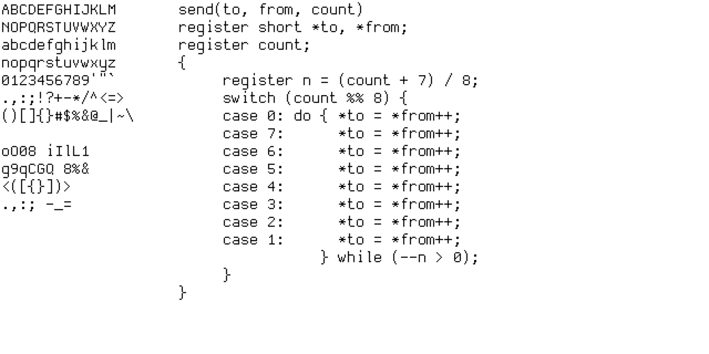
-   [Drafting\* Mono](https://indestructibletype.com/Drafting/)
    -   Previews:
        -   DraftingMono-Regular 
            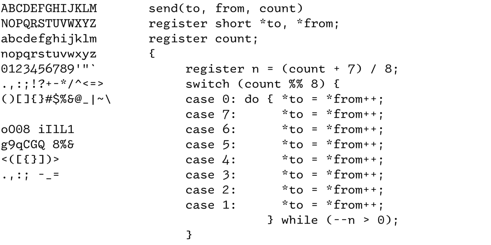
        -   DraftingMono-Italic 
            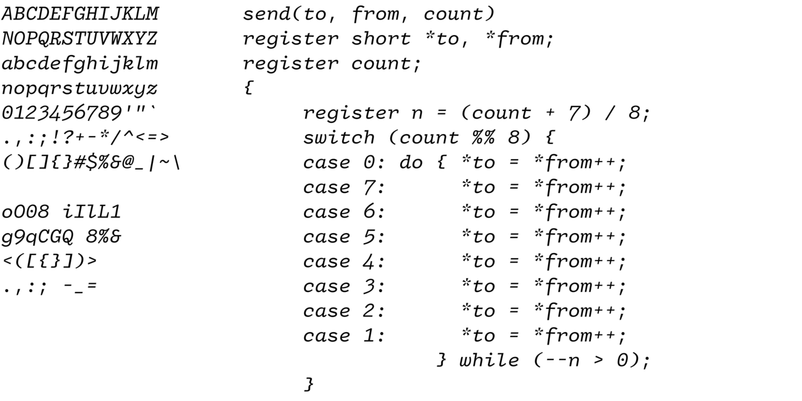
-   [Droid Sans Mono](https://damieng.com/blog/2007/11/14/droid-sans-mono-great-coding-font/)
    -   Variants:
        -   [dotted and slashed zero variants](https://www.cosmix.org/software/)
        -   [Droid Sans Mono ZeroMod](https://github.com/AlbertoDorado/droid-sans-mono-zeromod)
    -   Previews:
        -   DroidSansMono 
            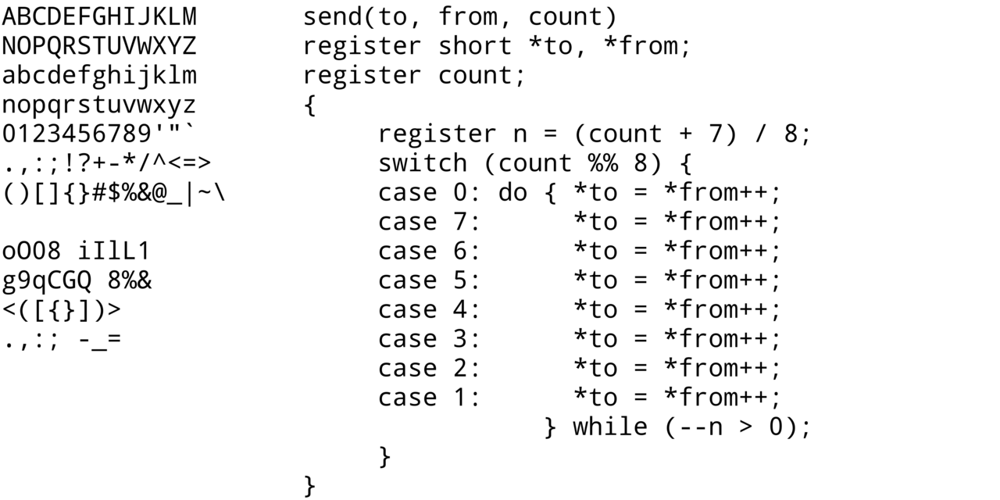
-   [DSE Typewriter](https://github.com/dse/dse-typewriter-font)
    -   Notes:
        -   author says you'll probalby like his Old Timey Mono, based on Reproducing Typewriter, better.
    -   Previews:
        -   dse-typewriter-font 
            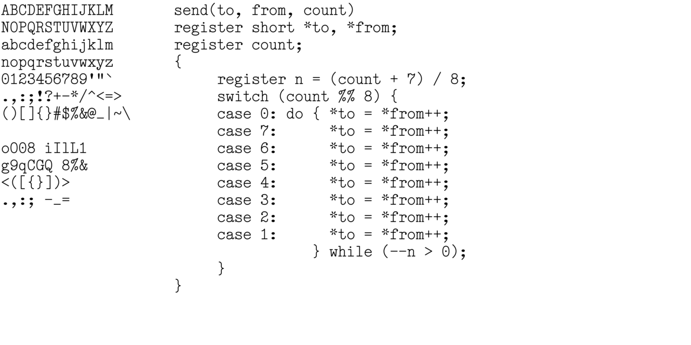
-   [DSE Typewriter Bitmap](https://github.com/dse/dse-typewriter-bitmap-font)
    -   Previews:
        -   typewriter-oldstyle 
            
        -   typewriter 
            
-   [Edlo](https://github.com/ehamiter/Edlo)
    -   Previews:
        -   edlo 
            
-   [Envy Code B](https://damieng.com/blog/2006/11/06/envy-code-b-font-available-in-ttf-format/)
    -   Previews:
        -   Envy_Code_B_10pt 
            
-   [Envy Code R](https://damieng.com/blog/2008/05/26/envy-code-r-preview-7-coding-font-released/)
-   [Everson Mono](https://www.evertype.com/emono/)
    -   Previews:
        -   Everson_Mono 
            
-   [Fairfax](https://www.kreativekorp.com/software/fonts/fairfax/)
    -   Previews:
        -   Fairfax 
            
        -   FairfaxItalic 
            
-   [Fairfax HD](https://www.kreativekorp.com/software/fonts/fairfaxhd/)
    -   Previews:
        -   FairfaxHD 
            
-   [Fairfax Serif](https://fonts2u.com/fairfax-serif.font)
    -   Previews:
        -   FairfaxSerif 
            
-   [Fantasque Sans Mono](https://github.com/belluzj/fantasque-sans)
    -   Notes:
        -   f/k/a Cosmic Sans Neue Mono
    -   Previews:
        -   FantasqueSansMono-Regular 
            
        -   FantasqueSansMono-Italic 
            
-   [Fifteen](https://fontlibrary.org/en/font/fifteen)
    -   Previews:
        -   FifteenNarrow 
            
-   [Fira Code](https://github.com/tonsky/FiraCode)
    -   [googlefonts](https://fonts.google.com/specimen/Fira+Code)
    -   Previews:
        -   FiraCode-Regular 
            
-   [Fira Cousine](https://github.com/macduy/FiraCousine)
    -   Previews:
        -   FiraCousine-Regular 
            
        -   FiraCousine-Italic 
            
-   [Fira Flott](https://github.com/kosimst/FiraFlott)
    -   Previews:
        -   FiraFlott_FiraCode_Medium 
            
        -   FiraFlott_FlottFlott_Italic 
            
-   [Fira Mono](https://github.com/mozilla/Fira)
    -   [googlefonts](https://fonts.google.com/specimen/Fira+Mono)
    -   Previews:
        -   FiraMono-Regular 
            
-   [Fixedsys Excelsior](https://github.com/kika/fixedsys)
    -   Previews:
        -   FSEX302 
            
        -   FSEX302-alt 
            
-   [Flexi IBM VGA](https://int10h.org/blog/2018/05/flexi-ibm-vga-scalable-truetype-font/)
    -   Previews:
        -   Flexi_IBM_VGA_False_437 
            
        -   Flexi_IBM_VGA_False 
            
        -   Flexi_IBM_VGA_True_437 
            
        -   Flexi_IBM_VGA_True 
            
-   [fn0t](https://www.dafontfree.net/freefonts-fn0t-f99496.htm)
    -   Previews:
        -   fn0t 
            
-   [Fragment Mono](https://github.com/weiweihuanghuang/fragment-mono)
    -   [googlefonts](https://fonts.google.com/specimen/Fragment+Mono)
    -   Previews:
        -   FragmentMono-Regular 
            
        -   FragmentMono-Italic 
            
-   [FS Regulate](https://fontstruct.com/fontstructions/show/947828/fs_regulate)
    -   Previews:
        -   fs-regulate 
            
-   [Geist](https://vercel.com/font)
    -   [googlefonts](https://fonts.google.com/specimen/Geist+Mono)
    -   Previews:
        -   GeistMono-Regular 
            
-   [Generic Mono II](https://github.com/organicplanning/hackedfonts)
    -   Previews:
        -   generic 
            
-   [Glass TTY](https://caglrc.cc/glasstty/)
    -   Previews:
        -   Glass_TTY_VT220 
            
-   [GNU Unifont](https://unifoundry.com/unifont/)
    -   Previews:
        -   unifont-16.0.04 
            
-   [Go Mono](https://go.dev/blog/go-fonts)
    -   Previews:
        -   Go-Italic 
            
        -   Go-Regular 
            
        -   Go-Mono 
            
        -   Go-Mono-Italic 
            
-   [Gohu](https://font.gohu.org/)
    -   Previews:
        -   koemadea-gohufont-11 
            
        -   koemadea-gohufont-14 
            
        -   koemadea-gohufont-uni-11 
            
        -   koemadea-gohufont-uni-14 
            
-   [Coogle Sans Code](https://fonts.google.com/specimen/Google+Sans+Code)
    -   Notes:
        -   based on Google Sans Mono, which see.
    -   [github](https://github.com/googlefonts/googlesans-code)
-   [Google Sans Mono](https://github.com/mehant-kr/Google-Sans-Mono)
    -   [via](https://www.reddit.com/r/fonts/comments/s1mk81/google_has_a_new_monospaced_font/)
    -   Previews:
        -   Google-Sans-Mono-Regular 
            
        -   Google-Sans-Mono-Italic 
            
-   [Grid15](https://typedrawers.com/discussion/964/grid15-futuristic-geometric-monospace)
-   [Hack](https://sourcefoundry.org/hack/)
    -   Previews:
        -   Hack-Regular 
            
        -   Hack-Italic 
            
-   [Hasklig](https://github.com/i-tu/Hasklig)
    -   Previews:
        -   Hasklig-Regular 
            
        -   Hasklig-It 
            
-   [Haskplex](https://github.com/huytd/haskplex-font)
    -   Previews:
        -   Haskplex-Regular 
            
        -   Haskplex-Italic 
            
-   [Hera](https://github.com/sayyadirfanali/Hera)
    -   Previews:
        -   Hera 
            
-   [Hermit](https://pcaro.es/hermit/)
    -   Previews:
        -   Hermit-Regular 
            
        -   Hermit-RegularItalic 
            
-   [HVDOSBox](https://download.cnet.com/hvdosbox-windows-terminal-fonts/3000-2094_4-10635163.html)
    -   Notes:
        -   .FON bitmap font for use with Windows
-   HVRaster
-   HVTerminal
-   [IBM Fonts](https://farsil.github.io/ibmfonts/)
-   [IBM Plex](https://www.ibm.com/plex/)
    -   [googlefonts](https://fonts.google.com/specimen/IBM+Plex+Mono)
    -   Variants:
        -   [iA Writer Mono](https://github.com/iaolo/iA-Fonts/tree/master/iA%20Writer%20Mono)
        -   [Perplexed](https://github.com/phoikoi/perplexed) - fork of IBM Plex Mono with Powerline glyphs
        -   [Terminex](https://github.com/vsalvino/terminex) [free] derived from IBM Plex Mono
-   [Illinois Mono](https://github.com/MadSimple/illinois-mono)
    -   Previews:
        -   Illinois_Mono_Regular 
            
-   [Illusion](https://github.com/tomonic-x/Illusion)
    -   Previews:
        -   Illusion-N-Regular 
            
        -   Illusion-N-Italic 
            
        -   Illusion-W-Regular 
            
        -   Illusion-W-Italic 
            
        -   Illusion-Z-Regular 
            
        -   Illusion-Z-Italic 
            
-   [Inconsolata](https://levien.com/type/myfonts/inconsolata.html)
    -   [googlefonts](https://fonts.google.com/specimen/Inconsolata)
    -   Variants:
        -   [Inconsolata Light](https://github.com/googlefonts/Inconsolata/blob/main/fonts/ttf/Inconsolata-Light.ttf)
        -   [Inconsolata-g](https://leonardo-m.livejournal.com/77079.html), Inconsolata with some changes
        -   [Inconsolata-dz](https://nodnod.net/posts/inconsolata-dz/), another altered Inconsolata
        -   [Inconsolata Go](https://levien.com/type/myfonts/inconsolata/), Inconsolata author's alteration with straight quotes
        -   [Inconsolata LGC](https://github.com/DeLaGuardo/Inconsolata-LGC) - adds Cyrillic alphabet
    -   Previews:
        -   Inconsolata-Regular 
            
        -   Inconsolata_Condensed-Regular 
            
        -   Inconsolata_Expanded-Regular 
            
-   [Input Mono](https://input.djr.com/)
    -   Previews:
        -   InputMono-Regular 
            
        -   InputMono-Italic 
            
        -   InputMonoNarrow-Regular 
            
        -   InputMonoCondensed-Regular 
            
        -   InputMonoCompressed-Regular 
            
-   [Intel One Mono](https://www.intel.com/content/www/us/en/company-overview/one-monospace-font.html)
    -   [googlefonts](https://fonts.google.com/specimen/Intel+One+Mono)
    -   Previews:
        -   IntelOneMono-Regular 
            
        -   IntelOneMono-Italic 
            
-   [Iosevka](https://typeof.net/Iosevka/)
    -   Variants:
        -   [Iosevka VardanPro](https://github.com/varp/VardanPro-Fonts)
    -   Previews:
        -   Iosevka-Regular 
            
        -   Iosevka-Italic 
            
-   [Jetbrains Mono](https://www.jetbrains.com/lp/mono/)
    -   [googlefonts](https://fonts.google.com/specimen/JetBrains+Mono)
    -   Previews:
        -   JetBrainsMono-Regular 
            
        -   JetBrainsMono-Italic 
            
-   [Jozsika](https://github.com/nilcons/jozsika)
    -   Previews:
        -   jozsika-regular 
            
        -   jozsika-italic 
            
-   [Julia Mono](https://juliamono.netlify.app/)
    -   Previews:
        -   JuliaMono-Regular 
            
        -   JuliaMono-RegularItalic 
            
-   [jxyahei](https://github.com/zhenruyan/codefont/blob/master/readme_en.md)
    -   Previews:
        -   JXYHBD 
            
        -   JXYH 
            
        -   lmyahei 
            
        -   YHHT 
            
        -   正黑 
            
-   [Karen](https://github.com/amaya382/karen)
-   [Kode Mono](https://fonts.google.com/specimen/Kode+Mono)
    -   Previews:
        -   KodeMono-Regular 
            
-   [Lab Mono](https://github.com/hatsumatsu/Lab-Mono)
    -   Previews:
        -   LabMono-Regular 
            
-   [Lavender](https://github.com/hirigaray/lavender-font)
-   [League Mono](https://www.theleagueofmoveabletype.com/league-mono)
    -   Previews:
        -   LeagueMono-Regular 
            
-   [Lekton Code](https://fontlibrary.org/en/font/lektoncode)
    -   [googlefonts](https://fonts.google.com/specimen/Lekton)
    -   Previews:
        -   LektonCode-Regular 
            
        -   LektonCode-Italic 
            
-   [Letter Gothic Code](https://github.com/jamesxmcintosh/LetterGothicCode)
    -   Previews:
        -   LetterGothicCode-R 
            
        -   LetterGothicCode-I 
            
-   [Liberation Mono](https://github.com/liberationfonts/liberation-fonts)
    -   Previews:
        -   LiberationMono-Regular 
            
        -   LiberationMono-Italic 
            
-   [Lilex](https://github.com/mishamyrt/Lilex)
    -   Previews:
        -   Lilex-Regular 
            
        -   Lilex-Italic 
            
-   [Linux Console Fonts for Windows](http://underpop.online.fr/l/linux-console-fonts-for-windows-in-ttf-and-fon/)
    -   Previews:
        -   miscfb__ 
            
        -   misc-fixed 
            
        -   miscfs__ 
            
-   [Linux Libertine](https://sourceforge.net/projects/linuxlibertine/)
    -   Previews:
        -   LinBiolinum_Rah 
            
        -   LinBiolinum_RIah 
            
        -   LinLibertine_Rah 
            
        -   LinLibertine_RIah 
            
        -   LinLibertine_I 
            
-   [LispM](https://github.com/unjordy/LispM-Font)
    -   Previews:
        -   LispM-Monospace 
            
-   [Lotion](https://font.nina.coffee/)
    -   Previews:
        -   Lotion-Regular 
            
        -   Lotion-RegularItalic 
            
-   [Luculent](https://usemodify.com/fonts/luculent/)
    -   Previews:
        -   luculent 
            
        -   luculenti 
            
-   [Luxi Mono](https://en.wikipedia.org/wiki/Luxi_fonts)
    -   Previews:
        -   luximr 
            
        -   luximri 
            
        -   luxirr 
            
        -   luxirri 
            
        -   luxisr 
            
        -   luxisri 
            
-   [LVC Mono](https://fontlibrary.org/en/font/lvc-mono)
    -   Previews:
        -   LVCMono 
            
        -   LVCMono-Italic 
            
-   [LXGW WenKai Mono TC](https://fonts.google.com/specimen/LXGW+WenKai+Mono+TC)
-   [M+ Fonts](https://mplusfonts.github.io/)
    -   [googlefonts](https://fonts.google.com/specimen/M+PLUS+1+Code)
    -   Previews:
        -   Mplus1Code-Regular 
            
        -   Mplus2-Regular 
            
        -   MplusCodeLatin50-Regular 
            
        -   MplusCodeLatin60-Regular 
            
-   [Maple Mono](https://github.com/subframe7536/maple-font)
    -   Previews:
        -   MapleMono-Regular 
            
        -   MapleMono-Italic 
            
        -   MapleMonoNormal-Regular 
            
        -   MapleMonoNormal-Italic 
            
-   Menlo
    -   Previews:
        -   Menlo-Regular 
            
        -   Menlo-Italic 
            
-   [Mensch](https://robey.lag.net/2010/06/21/mensch-font.html)
    -   Previews:
        -   mensch 
            
-   [Meslo](https://github.com/andreberg/Meslo-Font)
    -   Previews:
        -   MesloLGL-Regular 
            
        -   MesloLGL-Italic 
            
        -   MesloLGLDZ-Regular 
            
        -   MesloLGLDZ-Italic 
            
        -   MesloLGM-Italic 
            
        -   MesloLGM-Regular 
            
        -   MesloLGMDZ-Regular 
            
        -   MesloLGMDZ-Italic 
            
        -   MesloLGS-Regular 
            
        -   MesloLGS-Italic 
            
        -   MesloLGSDZ-Regular 
            
        -   MesloLGSDZ-Italic 
            
-   [Metrickal](https://github.com/davelab6/metrickal-typeface)
    -   Previews:
        -   Metrickal-Regular 
            
-   [Meyrin CERN](https://github.com/optional-is/Meyrin)
    -   Previews:
        -   Meyrin 
            
-   Miracode
    -   Notes:
        -   vectorized version of Monocraft, the Minecraft font
    -   [github](https://github.com/IdreesInc/Miracode)
    -   Previews:
        -   Miracode 
            
-   [mnicmp](https://fontlibrary.org/en/font/mnicmp)
    -   Previews:
        -   mnicmp 
            
        -   mnicmp-Italic 
            
        -   mnicmpSquare-Regular 
            
        -   mnicmpSquare-Italic 
            
        -   mnicmpStar-Regular 
            
        -   mnicmpStar-Italic 
            
-   [Monaspace](https://monaspace.githubnext.com/)
    -   Notes:
        -   A superfamily of typefaces.
            
            The superfamilies are Neon, a neo-grotesque sans serif; Argon, a
            humanist sans serif; Xenon, a slab serif; Radon, a handwriting
            typeface; and Krypton, a 'mechanical' sans serif.
            
            Monaspace's major innovation is called TEXTURE HEALING.
            Characters like 'm' and 'w', typically crowded in a monospace
            typeface, can expand a little bit if they're next to characters
            that can take a little less room, like 'i' and 'L'.  This reduces
            what's called "uneven texture".
            
            0xProto also has texture healing.
    -   Previews:
        -   MonaspaceArgon-Regular 
            
        -   MonaspaceArgon-Italic 
            
        -   MonaspaceKrypton-Regular 
            
        -   MonaspaceKrypton-Italic 
            
        -   MonaspaceNeon-Regular 
            
        -   MonaspaceNeon-Italic 
            
        -   MonaspaceRadon-Regular 
            
        -   MonaspaceRadon-Italic 
            
        -   MonaspaceXenon-Regular 
            
        -   MonaspaceXenon-Italic 
            
-   [Monego](https://github.com/cseelus/monego)
    -   Previews:
        -   Monego-Regular 
            
        -   Monego-Italic 
            
-   [Monocraft](https://github.com/IdreesInc/Monocraft)
    -   Previews:
        -   Monocraft-Bold 
            
        -   Monocraft-Italic 
            
-   [Monoid](https://larsenwork.com/monoid/)
    -   Previews:
        -   Monoid-Regular 
            
        -   Monoid-Italic 
            
-   [Mononoki](https://madmalik.github.io/mononoki/)
    -   Previews:
        -   mononoki-Regular 
            
        -   mononoki-Italic 
            
-   [MonoOne](https://github.com/zlsa/monoOne)
    -   Previews:
        -   monoOne 
            
-   [MonteCarlo (programmer font)](https://www.bok.net/MonteCarlo/)
    -   Previews:
        -   gonzalez-MonteCarloFixed12 
            
-   [Nanum Gothic Coding](https://github.com/emersion/nanum-gothic-coding)
    -   [googlefonts](https://fonts.google.com/specimen/Nanum+Gothic+Coding)
    -   Previews:
        -   NanumGothicCoding-Regular 
            
-   [Natural Mono](https://fontlibrary.org/en/font/natural-mono)
    -   Previews:
        -   Natural_Mono_Alt-Regular 
            
        -   Natural_Mono-Regular 
            
-   [Necto Mono](https://www.collletttivo.it/typefaces/necto-mono)
    -   [uncut](https://uncut.wtf/monospace/necto-mono/)
    -   Previews:
        -   NectoMono-Regular 
            
-   [Neomatrix Code](https://fontlibrary.org/en/font/neomatrixcode)
    -   Previews:
        -   NeomatrixCode 
            
-   [New Heterodox Mono](https://github.com/hckiang/font-new-heterodox-mono)
    -   Previews:
        -   NewHeterodoxMonoA-Book 
            
-   [NK57 Monospace](https://www.dafont.com/nk57-monospace.font)
    -   Previews:
        -   NK57_Monospace_No_Rg 
            
        -   NK57_Monospace_No_Rg_It 
            
-   [Noto Sans Mono](https://fonts.google.com/noto/specimen/Noto+Sans+Mono)
    -   [source](https://github.com/notofonts)
    -   [googlefonts](https://fonts.google.com/specimen/Noto+Sans+Mono)
    -   Previews:
        -   NotoSansMono-Regular 
            
        -   NotoSansMono_Condensed-Regular 
            
-   [Nova Mono](https://fonts.google.com/specimen/Nova+Mono)
    -   Previews:
        -   NovaMono-Regular 
            
-   [Ocodo Mono](https://github.com/ocodo/ocodo-mono)
    -   Previews:
        -   OcodoMono-Light 
            
        -   OcodoMono-Thin 
            
-   [OCR A Extended](https://www.wfonts.com/font/ocr-a-extended)
    -   Previews:
        -   ocraextended 
            
        -   OCR_A_Extended_Regular 
            
        -   ocraext 
            
-   [Office Code Pro](https://github.com/nathco/Office-Code-Pro)
    -   [googlefonts](https://fonts.google.com/specimen/Source+Code+Pro)
    -   Variants:
        -   [Relaxed Typing Mono JP](https://github.com/mshioda/relaxed-typing-mono-jp)
            -   derived from Source Code Pro and Noto Sans JP.
            -   No significant changes other than mixing.
    -   Previews:
        -   OfficeCodePro-Regular 
            
        -   OfficeCodePro-RegularItalic 
            
        -   OfficeCodeProD-Regular 
            
        -   OfficeCodeProD-RegularItalic 
            
-   [Old School PC Fonts](https://int10h.org/oldschool-pc-fonts/fontlist/)
    -   Notes:
        -   from which is derived [IBM Fonts](https://farsil.github.io/ibmfonts/)
-   [Old Timey Mono](https://webonastick.com/fonts/old-timey-mono/)
    -   [github](https://github.com/dse/old-timey-mono-font/)
    -   Previews:
        -   OldTimeyMono 
            
        -   OldTimeyMonoCond 
            
        -   OldTimeyMonoComp 
            
        -   OldTimeyCode 
            
-   [OpenGenera fonts](https://archive.org/download/SymblicsOpenGenera)
    -   Notes:
        -   look in the `.tar.bz2` for `sys.sct/x11/fonts/bdf/genera`
    -   [url\_2](https://github.com/minombreesjeff/LISP_machines/tree/master/opengenera2/sys.sct/x11/fonts/bdf/genera)
-   [Openstep Mono](https://fontstruct.com/fontstructions/show/918633/openstep_mono)
    -   Previews:
        -   openstep-mono 
            
-   [Opus One](https://blog.chay.dev/i-made-a-font/)
    -   [github](https://github.com/chaychoong/OpusOne)
    -   Previews:
        -   OpusOne-Regular 
            
        -   OpusOne-RegularItalic 
            
-   [Ormaxx](https://web.archive.org/web/20060715183153/http://www.ormaxx.ch/stuff.php?nummer=1)
    -   Notes:
        -   a set of fonts in BDF, PCF, and .FON for X11 and Windows
-   Osaka
    -   [download](https://web.archive.org/web/20060218153823/http://osakattf.hp.infoseek.co.jp:80/converted/osaka.unicode.ttf.bz2)
    -   Previews:
        -   osaka.unicode 
            
-   [Overpass Mono](https://overpassfont.org/)
    -   [googlefonts](https://fonts.google.com/specimen/Overpass+Mono)
    -   Previews:
        -   overpass-mono-regular 
            
-   [Oxygen Mono](https://fonts.google.com/specimen/Oxygen+Mono)
    -   Previews:
        -   OxygenMono-Regular 
            
-   PCSANSI.FON
    -   [download](https://github.com/dcgrace/e93/raw/refs/heads/master/PCSANSI.FON)
-   [Peep](https://github.com/greemo/peep-font)
    -   Notes:
        -   previously listed here as Zevv Peep
    -   Previews:
        -   peep8x16 
            
-   [Perfect DOS VGA fonts](https://laemeur.sdf.org/fonts/)
    -   Previews:
        -   Perfect_DOS_VGA_437 
            
        -   Perfect_DOS_VGA_437_Win 
            
        -   LessPerfectDOSVGA 
            
        -   MorePerfectDOSVGA 
            
-   [Pet Me](https://www.kreativekorp.com/software/fonts/c64/)
-   [Perfect DOS VGA fonts](https://laemeur.sdf.org/fonts/)
-   [Pixel Carnage](https://www.dafont.com/pixelcarnage.d870)
-   [Pointfree](https://www.dafont.com/pointfree.font)
    -   Previews:
        -   pointfree 
            
-   [Print Char 21 and PR Number 3](https://www.kreativekorp.com/software/fonts/apple2/)
    -   Previews:
        -   PrintChar21 
            
        -   PRNumber3 
            
-   [Profont](https://tobiasjung.name/profont/)
    -   Previews:
        -   ProFontWindows 
            
        -   ProFontWindowsTweaked 
            
-   [Proggy Fonts](https://github.com/bluescan/proggyfonts)
    -   Previews:
        -   ProggyClean 
            
        -   ProggyCrossed_Regular 
            
        -   ProggyDotted_Regular 
            
        -   ProggySmall 
            
        -   ProggySquare 
            
        -   ProggyTiny 
            
        -   ProggyVector-Regular 
            
        -   ProggyVector-Dotted 
            
-   [PT Mono](https://fonts.google.com/specimen/PT+Mono)
    -   Previews:
        -   PTMono-Regular 
            
-   [Quinze](https://fontlibrary.org/en/font/quinze)
    -   Previews:
        -   QuinzeNarrow 
            
-   [Recursive](https://www.recursive.design/)
    -   Variants:
        -   [Recursive Mono Affine](https://github.com/idan/recursiveMonoAffine) is a different build of Recursive
    -   Previews:
        -   RecMonoCasual-Regular-1.085 
            
        -   RecMonoCasual-Italic-1.085 
            
        -   RecMonoDuotone-Regular-1.085 
            
        -   RecMonoDuotone-Italic-1.085 
            
        -   RecMonoLinear-Regular-1.085 
            
        -   RecMonoLinear-Italic-1.085 
            
        -   RecMonoSemicasual-Regular-1.085 
            
        -   RecMonoSemicasual-Italic-1.085 
            
-   [Reddit Mono](https://fonts.google.com/specimen/Reddit+Mono)
    -   Previews:
        -   RedditMono-Regular 
            
-   [Red Hat Mono](https://fonts.google.com/specimen/Red+Hat+Mono)
    -   Previews:
        -   RedHatMono-Regular 
            
        -   RedHatMono-Italic 
            
-   [retro fonts](http://www.modelb.bbcmicro.com/retro-fonts.html)
-   [Roboto Mono](https://github.com/googlefonts/roboto)
    -   [googlefonts](https://fonts.google.com/specimen/Roboto+Mono)
    -   Previews:
        -   RobotoMono-Regular 
            
        -   RobotoMono-Italic 
            
-   [romfont](https://github.com/spacerace/romfont)
-   [Sarasa Gothic Mono](https://picaq.github.io/sarasa/)
-   [SAX2 APL font](https://abrudz.github.io/SAX2/)
    -   Previews:
        -   SAX2 
            
-   [Selectric (by Paradox 2005)](https://www.dafont.com/selectric.font)
    -   Notes:
        -   courier
-   [Serious Shanns](https://kabeech.github.io/serious-shanns/)
    -   Notes:
        -   Based on Comic Mono, with legibility enhancements and a lighter weight.
    -   Previews:
        -   SeriousShanns-Regular 
            
        -   SeriousShanns-Italic 
            
-   [Server Mono](https://servermono.com/)
    -   Previews:
        -   ServerMono-Regular 
            
        -   ServerMono-RegularSlanted 
            
-   [SF Mono](https://developer.apple.com/fonts/)
-   [SGI Screen](https://bitbucket.org/tarkasteve/sgi-screen-ttf/src/master/)
    -   [osx\_port](https://njr.sabi.net/2015/11/01/sgi-screen-fonts-converted-for-os-x/)
    -   Variants:
        -   also [bitmaps](https://www.gnome-look.org/p/998527/)
        -   also https://njr.sabi.net/2015/11/01/sgi-screen-fonts-converted-for-os-x/
-   [Share Tech Mono](https://fonts.google.com/specimen/Share+Tech+Mono)
    -   Previews:
        -   ShareTechMono-Regular 
            
-   [SHELDON4.fon](https://www.lowing.org/fonts/Free/Sheldon4_License.txt)
    -   Notes:
        -   modified version available:
            https://web.archive.org/web/20090414084153/http://grosskurth.ca/typography/sheldon4.fon
-   [Sixtyfour](https://fonts.google.com/specimen/Sixtyfour)
-   [Sometype Mono](https://monospacedfont.com/)
    -   [source](https://github.com/dharmatype/Sometype-Mono)
    -   [googlefonts](https://fonts.google.com/specimen/Sometype+Mono)
    -   Previews:
        -   SometypeMono-Regular 
            
        -   SometypeMono-RegularItalic 
            
-   [Sono](https://usemodify.com/fonts/sono/)
    -   [googlefonts](https://fonts.google.com/specimen/Sono)
    -   Previews:
        -   Sono-Regular 
            
        -   SonoSans-Regular 
            
-   [Source Code Pro](https://github.com/adobe-fonts/source-code-pro)
    -   Previews:
        -   SourceCodePro-Regular 
            
        -   SourceCodePro-It 
            
-   [Space Mono](https://fonts.google.com/specimen/Space+Mono)
    -   Previews:
        -   SpaceMono-Regular 
            
        -   SpaceMono-Italic 
            
-   [Spleen](https://www.cambus.net/spleen-monospaced-bitmap-fonts/)
    -   Previews:
        -   spleen-6x12 
            
        -   spleen-8x16 
            
        -   spleen-12x24 
            
        -   spleen-16x32 
            
        -   spleen-32x64 
            
-   [Spline Sans Mono](https://fonts.google.com/specimen/Spline+Sans+Mono)
    -   Previews:
        -   SplineSansMono-Regular 
            
        -   SplineSansMono-Italic 
            
-   [String Literal 437](https://fonts2u.com/string-literal-437-medium.font)
    -   Previews:
        -   Str437 
            
-   [Sudo](https://www.kutilek.de/sudo-font/)
    -   Previews:
        -   Sudo-Regular 
            
        -   Sudo-Italic 
            
        -   SudoUI-Regular 
            
        -   SudoUI-Italic 
            
-   [Sun Gallant Demi](https://github.com/dim13/gallant)
    -   [download](https://web.archive.org/web/20210227104132/https://raw.githubusercontent.com/Zygo/xscreensaver/master/OSX/gallant12x22.ttf)
    -   Previews:
        -   gallant12x22 
            
-   [SUSE Mono](https://www.suse.com/c/suse-releases-suse-mono-italics-and-more-in-a-packed-update-to-its-type-family/)
    -   [googlefonts](https://fonts.google.com/specimen/SUSE+Mono)
    -   [github](https://github.com/SUSE/suse-font)
-   [Sydnie](https://fontsgeek.com/fonts/Sydnie-Regular)
    -   Previews:
        -   Sydnie_Regular 
            
-   [Tamsyn](http://www.fial.com/~scott/tamsyn-font/)
-   [Tamzen](https://github.com/sunaku/tamzen-font)
    -   Previews:
        -   Tamzen5x9b 
            
        -   Tamzen5x9r 
            
        -   Tamzen6x12b 
            
        -   Tamzen6x12r 
            
        -   Tamzen7x13b 
            
        -   Tamzen7x13r 
            
        -   Tamzen7x14b 
            
        -   Tamzen7x14r 
            
        -   Tamzen8x15b 
            
        -   Tamzen8x15r 
            
        -   Tamzen8x16b 
            
        -   Tamzen8x16r 
            
        -   Tamzen10x20b 
            
        -   Tamzen10x20r 
            
-   Terminal Land Mono
    -   [github](https://github.com/neatnik/terminal-land-mono)
    -   Previews:
        -   TerminalLandMono-Regular 
            
        -   TerminalLandMono-Italic 
            
        -   TerminalLandMonoSans-Regular 
            
        -   TerminalLandMonoSans-Italic 
            
-   [Terminus](https://terminus-font.sourceforge.net/)
-   [Termsyn](https://sourceforge.net/projects/termsyn/)
-   [ti92plus](https://github.com/sterpe/ti92plus)
    -   Notes:
        -   based on [Ti92Pluspc](https://fontsgeek.com/fonts/Ti92Pluspc-Regular)
    -   Previews:
        -   Ti92Pluspc_Regular 
            
        -   Ti92Pluspc-unicode 
            
-   [Triskweline](https://www.netalive.org/tinkering/triskweline/)
    -   Previews:
        -   trisk 
            
-   [TT2020](https://copypaste.wtf/TT2020/docs/)
    -   Previews:
        -   TT2020Base-Regular 
            
        -   TT2020Base-Italic 
            
-   [TxFonts](https://tug.org/FontCatalogue/txtt/)
    -   Notes:
        -   available as PS Type 1 and some other older formats.
    -   Previews:
        -   txbtt 
            
        -   txtt 
            
-   [Ubuntu Monospace](https://design.ubuntu.com/font)
    -   [googlefonts](https://fonts.google.com/specimen/Ubuntu+Mono)
    -   Previews:
        -   UbuntuMono-R 
            
        -   UbuntuMono-RI 
            
-   [Ubuntu Sans Mono](https://fonts.google.com/specimen/Ubuntu+Sans+Mono)
-   [Unix-originated terminal fonts for Windows](http://christian.lestrade.free.fr/fonts.html)
-   [Unix PC 3B1](https://github.com/brandon-rhodes/unixpc-font-bdf)
-   [UNSCII](http://viznut.fi/unscii/)
    -   Previews:
        -   unscii-8-alt 
            
        -   unscii-8-fantasy 
            
        -   unscii-8-mcr 
            
        -   unscii-8 
            
        -   unscii-8-tall 
            
        -   unscii-8-thin 
            
        -   unscii-16-full 
            
        -   unscii-16 
            
-   [VCR OSD Mono](https://www.dafont.com/vcr-osd-mono.font)
    -   Previews:
        -   VCR_OSD_MONO_1.001 
            
-   [Verily Serif Mono](https://usemodify.com/fonts/verily-serif-mono/)
    -   Previews:
        -   VerilySerifMono 
            
-   [Victor Mono](https://github.com/rubjo/victor-mono)
    -   [googlefonts](https://fonts.google.com/specimen/Victor+Mono)
    -   Previews:
        -   VictorMono-Regular 
            
        -   VictorMono-Italic 
            
-   [VT323](https://github.com/phoikoi/VT323)
    -   [googlefonts](https://fonts.google.com/specimen/VT323)
    -   Previews:
        -   VT323-Regular 
            
-   [WenQuanYi Black](http://wenq.org/wqy2/index.cgi?FontGuide#_4)
-   [Whois Mono](https://github.com/raphaelbastide/Whois-mono)
    -   [uncut](https://uncut.wtf/monospace/whois/)
    -   Previews:
        -   whois-mono 
            
-   [Workbench](https://fonts.google.com/specimen/Workbench)
-   [Writer](https://github.com/tonsky/font-writer)
    -   Previews:
        -   Writer-Regular 
            
        -   Writer-Italic 
            
-   [Wumpus Mono](https://github.com/vaughantype/wumpus-mono/)
    -   Previews:
        -   WumpusMonoDemo-Regular 
            
-   [X Fonts for Windows](https://www.hassings.dk/lars/fonts.html)
    -   Notes:
        -   .fon format
-   [X11 Fonts](https://gitlab.freedesktop.org/xorg/font)
-   [Zed Mono](https://github.com/zed-industries/zed-fonts)
    -   Previews:
        -   zed-mono-regular 
            
        -   zed-mono-italic 
            

## Paid

90 typefaces listed here.

-   [0Arame Mono](https://www.fontspring.com/fonts/hitype/0arame-mono)
-   [1403 Vintage Mono](https://1403.slantedhall.com/)
-   [64-SRC](https://www.myfonts.com/fonts/ilott-type/64-src/)
-   [Adelle Mono](https://www.myfonts.com/collections/adelle-mono-font-type-together)
-   [Aeroport](https://www.fontspring.com/fonts/brownfox/aeroport)
-   [Akkurat Mono](https://lineto.com/typefaces/akkurat-mono)
-   [Adapter Mono](https://rosettatype.com/AdapterMonoPE)
-   [Adelle Mono](https://www.type-together.com/adelle-mono-font)
-   [Almarena Mono](https://www.myfonts.com/collections/almarena-mono-font-almarena)
    -   Notes:
        -   This is confusing.  So, Almarena Mono is a family of eight fonts.
            Four are proportional; four are actual monospace.
            The monospace variants are the ones with "FW" in the name,
            meaning "fixed width".
-   [AOT Serial Mono](https://prioritypeco.com/product/aot-serial-mono/)
-   [Arazatí](https://www.fontspring.com/fonts/underground/arazati)
    -   Notes:
        -   digits are underlined
-   [Arnold](https://www.futurefonts.xyz/rudiger/arnold)
-   [Array Mono](https://jtdtype.com/typeface/Array)
-   [ASM](https://www.myfonts.com/collections/asm-font-textaxis)
-   [ATC Harris](https://www.myfonts.com/collections/atc-harris-font-avondale-type-co)
-   [Autocode](https://www.myfonts.com/collections/autocode-font-avp)
-   [Autoscape](https://lineto.com/typefaces/autoscape)
-   [Azo Mono](https://www.r-typography.com/fonts/azo-mono)
-   [Ballinger Mono](https://signalfoundry.com/typefaces/ballinger-mono)
-   [BB Manual Mono](https://www.fontspring.com/fonts/bold_studio/bb-manual-mono-pro)
-   [Berkeley Mono](https://berkeleygraphics.com/typefaces/berkeley-mono/)
-   [Best Choice](https://dharmatype.com/best-choice)
-   [Boing Mono](https://a2-type.co.uk/boing-mono)
-   [Calling Code](https://dharmatype.com/calling-code)
-   [Carot Mono](https://www.stormtype.com/families/carot-mono)
-   [Cartograph CF](https://connary.com/cartograph.html)
-   [Chainprinter](https://www.fontspring.com/fonts/typodermic/chainprinter)
-   [Cinecav X](https://www.fontspring.com/fonts/typodermic/cinecav-x)
-   [Circular Mono](https://lineto.com/typefaces/circular-mono)
-   [Code Saver](https://dharmatype.com/code-saver)
-   [Codelia](https://tosche.net/fonts/codelia)
-   [Codename Coder 4F](http://fonts.4thfebruary.com.ua/codename-coder-4f/)
-   [Comic Code](https://tosche.net/fonts/comic-code)
-   [Consolas](https://learn.microsoft.com/en-us/typography/font-list/consolas)
    -   Notes:
        -   bundled with Windows
    -   [source](https://www.lucasfonts.com/fonts/consolas/)
    -   [myfonts](https://www.myfonts.com/collections/consolas-font-microsoft-corporation)
-   [Covik Sans Mono](https://ohnotype.co/fonts/covik)
-   [Cubiculum](https://www.myfonts.com/collections/cubiculum-font-johan-winge)
-   [Dank Mono](https://philpl.gumroad.com/l/dank-mono)
-   [Darkmode Mono](https://www.daltonmaag.com/font-library/darkmode-mono.html)
-   [Debugger](https://dharmatype.com/debugger)
-   [Degular Mono](https://ohnotype.co/fonts/degular)
-   [Dico](https://www.boldmonday.com/typeface/dico/)
-   [Droid Sans Mono (commercial)](https://www.myfonts.com/collections/droid-sans-mono-pro-font-ascender-corp)
-   [Eco Coding](https://www.myfonts.com/collections/eco-coding-font-s-core)
-   [Ellograph](https://connary.com/ellograph.html)
-   [Fakt Mono](https://www.typeby.com/fonts/fakt-mono)
-   [GT Maru Mono](https://www.gt-maru.com/#monospaced)
-   [Gintronic](https://markfromberg.com/projects/gintronic)
-   [Graebenbach](https://camelot-typefaces.com/graebenbach-mono)
-   [Gravitica Mono](https://www.myfonts.com/collections/gravitica-mono-font-ckhans-fonts)
-   [Grotesk Remix Monospace](https://www.myfonts.com/collections/grotesk-remix-monospace-font-benbenworld)
-   [Inklination Mono](https://www.myfonts.com/collections/inklination-font-emtype-foundry)
    -   Notes:
        -   Inklination is a typeface family with both proportional and monospace varieties.
-   [Karl Mono](https://www.sourcetype.com/typefaces/4573/karl-mono)
-   [Ki](https://www.myfonts.com/collections/ki-font-mint-type)
-   [Klamp 205](https://www.fontspring.com/fonts/talbot-type/klamp-205-mono)
-   [Lab Grotesque Mono](https://lettersfromsweden.se/font/lab-grotesque-mono/)
-   [Lexia Mono](https://www.daltonmaag.com/font-library/lexia-mono.html)
-   [Logic Monospace](https://mckltype.com/logic-monospace)
-   [Lucida Console](https://lucidafonts.com/collections/lucida-console)
-   [Lucida Grande Mono](https://www.myfonts.com/collections/lucida-grande-mono-w1-g-font-monotype-imaging)
-   [MD IO](https://mass-driver.com/typefaces/md-io/)
-   [MD System Mono](https://mass-driver.com/typefaces/md-system/)
-   [Matahari Sans](https://www.fontspring.com/fonts/studio-sun/matahari-sans)
-   [Matter Mono](https://displaay.net/typeface/matter-collection/matter-mono/)
-   [Mingray Mono](https://www.fontspring.com/fonts/rekord/mingray-mono)
-   [Moki Mono](https://www.myfonts.com/products/mono-moki-117843)
-   [Monoflow](https://www.fontspring.com/fonts/finaltype/monoflow)
-   [Monolisa](https://www.monolisa.dev/)
-   [Montris Mono](https://www.r-typography.com/fonts/montris-mono?weight=737)
-   [NT Bau Mono](https://nodotypefoundry.com/typefaces/nt-bau-mono/)
-   [Native](https://fortfoundry.com/fonts/native)
-   [Nekst Mono](https://www.myfonts.com/collections/nekst-mono-font-dzianis-serabrakou)
-   [Operator Mono](https://typography.com/blog/introducing-operator)
-   [Panel Mono](https://pstypelab.com/panel-mono)
-   [Pentameter](https://occupantfonts.com/fonts/pentameter/)
-   [Pragmata Pro](https://fsd.it/shop/fonts/pragmatapro/)
-   [Resolution](https://www.myfonts.com/collections/resolution-font-emil-kozole)
-   [Senpai Coder](https://dharmatype.com/senpai-coder)
-   [Simplon Mono](https://www.swisstypefaces.com/fonts/simplon/#Mono)
-   [HK Simulacrum Mono](https://www.myfonts.com/collections/simulacrum-font-hanken-design-co)
-   [System85](https://www.colophon-foundry.org/typefaces/system85/glyphs)
-   [TB Matrix](https://www.myfonts.com/collections/matrix-font-trueblue)
-   [Telidon](https://www.myfonts.com/collections/telidon-font-typodermic)
    -   Notes:
        -   dot matrix printer
-   [TG Frekuent Mono](https://www.fontspring.com/fonts/tegami-type/tg-frekuent-mono)
-   [TheSansMono](https://www.lucasfonts.com/fonts/the-sans-mono)
    -   Notes:
        -   TheSansMonoCondensed is an older variant.
-   [Triplicate](https://mbtype.com/fonts/triplicate/)
-   [TT Autonomous](https://www.fontspring.com/fonts/typetype/tt-autonomous)
-   [TT Interphases Pro](https://www.fontspring.com/fonts/typetype/tt-interphases-pro)
-   [Vivala Code](https://www.myfonts.com/collections/vivala-code-font-johannes-hoffmann)
-   [Xanti Mono](https://www.c-a-s-t.com/typefaces/xanti-typewriter/)
-   [Zeitung Mono](https://underware.nl/fonts/zeitung_mono/)

