# Monospace Font List

DO NOT EDIT THIS FILE.  EDIT `monospace-font-list.yaml`.

# Table of Contents

-   [1403 Vintage Mono](#1403-vintage-mono)
-   [3270](#3270)
-   [64-SRC](#64-src)
-   [Adobe Courier Bitmap Fonts](#adobe-courier-bitmap-fonts)
-   [Agave](#agave)
-   [Ahamono Monospaced](#ahamono-monospaced)
-   [Akkurat Mono](#akkurat-mono)
-   [Amiri Typewriter](#amiri-typewriter)
-   [Andalé Mono](#andalé-mono)
-   [Angelus III](#angelus-iii)
-   [Anka/Coder](#ankacoder)
-   [Anonymous Pro](#anonymous-pro)
-   [Another Man's Treasure](#another-mans-treasure)
-   [Aperçu Mono](#aperçu-mono)
-   [APL2741](#apl2741)
-   [APL385 Unicode](#apl385-unicode)
-   [APLX Upright](#aplx-upright)
-   [Archive Mono](#archive-mono)
-   [Arial Monospaced](#arial-monospaced)
-   [Ascender Sans Mono](#ascender-sans-mono)
-   [ASM](#asm)
-   [Atlas Typewriter](#atlas-typewriter)
-   [Audimat Mono](#audimat-mono)
-   [Aurulent Sans Mono](#aurulent-sans-mono)
-   [Autocode](#autocode)
-   [Autoscape](#autoscape)
-   [Average Mono](#average-mono)
-   [B612 Mono](#b612-mono)
-   [Base Monospace Narrow and Wide](#base-monospace-narrow-and-wide)
-   [Basier Mono](#basier-mono)
-   [Basis Grotesque Mono](#basis-grotesque-mono)
-   [Bedstead](#bedstead)
-   [BigBlue Terminal](#bigblue-terminal)
-   [Bino Mono](#bino-mono)
-   [Bitstream Courier Type 1](#bitstream-courier-type-1)
-   [Bitstream Pica 10 Pitch](#bitstream-pica-10-pitch)
-   [Bitstream Vera Sans Mono](#bitstream-vera-sans-mono)
-   [Bizcat](#bizcat)
-   [Borg Sans Mono](#borg-sans-mono)
-   [BPMono](#bpmono)
-   [BPtypewrite](#bptypewrite)
-   [Bradford Mono](#bradford-mono)
-   [Bront](#bront)
-   [BSU Kermit](#bsu-kermit)
-   [Calling Code](#calling-code)
-   [Camingo Code](#camingo-code)
-   [Cascadia Code](#cascadia-code)
-   [Centima Mono](#centima-mono)
-   [Century Schoolbook Monospace](#century-schoolbook-monospace)
-   [Circular Mono](#circular-mono)
-   [CMU Typewriter](#cmu-typewriter)
-   [Code New Roman](#code-new-roman)
-   [Code Saver](#code-saver)
-   [Codename Coder 4F](#codename-coder-4f)
-   [Coding Font Tobi](#coding-font-tobi)
-   [Colón Mono](#colón-mono)
-   [Compagnon](#compagnon)
-   [Computer Modern Typewriter](#computer-modern-typewriter)
-   [Concursico Mono BTN](#concursico-mono-btn)
-   [ConsolaMono](#consolamono)
-   [Consolas](#consolas)
-   [Cosmic Sans Neue Mono](#cosmic-sans-neue-mono)
-   [Courier](#courier)
-   [Courier 10 Pitch BT](#courier-10-pitch-bt)
-   [Courier Code](#courier-code)
-   [Courier Final Draft](#courier-final-draft)
-   [Courier MM Screenwriter](#courier-mm-screenwriter)
-   [Courier New](#courier-new)
-   [Courier Prime](#courier-prime)
-   [Courier Prime Code](#courier-prime-code)
-   [Courier Prime Sans](#courier-prime-sans)
-   [Courier Sans Mono](#courier-sans-mono)
-   [Courier SB](#courier-sb)
-   [Courier Screenplay](#courier-screenplay)
-   [Courier Standard](#courier-standard)
-   [Cousine](#cousine)
-   [Cozette](#cozette)
-   [CP Mono](#cp-mono)
-   [CP1250 Terminal Fonts](#cp1250-terminal-fonts)
-   [Creep](#creep)
-   [Crisp](#crisp)
-   [Crystal](#crystal)
-   [Cubiculum](#cubiculum)
-   [Cumberland](#cumberland)
-   [Cutive Mono](#cutive-mono)
-   [D2 Coding](#d2-coding)
-   [DaddyTimeMono](#daddytimemono)
-   [Dank Mono](#dank-mono)
-   [Dark Courier](#dark-courier)
-   [DEC Terminal](#dec-terminal)
-   [DEC Terminal Modern](#dec-terminal-modern)
-   [DEC VT330](#dec-vt330)
-   [Decima Mono](#decima-mono)
-   [Deja Vu Sans Code](#deja-vu-sans-code)
-   [Deja Vu Sans Mono](#deja-vu-sans-mono)
-   [DF Staple Mono](#df-staple-mono)
-   [DIN Monospace](#din-monospace)
-   [DIN Mono Pro](#din-mono-pro)
-   [Dina](#dina)
-   [Disket Mono](#disket-mono)
-   [Dispatch Mono](#dispatch-mono)
-   [Doire](#doire)
-   [Dossier](#dossier)
-   [DPCustomMono2](#dpcustommono2)
-   [Droid Sans Mono](#droid-sans-mono)
-   [Droid Sans Mono Slashed/Dotted](#droid-sans-mono-slasheddotted)
-   [Droid Sans Mono ZeroMod](#droid-sans-mono-zeromod)
-   [DSE Typewriter](#dse-typewriter)
-   [EB Jessica](#eb-jessica)
-   [Eco Coding](#eco-coding)
-   [Edlo](#edlo)
-   [EF Techno Script](#ef-techno-script)
-   [Effects Eighty](#effects-eighty)
-   [Efont](#efont)
-   [Envy Code R](#envy-code-r)
-   [EnvyPN](#envypn)
-   [Erica Type](#erica-type)
-   [Espresso Mono](#espresso-mono)
-   [Everson Mono](#everson-mono)
-   [Excalibur Monospace](#excalibur-monospace)
-   [Excellent](#excellent)
-   [F25 Bank Printer](#f25-bank-printer)
-   [F25 Cella](#f25-cella)
-   [F25 Typewriter Condensed](#f25-typewriter-condensed)
-   [F25 Blackletter Typewriter](#f25-blackletter-typewriter)
-   [F25 Telegraphem](#f25-telegraphem)
-   [F25 Artisan12](#f25-artisan12)
-   [F25 DaisyWheel](#f25-daisywheel)
-   [Fabrikat Mono](#fabrikat-mono)
-   [Fairfax](#fairfax)
-   [Fairfax HD](#fairfax-hd)
-   [Fairfax Serif](#fairfax-serif)
-   [Fantasque Sans Mono](#fantasque-sans-mono)
-   [Feggolite Mono](#feggolite-mono)
-   [Felt Pen](#felt-pen)
-   [FF Attribute Mono](#ff-attribute-mono)
-   [FF Elementa](#ff-elementa)
-   [FF Fago Monospaced](#ff-fago-monospaced)
-   [FF Magda Clean Mono](#ff-magda-clean-mono)
-   [FF Nexus Typewriter](#ff-nexus-typewriter)
-   [FF Trixie](#ff-trixie)
-   [Fifteen](#fifteen)
-   [Fira Code](#fira-code)
-   [Fira Mono](#fira-mono)
-   [Misc Fixed](#misc-fixed)
-   [Misc Fixed 6x13](#misc-fixed-6x13)
-   [Misc Fixed 6x13, 7x14, 9x15, 10x20](#misc-fixed-6x13-7x14-9x15-10x20)
-   [Fixedsys](#fixedsys)
-   [Fixedsys Excelsior](#fixedsys-excelsior)
-   [Fixedsys Excelsior with Ligatures](#fixedsys-excelsior-with-ligatures)
-   [Flexi IBM VGA](#flexi-ibm-vga)
-   [FreeMono](#freemono)
-   [Galexica Mono (novelty)](#galexica-mono-novelty)
-   [Gemeli Mono](#gemeli-mono)
-   [Generic Mono](#generic-mono)
-   [Glass TTY VT220](#glass-tty-vt220)
-   [Glovis](#glovis)
-   [GNUTypewriter](#gnutypewriter)
-   [Gohu](#gohu)
-   [Go Mono](#go-mono)
-   [Greenwood Pro](#greenwood-pro)
-   [GNU Unifont](#gnu-unifont)
-   [Grid15](#grid15)
-   [GT Alpina Typewriter](#gt-alpina-typewriter)
-   [GT America Mono](#gt-america-mono)
-   [GT Pressura Mono](#gt-pressura-mono)
-   [GwdTE 437](#gwdte-437)
-   [Hack](#hack)
-   [Hasklig](#hasklig)
-   [Haskplex](#haskplex)
-   [Heimat Mono](#heimat-mono)
-   [Helvetica Monospaced](#helvetica-monospaced)
-   [Hermit](#hermit)
-   [Hyperfont](#hyperfont)
-   [iA Writer Mono](#ia-writer-mono)
-   [IBM Courier](#ibm-courier)
-   [IBM Fonts](#ibm-fonts)
-   [IBM Plex Mono](#ibm-plex-mono)
-   [Inconsolata](#inconsolata)
-   [Inconsolata-LGC (adds cyrillics, bold, and italic)](#inconsolata-lgc-adds-cyrillics-bold-and-italic)
-   [Inconsolata-dz (adds straight quotes)](#inconsolata-dz-adds-straight-quotes)
-   [Inconsolata-g (adds dotted zero to Inconsolata-dz)](#inconsolata-g-adds-dotted-zero-to-inconsolata-dz)
-   [Inconsolata Hellenic](#inconsolata-hellenic)
-   [Ingrid Mono](#ingrid-mono)
-   [Input Mono](#input-mono)
-   [Intimo Two](#intimo-two)
-   [Iosevka](#iosevka)
-   [Iosevka Slab](#iosevka-slab)
-   [Italian Typewriter](#italian-typewriter)
-   [ITC Souvenir Monospaced](#itc-souvenir-monospaced)
-   [JetBrains Mono](#jetbrains-mono)
-   [JetJane Mono](#jetjane-mono)
-   [Julia Mono](#julia-mono)
-   [jxyahei](#jxyahei)
-   [Karben 105 Mono](#karben-105-mono)
-   [Karben 205 Mono](#karben-205-mono)
-   [Kawkab Mono](#kawkab-mono)
-   [Kepler-452b](#kepler-452b)
-   [Kettler](#kettler)
-   [Klartext Mono](#klartext-mono)
-   [Larabiefont](#larabiefont)
-   [Latin Modern Mono](#latin-modern-mono)
-   [Lavender](#lavender)
-   [League Mono](#league-mono)
-   [Lekton](#lekton)
-   [Less Perfect DOS VGA](#less-perfect-dos-vga)
-   [Letter Gothic](#letter-gothic)
-   [Lettera Mono](#lettera-mono)
-   [LH Mono Slab](#lh-mono-slab)
-   [Liberation Mono](#liberation-mono)
-   [Linefeed](#linefeed)
-   [Linux Console Fonts for Windows](#linux-console-fonts-for-windows)
-   [Linux Libertine Mono](#linux-libertine-mono)
-   [LispM](#lispm)
-   [Lotion](#lotion)
-   [LTC Remington Typewriter](#ltc-remington-typewriter)
-   [Lucida Console](#lucida-console)
-   [Lucida Typewriter Bitmap Fonts](#lucida-typewriter-bitmap-fonts)
-   [Lucida Typewriter](#lucida-typewriter)
-   [Lucida Typewriter EF](#lucida-typewriter-ef)
-   [Lucida Sans Typewriter](#lucida-sans-typewriter)
-   [Luculent](#luculent)
-   [Luxi Mono](#luxi-mono)
-   [M+ 1m](#m-1m)
-   [M+ 1mn](#m-1mn)
-   [M+ 2m](#m-2m)
-   [Maison Mono](#maison-mono)
-   [Maison Neue Mono](#maison-neue-mono)
-   [Marista](#marista)
-   [Menlo](#menlo)
-   [Mensch](#mensch)
-   [Meslo LG](#meslo-lg)
-   [Metrickal](#metrickal)
-   [Mingray Mono](#mingray-mono)
-   [Mitigate](#mitigate)
-   [Modd](#modd)
-   [Monaco](#monaco)
-   [Mono](#mono)
-   [Mono Condensed](#mono-condensed)
-   [Mono LH](#mono-lh)
-   [Mono Spatial](#mono-spatial)
-   [Monocto](#monocto)
-   [Monoela](#monoela)
-   [Monofur](#monofur)
-   [Monoid](#monoid)
-   [Monoist](#monoist)
-   [MonoLisa](#monolisa)
-   [Mononoki](#mononoki)
-   [MonoOne](#monoone)
-   [Monospace](#monospace)
-   [Monospace 821](#monospace-821)
-   [MonosapceTypewriter](#monosapcetypewriter)
-   [Monosten](#monosten)
-   [Monostep](#monostep)
-   [Monotype Typewriter](#monotype-typewriter)
-   [Monte Carlo](#monte-carlo)
-   [More Perfect DOS VGA](#more-perfect-dos-vga)
-   [MS Gothic](#ms-gothic)
-   [MS Mincho](#ms-mincho)
-   [MVB Fantabular](#mvb-fantabular)
-   [MVB Fantabular Sans](#mvb-fantabular-sans)
-   [Nanum Gothic Coding (Korean)](#nanum-gothic-coding-korean)
-   [Native](#native)
-   [NB Architekt](#nb-architekt)
-   [NB Typewriter](#nb-typewriter)
-   [Neep](#neep)
-   [Nimbus Mono L (URW)](#nimbus-mono-l-urw)
-   [Nitti](#nitti)
-   [NK57 Monospace](#nk57-monospace)
-   [Normafixed](#normafixed)
-   [NotCourierSans](#notcouriersans)
-   [Noto Mono](#noto-mono)
-   [Nova Mono](#nova-mono)
-   [NuSans Mono](#nusans-mono)
-   [OCR-A](#ocr-a)
-   [OCR-B](#ocr-b)
-   [OCRJ](#ocrj)
-   [Odisseia](#odisseia)
-   [Office Code Pro](#office-code-pro)
-   [Oloron Program](#oloron-program)
-   [Olympiad](#olympiad)
-   [Onuava](#onuava)
-   [OpenDyslexic](#opendyslexic)
-   [OpenGenera fonts](#opengenera-fonts)
-   [Operator Mono](#operator-mono)
-   [Opti](#opti)
-   [Orator](#orator)
-   [Osaka Regular-Mono](#osaka-regular-mono)
-   [Overpass Mono](#overpass-mono)
-   [Oxygen Mono](#oxygen-mono)
-   [Panic Sans](#panic-sans)
-   [PCMyungjo](#pcmyungjo)
-   [Perfect DOS VGA 437](#perfect-dos-vga-437)
-   [Pet Me](#pet-me)
-   [PF Din Mono](#pf-din-mono)
-   [Pitch](#pitch)
-   [Pixel Carnage](#pixel-carnage)
-   [PixSymbols Courex](#pixsymbols-courex)
-   [Platelet](#platelet)
-   [Plotter Mono](#plotter-mono)
-   [Pointfree](#pointfree)
-   [Polli Sans Mono](#polli-sans-mono)
-   [Powerline Fonts](#powerline-fonts)
-   [PR Number 3](#pr-number-3)
-   [Print Char 21](#print-char-21)
-   [Pragmata and Pragmata Pro](#pragmata-and-pragmata-pro)
-   [Essential PragmataPro](#essential-pragmatapro)
-   [Press Start 2P](#press-start-2p)
-   [Prestige (Elite)](#prestige-elite)
-   [Print Out](#print-out)
-   [Profont](#profont)
-   [Proggy](#proggy)
-   [Proggy Clean](#proggy-clean)
-   [Proggy Square](#proggy-square)
-   [Proggy Small](#proggy-small)
-   [Proggy Tiny](#proggy-tiny)
-   [Proggy Vector](#proggy-vector)
-   [PT Mono](#pt-mono)
-   [The Ultimate Oldschool PC Font Pack (PX Plus family)](#the-ultimate-oldschool-pc-font-pack-px-plus-family)
-   [QuickType Mono](#quicktype-mono)
-   [Quinze](#quinze)
-   [Raize](#raize)
-   [Range Mono](#range-mono)
-   [Rational TW](#rational-tw)
-   [Recursive Mono](#recursive-mono)
-   [Relative Mono](#relative-mono)
-   [Replica Mono](#replica-mono)
-   [Resolution](#resolution)
-   [RF Rostin](#rf-rostin)
-   [Roboto Mono](#roboto-mono)
-   [romfont](#romfont)
-   [Rubik Mono One](#rubik-mono-one)
-   [RX100](#rx100)
-   [Sabir Mono](#sabir-mono)
-   [Sarasa Gothic](#sarasa-gothic)
-   [SaxMono (\"Tile\")](#saxmono-tile)
-   [Sauna Mono Pro](#sauna-mono-pro)
-   [Schumaker Misc](#schumaker-misc)
-   [Screenwriter\'s Typewriter Fonts Pro](#screenwriters-typewriter-fonts-pro)
-   [Script 12 Pitch](#script-12-pitch)
-   [Segoe UI Mono](#segoe-ui-mono)
-   [Selectric](#selectric)
-   [SF Mono](#sf-mono)
-   [SGI Screen](#sgi-screen)
-   [Share Tech Mono](#share-tech-mono)
-   [Sheldon](#sheldon)
-   [Simple](#simple)
-   [SK Modernist Mono](#sk-modernist-mono)
-   [Skurier](#skurier)
-   [Skyhook Mono](#skyhook-mono)
-   [Small Type Writing](#small-type-writing)
-   [Smith Premier NF](#smith-premier-nf)
-   [Sometype Mono](#sometype-mono)
-   [Sony Misc](#sony-misc)
-   [Source Code Pro](#source-code-pro)
-   [Space Mono](#space-mono)
-   [Speedy](#speedy)
-   [Spleen](#spleen)
-   [Spot Mono](#spot-mono)
-   [Squareshooter Mono](#squareshooter-mono)
-   [String Literal 437](#string-literal-437)
-   [Sudo](#sudo)
-   [Sun Gallant Demi](#sun-gallant-demi)
-   [Superstudio](#superstudio)
-   [SV Basic Manual](#sv-basic-manual)
-   [Tabular](#tabular)
-   [Tamsyn](#tamsyn)
-   [Tamsyn-Modified](#tamsyn-modified)
-   [Tamzen](#tamzen)
-   [Teamhair](#teamhair)
-   [Telegrama](#telegrama)
-   [Telegrama Raw](#telegrama-raw)
-   [Telegramo](#telegramo)
-   [Terminal/VGA Font](#terminalvga-font)
-   [Terminus](#terminus)
-   [Termsyn](#termsyn)
-   [Tewi](#tewi)
-   [TeX Gyre Cursor](#tex-gyre-cursor)
-   [Thermo](#thermo)
-   [TheSansMono](#thesansmono)
-   [TI92PlusPC](#ti92pluspc)
-   [Tired of Courier](#tired-of-courier)
-   [Topaz-8](#topaz-8)
-   [Triplicate](#triplicate)
-   [Triskweline](#triskweline)
-   [Triumph Durabel](#triumph-durabel)
-   [TT2020](#tt2020)
-   [Tye Paloon](#tye-paloon)
-   [Typewalk Mono 1915](#typewalk-mono-1915)
-   [Typewriter Condensed](#typewriter-condensed)
-   [Ubuntu Monospace](#ubuntu-monospace)
-   [Unica77 Mono](#unica77-mono)
-   [Univers Next Typewriter](#univers-next-typewriter)
-   [UnixPC](#unixpc)
-   [Unotype](#unotype)
-   [UNSCII](#unscii)
-   [Valentine](#valentine)
-   [Verily Serif Mono](#verily-serif-mono)
-   [Victor Mono](#victor-mono)
-   [Vidilex](#vidilex)
-   [Vin Mono Pro](#vin-mono-pro)
-   [Vivala Code](#vivala-code)
-   [VLNL TP Kurier Callig Regular](#vlnl-tp-kurier-callig-regular)
-   [VT323](#vt323)
-   [WenQuanYi Zen Hei Mono](#wenquanyi-zen-hei-mono)
-   [WenQuanYi Micro Hei Mono](#wenquanyi-micro-hei-mono)
-   [Whois Mono](#whois-mono)
-   [WikisourceMono](#wikisourcemono)
-   [Wire Type Mono](#wire-type-mono)
-   [Wudoo](#wudoo)
-   [X11 Monospace Fonts](#x11-monospace-fonts)
-   [xnufont](#xnufont)
-   [Zolan Mono](#zolan-mono)

## [1403 Vintage Mono](https://1403.slantedhall.com/)

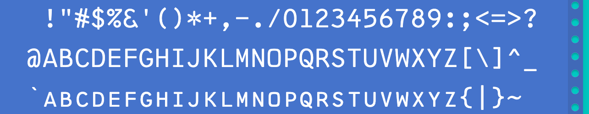

-   cost: $90; $40 for limited subset

-   description:

    A practical monospaced typeface, inspired by the IBM 1403
    mainframe line printer from the 1960s.

-   designer: Jeff Kellem

-   notes:

    -   small caps, no lower case

-   tags:

    -   classic line printer font
    
    -   ibm line printer

-   updated: 2020-02-19

## [3270](https://github.com/rbanffy/3270font)

-   debian package: fonts-3270

-   description:

    This font is derived from the x3270 font, which, in turn, was
    translated from the one in Georgia Tech's 3270tool, which was
    itself hand-copied from a 3270 series terminal. I built it
    because I felt terminals deserve to be pretty.

-   designer: Ricardo Bánffy

-   license: similar to 3-clause BSD

-   tags:

    -   ibm 3270
    
    -   mainframe
    
    -   terminal
    
    -   coding-focused
    
    -   vectorized terminal font

-   updated: 2020-02-19

## [64-SRC](https://www.myfonts.com/fonts/ilott-type/64-src/)

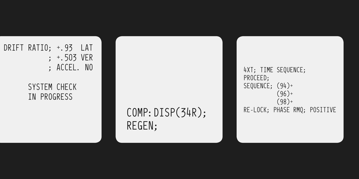

-   cost: $49 for individual weights; $169 for all six.

-   description:

    64-SRC is a condensed monospace font inspired by 1960s IBM
    Selectric type seen on HAL’s telemetric displays in 2001: A
    Space Odyssey. It is characterized by unique \double-space\"
    alternates for the widest characters such as “w” and “m”. These
    alternates maximize legibility, improve the rhythm of
    readability and keep typographic color even. As a result 64-SRC
    is as well suited for extensive copy as it is display type.

-   designer: Andrew Bellamy

-   foundry: ILOTT TYPE

-   listed in:

    -   http://luc.devroye.org/fonts-87939.html

-   similar to: orator

-   tags:

    -   ibm
    
    -   selectric
    
    -   classic typewriter font

-   updated: 2020-02-19

## [Adobe Courier Bitmap Fonts](https://gitlab.freedesktop.org/xorg/font/adobe-75dpi)

-   license: https://gitlab.freedesktop.org/xorg/font/adobe-75dpi/blob/master/COPYING

-   tags:

    -   bitmap
    
    -   implementation of Courier

-   updated: 2020-02-19

-   urls:
    -   <https://gitlab.freedesktop.org/xorg/font/adobe-100dpi> [1]

## Agave

-   description:

    Agave was an attempt at making a small, monospace, outline font
    that would be geometrically regular and simple. The endeavor was
    motivated by a deep adoration of old-school console bitmap
    fonts, of Consolas, of Pragmata Pro, as well as a novice
    curiosity for typographical design.

-   designer:

    -   name: type agaric
    
    -   url: https://b.agaric.net/about

-   license: MIT

-   tags:

    -   coding-focused

-   updated: 2020-02-19

-   urls:
    -   <https://github.com/agarick/agave> [0.9]
    -   <https://www.myfonts.com/fonts/jonahfonts/agave/> [0.7]

## [Ahamono Monospaced](https://www.behance.net/gallery/19532783/AhamonoMonospaced)

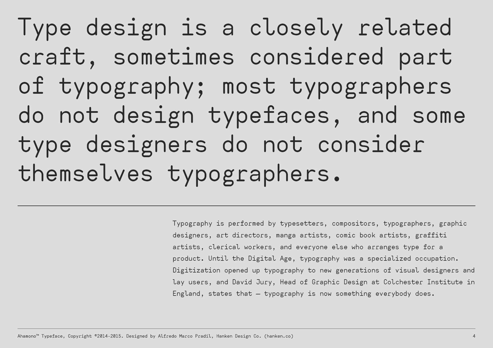

-   cost: $45

-   description: Ahamono™ is a rounded monospaced typeface

-   designer: Alfredo Marco Pradil

-   foundry:

    -   name: Hanken Design Co.
    
    -   url: https://hanken.co/

-   listed in:

    -   https://desket.co/blogs/news/50-free-fonts-for-minimalist-design

-   updated: 2020-02-19

-   urls:
    -   <http://www.myfonts.com/fonts/hanken-designco/ahamono/> [0.7]

## [Akkurat Mono](https://lineto.com/typefaces/akkurat-mono/)

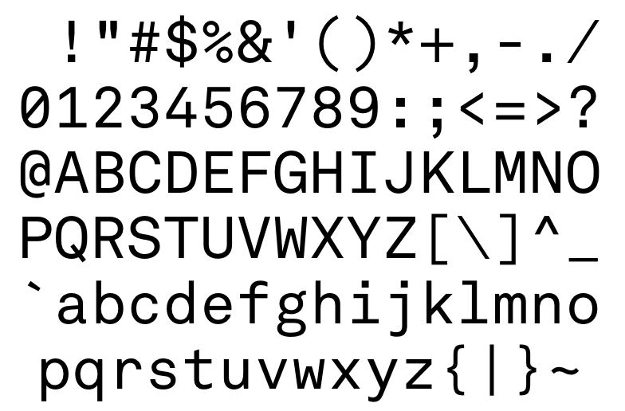

-   cost: CHF 190 for individual weights; CHF 570 for all four.

-   description:

    Fifteen years after its first release, Laurenz Brunner’s now
    famous LL Akkurat (2004) appears almost humble. With its static
    construction, it has proven that combining the qualities of
    classic sans-serif craft with a new contemporaneity can be a
    sustainable endeavour. Never attempting to be trendy, elegant or
    fashionable, LL Akkurat aspired to embody qualities such as
    technical precision, down-to-earth robustness, reliability and
    neutrality, reflecting certain values generally associated with
    Switzerland.

-   foundry: Lineto

-   updated: 2020-02-19

## [Amiri Typewriter](https://github.com/alif-type/amiri-typewriter)

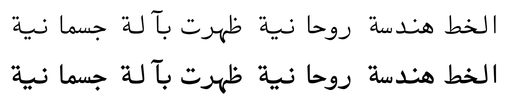

-   description:

    Amiri Typewriter is a typewriter companion to Amiri font family.
    The design is inspired inspired by old Arabic typewriters, and
    features a very simplified Arabic design with most letters using
    the one shape for both isolated and final forms, and one shape
    for initial and medial forms (with few exceptions).

-   designer: Khaled Hosny

-   foundry: Alif Type

-   language/script: Arabic

-   license: SIL OFL 1.1

-   updated: 2020-02-19

## [Andalé Mono](https://docs.microsoft.com/en-us/typography/font-list/andale-mono)

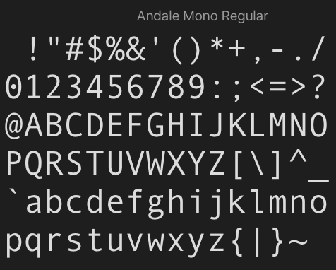

-   also known as: Andale Mono

-   cost:

    -   Individual Styles from $89.00
    
    -   Complete family of 4 fonts is $348.88

-   description:

    Andale Mono is a highly legible monospaced font designed with
    the needs of terminal emulation and software development
    environments.

-   designer: Steve Matteson

-   foundry: Monotype

-   license:

    -   https://www.fonts.com/content/microsoft-typography
    
    -   bundled with Windows

-   notes:

    -   Has a non-monospace sibling called Andalé Sans.
    
    -   Originally distributed with Internet Explorer 4.0 as Monotype.com; renamed Andale Mono for IE 5 and 6.
    
    -   Included in Core fonts for the Web.
    
    -   Bundled with macOS.
    
    -   Sold by the Ascender Corporation with bold and italic variants supporting WGL.
    
    -   Also sold by Monotype.

-   updated: 2020-02-19

-   urls:
    -   <https://www.myfonts.com/fonts/mti/andale-mono/> [0.7]
    -   <https://en.wikipedia.org/wiki/Andal%C3%A9_Mono> [0.1]

## [Angelus III](https://www.myfonts.com/fonts/scriptorium/angelus-iii/)

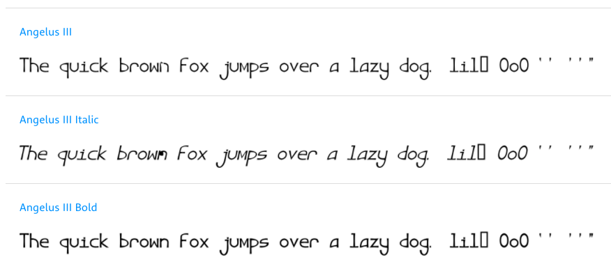

-   cost: $18 for individual weights, or for complete family

-   description:

    Angelus is a rather different monospaced font. Unlike an earlier
    version this one has full upper and lowercase characters.

-   designer: David Nalle

-   foundry: Scriptorium

-   listed in:

    -   http://www.cfcl.com/vlb/h/fontmono.html

-   tags:

    -   novelty

-   updated: 2020-02-19

## [Anka/Coder](https://github.com/fitojb/anka-coder-fonts)

-   description:

    The Anka/Coder family is a monospaced, courier-width (60% of
    height; em size 2048x1229) font that contains characters from
    437, 866, 1251, 1252 and some other code pages and can be used
    for source code, terminal windows etc.

-   designer: Adolfo Jayme-Barrientos

-   license: OFL

-   tags:

    -   coding-focused

-   updated: 2020-02-19

-   urls:
    -   <https://fontlibrary.org/en/font/anka-coder> [0.8]

## [Anonymous Pro](https://www.marksimonson.com/fonts/view/anonymous-pro)

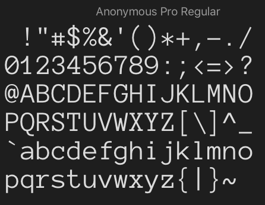

-   description:

    Anonymous Pro (2009) is a family of four fixed-width fonts
    designed with coding in mind.

-   designer: Mark Simonson

-   formerly known as: Anonymous

-   license: OFL

-   notes:

    -   Alternate version Anonymous Pro Minus does not contain embedded bitmaps at smaller sizes.

-   tags:

    -   coding-focused

-   updated: 2020-02-19

-   urls:
    -   <http://www.google.com/fonts/specimen/Anonymous+Pro> [0.6]
    -   <http://www.fontsquirrel.com/fonts/Anonymous-Pro> [0.5]
    -   <http://www.fontsquirrel.com/fonts/Anonymous> [0.5] [former]

## [Another Man's Treasure](http://www.kreativekorp.com/software/fonts/trs80.shtml)

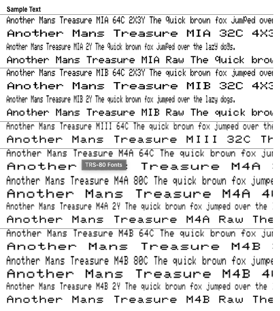

-   description:

    The world's most complete TRS-80 text font set, in TrueType
    format.

-   designer: Rebecca Bettencourt

-   license: TBD

-   notes:

    -   bitmap font

-   tags:

    -   free

-   updated: 2020-02-19

## [Aperçu Mono](https://www.colophon-foundry.org/typefaces/apercu/)

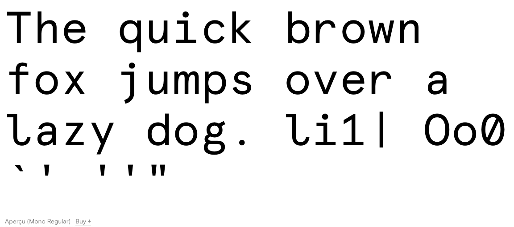

-   also known as: Apercu Mono

-   cost: mono family for £170.00

-   description:

    Aperçu was started in December 2009, and was trialled & tested
    throughout a number of design commissions into 2010. The conceit
    behind Aperçu was to create a synopsis or amalgamation of
    classic realist typefaces: Johnston, Gill Sans, Neuzeit &
    Franklin Gothic. Becoming, a sum of parts, building upon its
    initial reference points to create an extensive and usable
    family.

-   foundry: Colophon

-   updated: 2020-02-19

## [APL2741](http://apl385.com/fonts/)

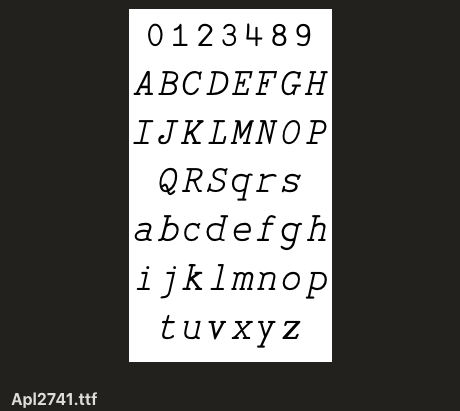

-   description:

    Historic interest only. This was hand digitised as a PostScript
    Type-3 font from an original 2741 golf-ball salvaged from an IBM
    selectric typewriter. Looks good on paper, but poor on screen as
    it is lightweight and italic. The hinting is rudimentary and
    even with ClearType it is hard to read!

-   designer: Adrian Smith

-   license: public domain

-   updated: 2020-02-19

## [APL385 Unicode](http://apl385.com/fonts/)

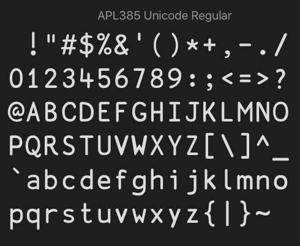

-   description:

    Developed with all APL software vendors in the late 1980s and
    enhanced as required with new characters to meet interpreter
    updates.

-   designer: Adrian Smith

-   license: public domain

-   notes:

    -   This is Adrian Smith\'s Unicode APL font, a de facto industry standard.
    
    -   Also available in a proportional version called APL333.

-   tags:

    -   coding-focused
    
    -   quirky

-   updated: 2020-02-19

-   urls:
    -   <http://www.dyalog.com/apl-font-keyboard.htm> [1] [old]

## [APLX Upright](https://www.dyalog.com/aplx.htm)

-   description: TBD

-   license: TBD

-   notes:

    -   Distributed with end-of-lifed product APLX.

-   updated: 2020-02-19

-   urls:
    -   <http://www.microapl.co.uk/download/aplx_unicode.ttf> [1] [download]

## [Archive Mono](https://www.colophon-foundry.org/typefaces/archive/)

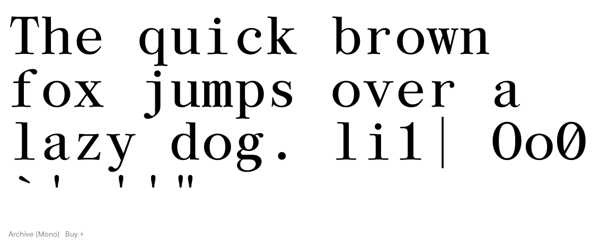

-   cost: UKP 50.00 for sole mono weight

-   foundry: Colphon

-   updated: 2020-02-19

## [Arial Monospaced](https://www.myfonts.com/fonts/mti/arial-monospaced-mt/)

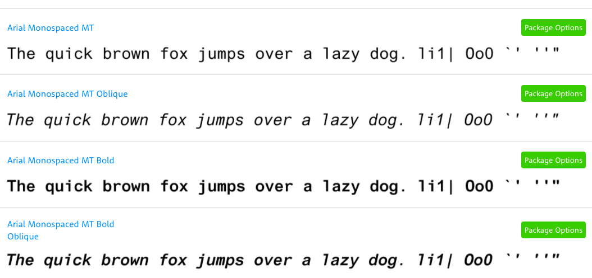

-   cost: $126 for complete family of four weights.

-   designer:

    -   Robin Nicholas
    
    -   Patricia Saunders

-   foundry: Monotype

-   tags:

    -   monospace variant of a proportional font

-   updated: 2020-02-19

## [Ascender Sans Mono](https://www.myfonts.com/fonts/ascender/ascender-sans-mono/)

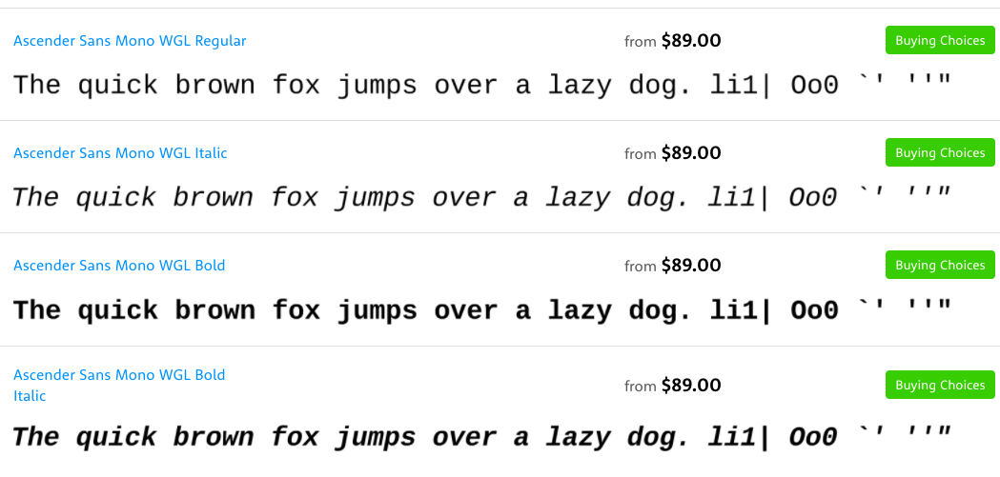

-   cost: Individual Styles from $89.00; Complete family of 4 fonts: $356.00 $348.88

-   description:

    The Ascender Sans Mono font family was designed by Steve
    Matteson as an innovative, refreshing sans serif design that is
    metrically compatible with Courier New.  Ascender Sans Mono
    offers improved on-screen readability characteristics and the
    pan-European WGL character set.

-   designer: Steve Matteson

-   foundry: Ascender

-   updated: 2020-02-19

## [ASM](https://www.myfonts.com/fonts/textaxis/asm/)

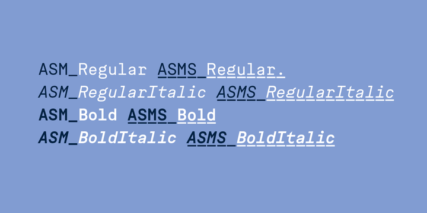

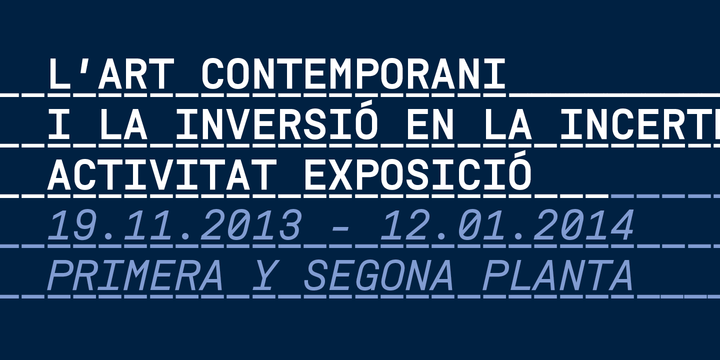

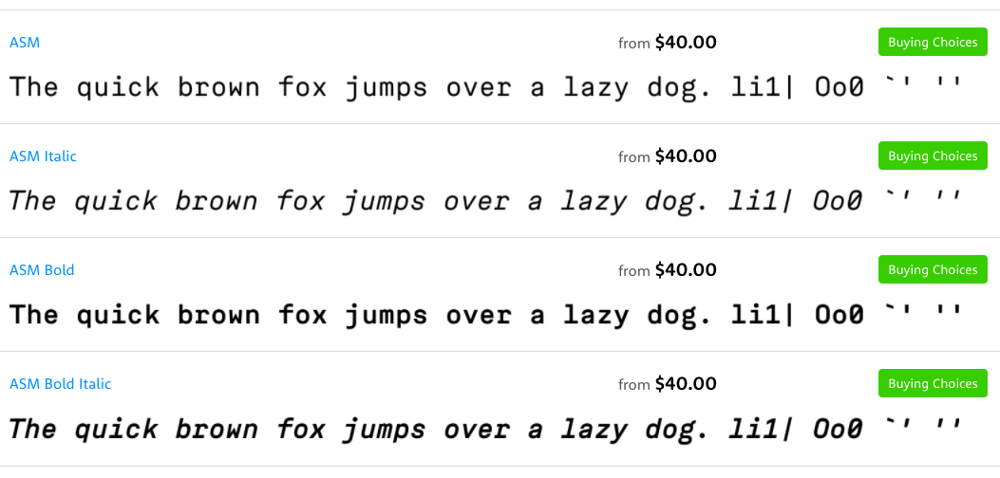

-   foundry: Extratype f/k/a Textaxis

-   tags:

    -   paid

## [Atlas Typewriter](https://commercialtype.com/catalog/atlas/atlas_typewriter)

-   cost: $325 desktop; $325 web; $487.50 app

-   description:

    Atlas Typewriter is a distinctive monospaced sans, well suited
    for a wide range of uses, from art catalogues to personal
    correspondence, through to data visualization. Rather than
    hewing closely to the model of existing monospaced typefaces,
    Atlas Typewriter aims for an even, readable texture with the
    same clean and effortless tone as the Grotesk.

-   foundry: Commercial Type

-   updated: 2020-04-22

## [Audimat Mono](https://www.smeltery.net/en/fonts/dead)

-   designer: Jack Usine

-   foundry: SMeltery

-   notes:

    -   no longer available from the official site

-   updated: 2020-05-09

-   urls:
    -   <https://www.fontsquirrel.com/fonts/audimat-mono> [0.5]

## [Aurulent Sans Mono](https://www.fontsquirrel.com/fonts/aurulent-sans-mono)

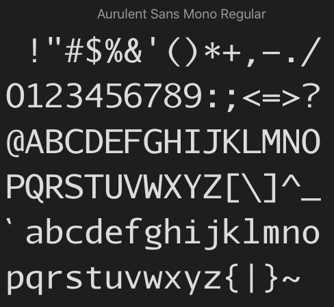

-   designer: Stephen G. Hartke, designer of Verily Serif Mono

-   tags:

    -   coding focused

-   updated: 2020-05-09

-   urls:
    -   <https://www.dafont.com/aurulent-sans-mono.font> [0.5]

## [Autocode](https://www.myfonts.com/fonts/aviation/autocode/)

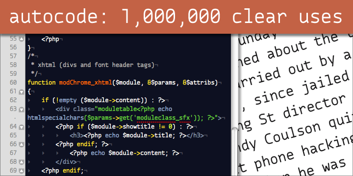

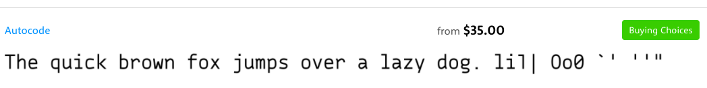

-   cost: $35.00

-   foundry: AVP

-   updated: 2020-05-09

## [Autoscape](https://lineto.com/typefaces/autoscape)

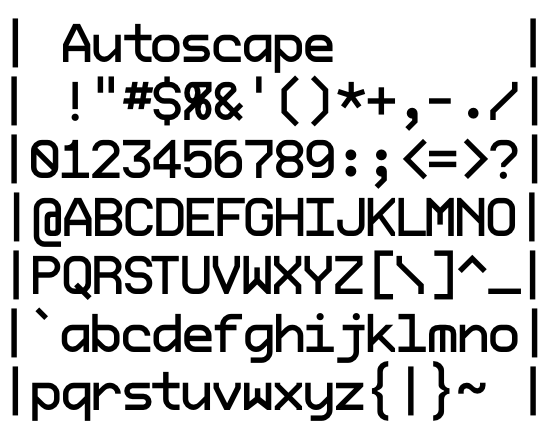

-   cost: CHF 120

-   foundry: Lineto

-   updated: 2020-05-09

## [Average Mono](https://fontlibrary.org/en/font/average-mono)

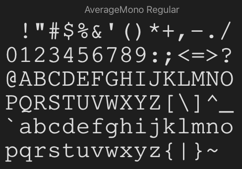

-   clone of: Courier

-   description:

    Average Mono is an average of thirteen different fonts which are
    all derivatives of the public domain “Courier” typeface.

-   designer: Richard Alexander Hall

-   license: Bitstream Vera License

-   tags:

    -   open source
    
    -   implementation of Courier

-   updated: 2020-05-09

## [B612 Mono](http://b612-font.com/)

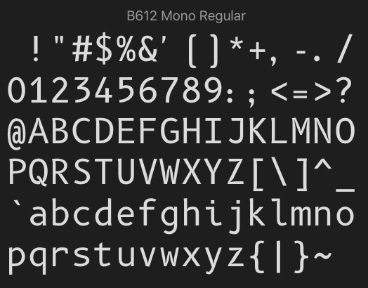

-   description:

    B612 is an highly legible open source font family designed and
    tested to be used on aircraft cockpit screens.

-   designer:

    -   Nicolas Chauveau, Thomas Paillot, and Jonathan Favre-Lamarine

-   foundry: intactile DESIGN on behalf of Airbus

-   license: Eclipse Public License v2.0, Eclipse Distribution License v1.0, and SIL Open Font License v1.1

-   updated: 2020-05-09

-   urls:
    -   <https://github.com/polarsys/b612> [0.9]

## [Base Monospace Narrow and Wide](https://www.emigre.com/Fonts/Base-Monospace)

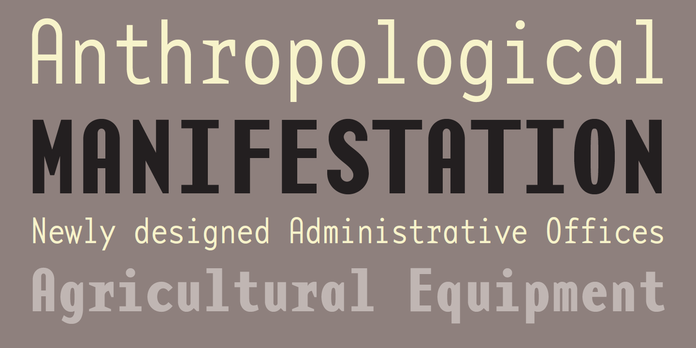

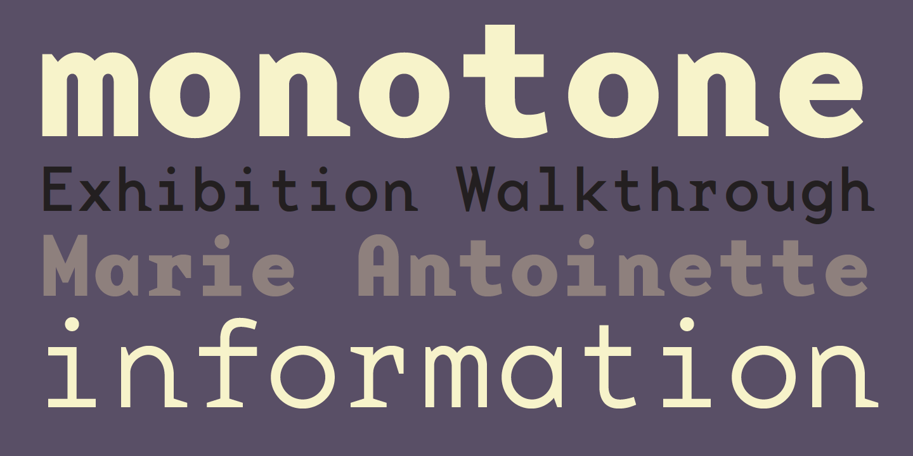

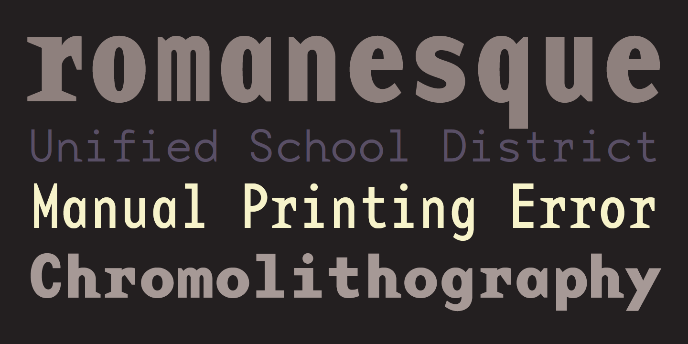

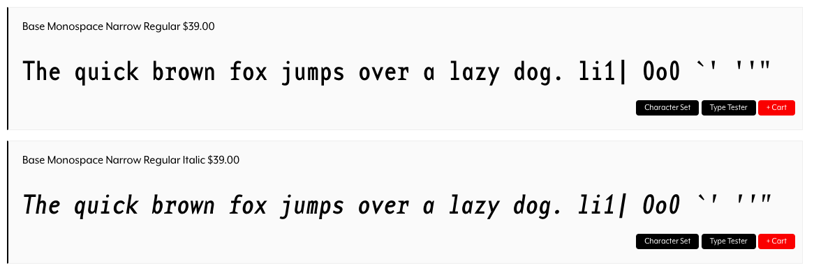

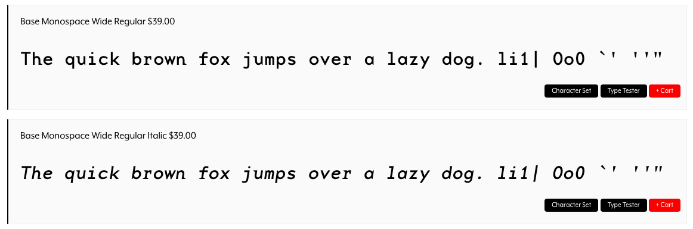

-   cost: $39 for each weight; packages from $115 to $170

-   designer: Zuzana Licko

-   foundry: Emigre

-   updated: 2020-05-09

## [Basier Mono](http://atipofoundry.com/fonts/basier-mono)

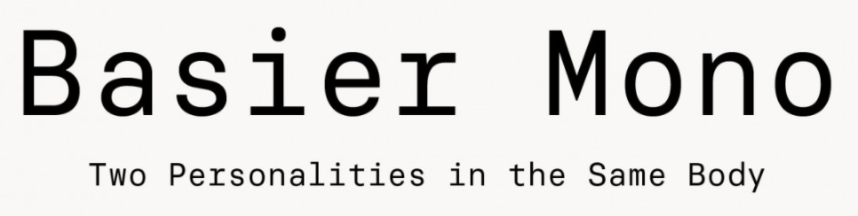

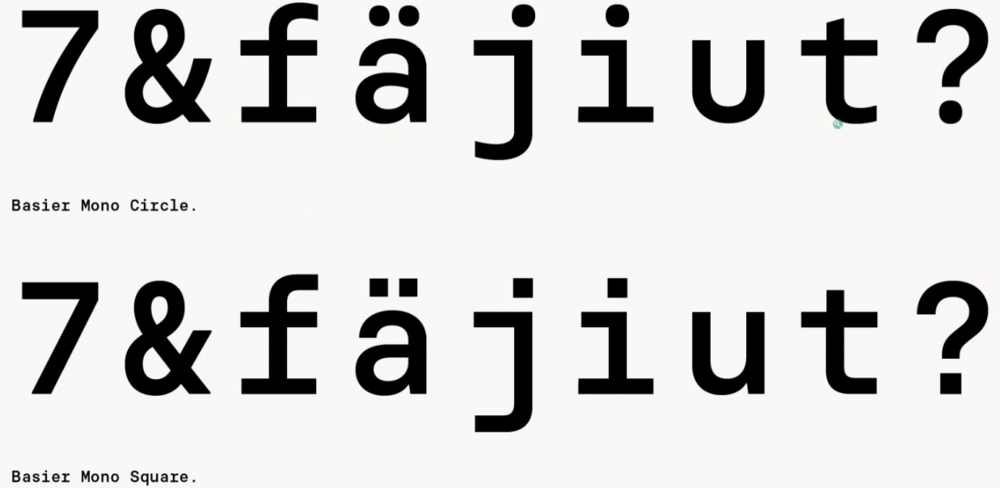

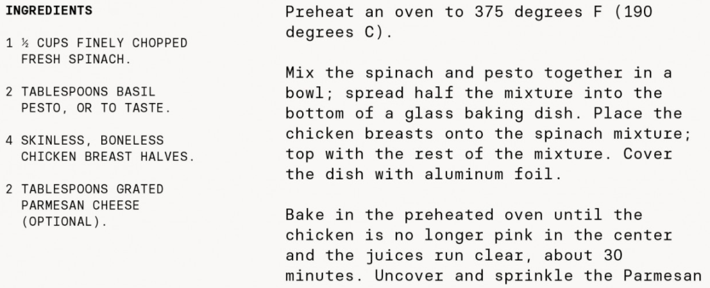

-   cost: regular weight free; pay what you want for complete family

-   foundry: Atipo

-   updated: 2020-03-27

-   urls:
    -   <https://github.com/example/xyzmono> [0.9]

## [Basis Grotesque Mono](https://www.colophon-foundry.org/typefaces/basis-grotesque/)

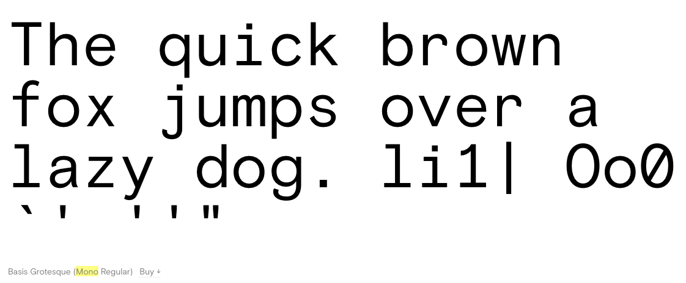

-   cost: GBP 340 for complete mono family

-   foundry: Colophon

-   updated: 2020-05-09

## [Bedstead](https://bjh21.me.uk/bedstead/)

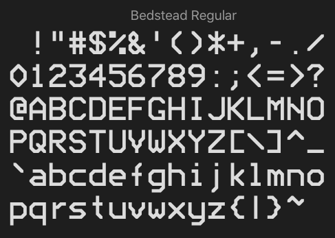

-   description:

    Bedstead is a family of outline fonts based on the characters
    produced by the Mullard SAA5050 series of Teletext Character
    Generators. The SAA5050 is familiar to those of a certain age as
    the chip that produced the MODE 7 display on the BBC
    Microcomputer. It generates characters from a 5 × 9 pixel
    matrix, smoothing diagonal lines to produce an interlaced 10 ×
    18 matrix for each character. Bedstead extends that algorithm to
    continuity, converting a 5 × 9 pixel grid into an outline with
    smooth diagonals.

-   designer: Ben Harris

-   license: public domain

-   updated: 2020-05-09

## [BigBlue Terminal](https://int10h.org/blog/2015/12/bigblue-terminal-oldschool-fixed-width-font/)

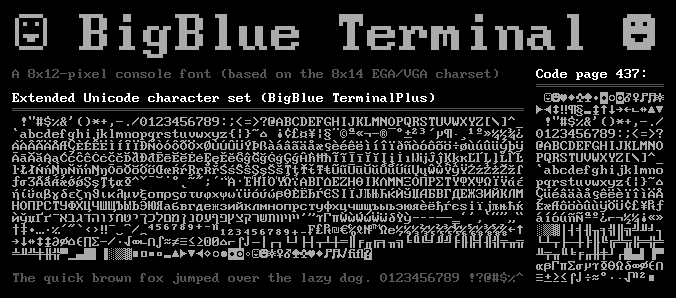

-   author: VileR

-   description:

    BigBlue Terminal is a monospaced pixel font, designed for use
    in fixed-width textual environments (consoles/terminals,
    text/code/hex editors and so on).  It follows the metrics and
    dimensions of Windows' old Terminal font (at the 9pt/12px size),
    but the appearance is closer to the classic IBM PC text mode
    character sets.

-   license: CC Attribution-ShareAlike 4.0 license

-   updated: 2020-05-09

## [Bino Mono](https://www.behance.net/gallery/2120022/Bino-Typeface)

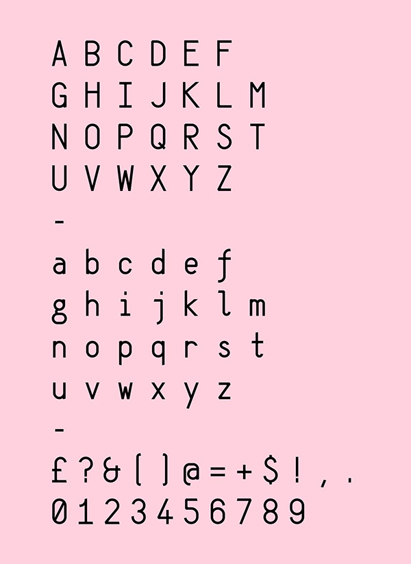

-   description:

    Bino is a monospaced typeface consisting of uppercase,
    lowercase, numerals, punctuation and diacritic characters.  With
    a combination of curves and slanted cuts I wanted the typeface
    to be both a regimented monospaced font with that slightly
    decorative feel.

-   designer: Neal Fletcher

-   tags:

    -   display

-   updated: 2020-05-09

## [Bitstream Courier Type 1](https://gitlab.freedesktop.org/xorg/font/bitstream-type1)

-   license: https://gitlab.freedesktop.org/xorg/font/bitstream-type1/-/blob/master/Copyright

-   updated: 2020-05-09

## [Bitstream Pica 10 Pitch](http://www.myfonts.com/fonts/bitstream/pica-10-pitch/)

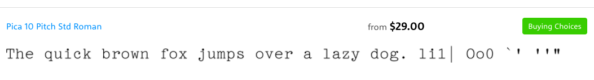

-   cost: $29.00

-   foundry: Bitstream

-   tags:

    -   classic traditional typewriter font

-   updated: 2020-05-09

## [Bitstream Vera Sans Mono](https://www.gnome.org/fonts/)

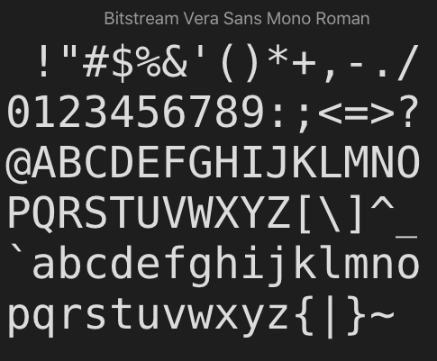

-   description:

    Bitstream Vera Sans Mono is the basis of numerous open source
    fonts, the first and most popular of which is Deja Vu Sans Mono.

-   foundry: Bitstream

-   license: https://www.gnome.org/fonts/#Final_Bitstream_Vera_Fonts

-   tags:

    -   monospace variant of a proportional font
    
    -   coding-focused

-   updated: 2020-05-09

-   urls:
    -   <http://ftp.gnome.org/pub/GNOME/sources/ttf-bitstream-vera/1.10/> [1]

## [Bizcat](https://robey.lag.net/2020/02/09/bizcat-bitmap-font.html)

-   description:

    Bizcat is a retro 8x16 bitmap font, intended for hobby computers
    or terminals that use a 640x480 graphics mode, like the Linux
    VGA console. It supports most of Latin-9 and box-drawing glyphs.

-   designer: Robey Pointer

-   license: https://creativecommons.org/licenses/by/4.0/

-   tags:

    -   bitmap

-   updated: 2020-05-09

## [Borg Sans Mono](https://github.com/marnen/borg-sans-mono)

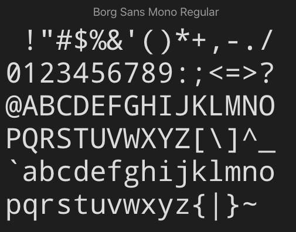

-   description:

    Borg Sans Mono is a fork of Droid Sans Mono, adding a slashed
    zero and ligatures à la Hasklig.

-   designer: Marnen Laibow-Koser

-   license: Apache License 2.0 https://github.com/marnen/borg-sans-mono/blob/master/LICENSE

-   tags:

    -   fork of Droid Sans Mono
    
    -   ligatures
    
    -   coding-focused

-   updated: 2020-05-09

## [BPMono](https://backpacker.gr/fonts/5)

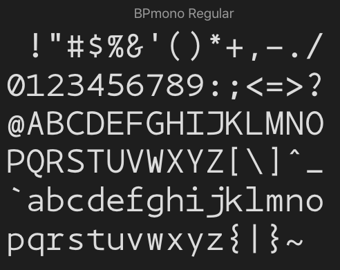

-   description:

    A monospaced typeface suitable for technical texts and/or
    programming. BPmono and BPmono Bold are manually hinted from 9px
    to 16px making it appropriate for use in various advanced text
    and programming editors (eg. Visual Studio .net, Visual Web
    Developer, MS Word etc). All three fonts are available in TTF
    format.

-   foundry: Backpacker

-   tags:

    -   coding-focused

-   updated: 2020-05-09

-   urls:
    -   <https://www.fontsquirrel.com/fonts/BPmono> [0.5]

## [BPtypewrite](https://backpacker.gr/fonts/10)

-   description:

    Didn't you just love BPmono italics? Well, it has undergone
    through a transformation process and has eventually been
    reformed into an actual typewriter font. BPtypewrite is in fact
    BPmono italics standing up, with new soft edges, and a whole
    system of supporting fonts including underscored, strikethrough
    and slashed. The italics version remains in all variations,
    while a rough alternate complements the whole set
    (BPtypewriteDamaged).

-   foundry: Backpacker

-   updated: 2021-03-20

## [Bradford Mono](https://lineto.com/typefaces/bradford-mono)

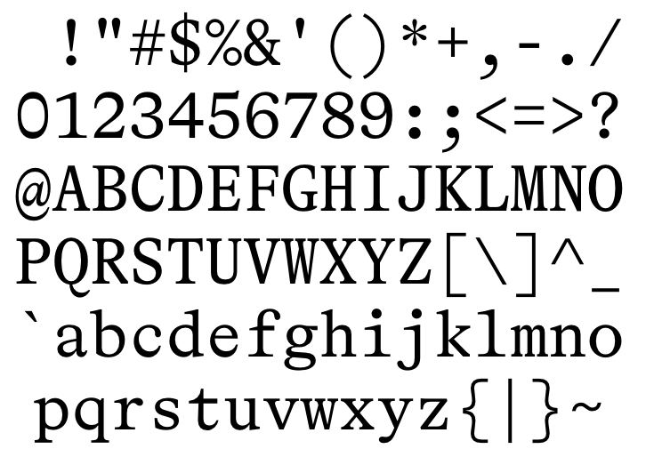

-   cost: CHF 190

-   foundry: Lineto

-   updated: 2020-05-09

## [Bront](https://github.com/chrismwendt/bront)

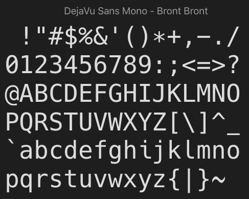

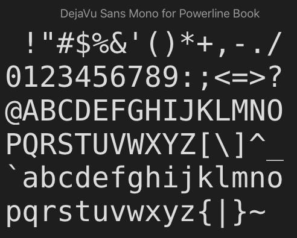

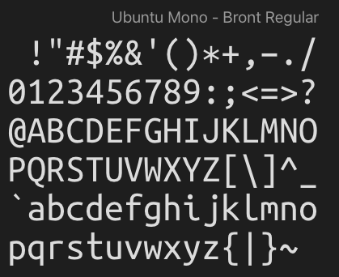

-   designer: Chris Wendt

-   license:

    -   https://github.com/chrismwendt/bront/blob/master/DejaVuSansMono-LICENSE.txt
    
    -   https://github.com/chrismwendt/bront/blob/master/UbuntuMono-LICENSE.txt

-   notes: Programming-oriented forks of Deja Vu Sans Mono and Ubuntu Mono

-   tags:

    -   open source
    
    -   coding-focused

-   updated: 2020-05-09

## [BSU Kermit](http://www.lowing.org/fonts/)

-   old URLs:

    -   http://nova.bsuvc.bsu.edu/prn/monofont/bsuk.html
    
    -   http://home.datacomm.ch/privmsg/havoc/mircscript.htm

-   updated: 2020-05-09

## [Calling Code](https://catalog.monotype.com/family/dharma-type/calling-code)

-   foundry: Dharma Type

-   updated: 2021-03-21

## [Camingo Code](http://www.janfromm.de/typefaces/camingomono/camingocode/)

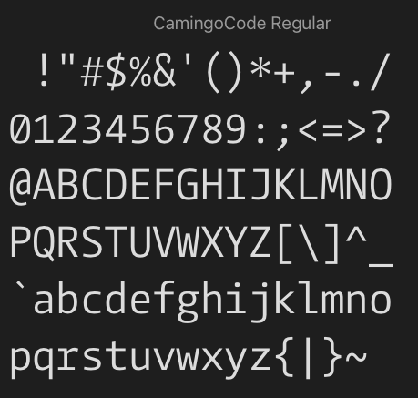

-   cost: $441 complete family; $45 per weight

-   designer: Jan Fromm

-   tags:

    -   coding-focused

-   updated: 2020-05-11

-   urls:
    -   <https://www.myfonts.com/fonts/jan-fromm/camingo-code/> [0.7]

## [Cascadia Code](https://github.com/microsoft/cascadia-code)

-   description:

    This is a fun, new monospaced font that includes programming
    ligatures and is designed to enhance the modern look and feel of
    the Windows Terminal.

-   license: SIL OFL 1.1

-   tags:

    -   ligatures
    
    -   coding-focused

-   updated: 2020-05-11

## [Centima Mono](http://www.tipografiaramis.com/centima-mono.html)

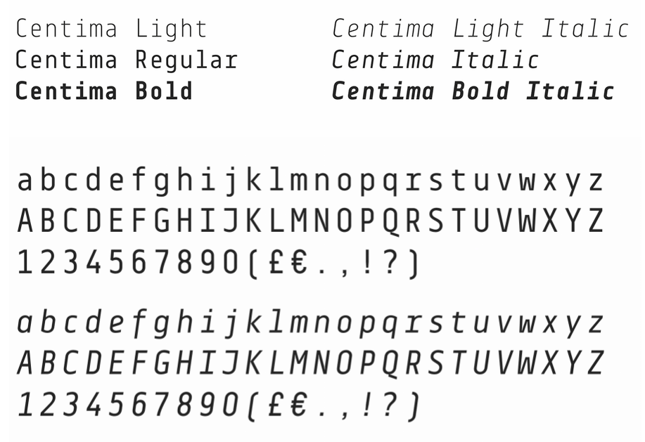

-   cost: $29 per weight: $140 for complete family

-   designer: Ramiz Guseynov

-   foundry: TipografiaRamis

-   see also:

    -   Decima Mono

-   updated: 2020-05-11

-   urls:
    -   <https://www.myfonts.com/fonts/tipografiaramis/centima-mono/> [0.7]

## [Century Schoolbook Monospace](https://catalog.monotype.com/font/bitstream/century-schoolbook/monospaced)

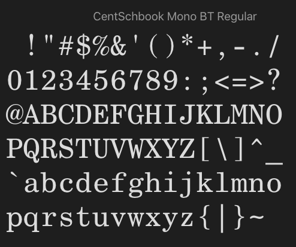

-   tags:

    -   monospace variant of a proportional font

-   urls:
    -   <https://github.com/zhenruyan/codefont/tree/master/lib/centschbook-mono> [0.9]
    -   via <http://www.lowing.org/fonts/> [-1] [via]

## [Circular Mono](https://lineto.com/typefaces/circular-mono)

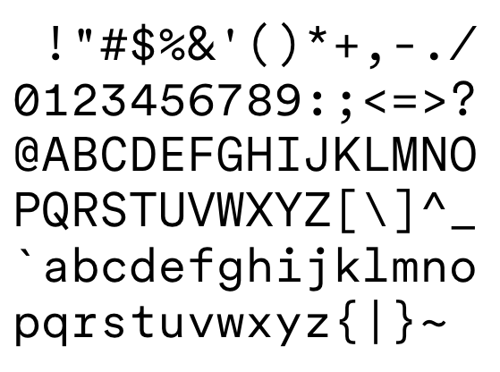

-   foundry: Lineto

-   tags:

    -   paid

## [CMU Typewriter](https://cm-unicode.sourceforge.io/)

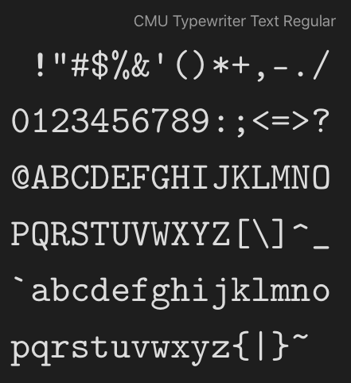

-   designer: Donald Knuth

-   see also:

    -   Latin Modern Mono

-   tags:

    -   free
    
    -   implementation of Computer Modern Typewriter Text

-   urls:
    -   <https://fontlibrary.org/en/font/cmu-typewriter> [0.8]

## [Code New Roman](https://sourceforge.net/projects/codenewroman/)

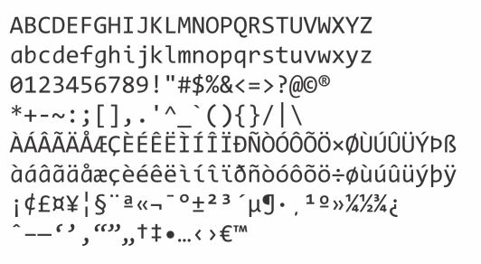

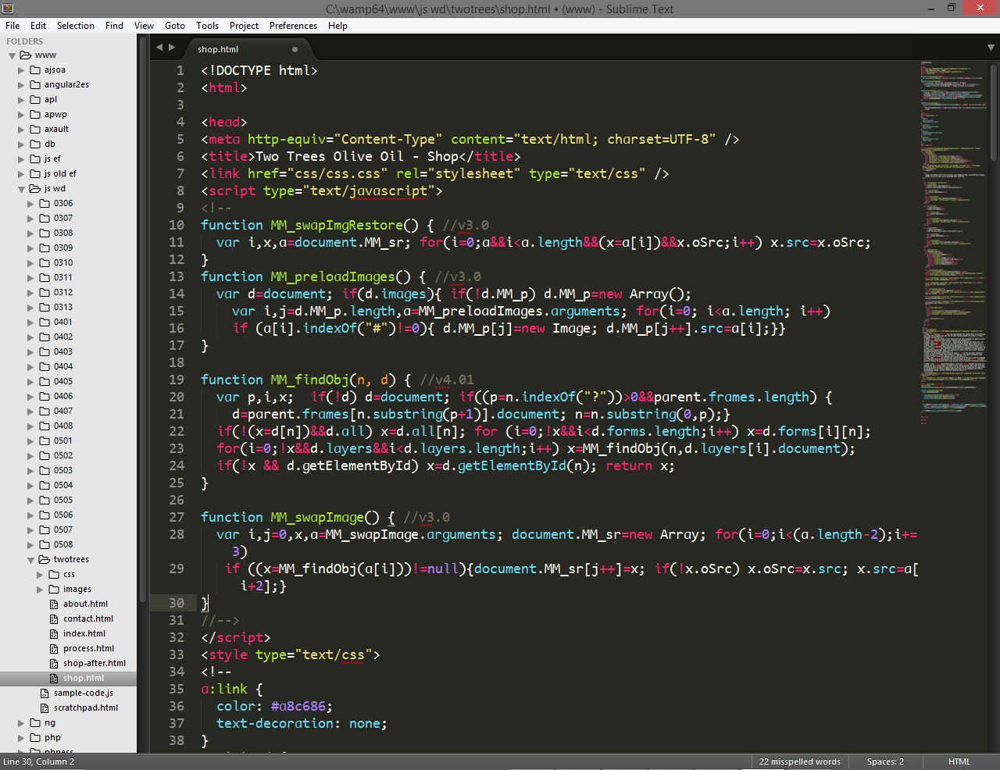

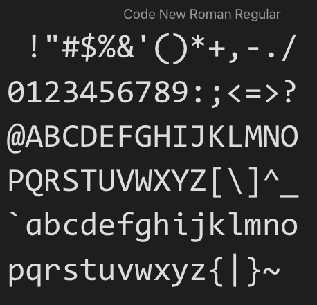

-   designer: imsamhj (Sam)

-   fork of: Ubuntu Mono

-   tags:

    -   open source
    
    -   fork of Ubuntu Mono
    
    -   coding-focused

## [Code Saver](https://catalog.monotype.com/family/dharma-type/code-saver)

-   foundry: Dharma Type

-   updated: 2021-03-21

## [Codename Coder 4F](https://www.myfonts.com/fonts/4thfebruary/codename-coder-4f/)

## [Coding Font Tobi](https://proggyfonts.net/coding-font-tobi/)

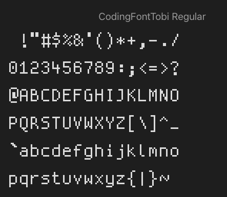

-   designer: Tobias Werner

-   tags:

    -   free
    
    -   coding-focused

-   urls:
    -   <https://github.com/chrissimpkins/codeface/tree/master/fonts/coding-font-tobi> [0.9]

## [Colón Mono](http://www.youworkforthem.com/font/T4920/colon-mono)

-   foundry: TipografiaRamis

-   tags:

    -   paid

## [Compagnon](https://fontsarena.com/compagnon-by-velvetyne-type-foundry/)

-   tags:

    -   free

## [Computer Modern Typewriter](https://en.wikipedia.org/wiki/Computer_Modern)

-   designer: Donald Knuth

-   notes:

    Computer Modern was Donald Knuth\'s original name for his family
    of typefaces, including this monospace variant.  As a condition
    of his license, derivative works can not be called \"Computer
    Modern\".  Popular modern implementations of Computer Modern
    include:
    
    - the CMU distribution (for Computer Modern Unicode);
    
    - the PostScript Type 1 versions generated by Blue Sky, Inc. and
    donated to the American Mathematical Society; and
    
    - Latin Modern.

## [Concursico Mono BTN](https://www.myfonts.com/fonts/btn/concursico-mono-btn/)

-   designer: Stuart Sandler

-   foundry: Breaking the Norm

-   tags:

    -   paid

## [ConsolaMono](https://fontlibrary.org/en/font/consolamono)

-   designer: wmk69 (wmk69@o2.pl)

-   tags:

    -   open source
    
    -   coding-focused

## [Consolas](https://www.microsoft.com/typography/fonts/family.aspx?FID=300)

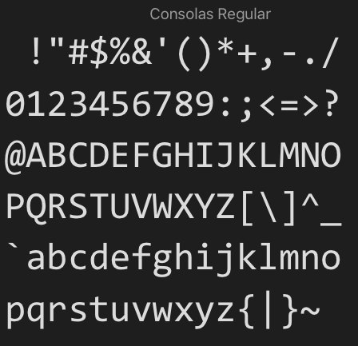

-   designer: Luc(as) de Groot, designer of TheSansTypewriter and TheSansMono

-   foundry: Microsoft

-   tags:

    -   paid
    
    -   coding-focused

-   urls:
    -   <https://en.wikipedia.org/wiki/Consolas> [0.1]

## Cosmic Sans Neue Mono

-   now known as: Fantasque Sans Mono

-   tags:

    -   open source
    
    -   coding-focused

## [Courier](https://en.wikipedia.org/wiki/Courier_(typeface))

-   designer: Howard "Bud" Kettler

-   notes:

    Courier was commissioned by IBM to become a standard typewriter
    font for the typewriter industry.  As such, IBM deliberately did
    not seek intellectual property protection for it; it is royalty
    free.
    
    Implementations not specifically listed here include:
    - Adobe\'s bitmap version for X11
    - Microsoft\'s bitmap version for Windows
    - Linotype\'s square terminal version
    - Monotype\'s square terminal version
    - Adobe\'s square terminal version
    
    Since its release in 1956, Courier has become favored for
    screenplays and business correspondence, and a version of
    Courier is bundled with virtually all modern computer operating
    systems.

-   tags:

    -   royalty free

## [Courier 10 Pitch BT](http://www.rolandstroud.com/Fonts-1.html)

-   foundry: Bitstream

-   notes: thicker; rounded terminals

-   tags:

    -   free
    
    -   implementation of Courier

## [Courier Code](http://openfontlibrary.org/en/font/courier-code)

-   foundry: Bitstream

-   tags:

    -   coding-focused

## [Courier Final Draft](https://store.finaldraft.com/final-draft-11.html)

-   software: from Final Draft

-   tags:

    -   free
    
    -   implementation of Courier

-   urls:
    -   <https://web.archive.org/web/20180704043252/http://kb.finaldraft.com/article/1001/5328/Download-the-updated-Courier-Final-Draft-font> [1]
    -   <https://finaldraft.box.com/shared/static/714ubyxzjd937ntsxqdmvij7clvgzfer.dmg> [1]
    -   <https://finaldraft.app.box.com/s/8c5nx8bkyxpfxl9jsv41bsqif9rt5b58> [1]

## Courier MM Screenwriter

-   software: from Movie Magic Screenwriter

-   tags:

    -   implementation of Courier

## [Courier New](https://docs.microsoft.com/en-us/typography/font-list/courier-new)

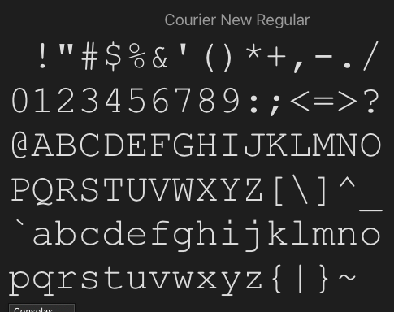

-   foundry: Monotype

-   tags:

    -   paid
    
    -   implementation of Courier

## [Courier Prime](https://quoteunquoteapps.com/courierprime/)

-   tags:

    -   open source
    
    -   implementation of Courier

## [Courier Prime Code](https://quoteunquoteapps.com/courierprime/)

-   tags:

    -   open source
    
    -   implementation of Courier, sort of
    
    -   coding-focused

## [Courier Prime Sans](https://quoteunquoteapps.com/courierprime/)

-   tags:

    -   open source
    
    -   implementation of Courier, sort of

## [Courier Sans Mono](https://lineto.com/typefaces/courier-sans-mono)

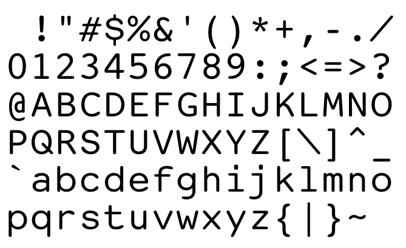

-   foundry: Lineto

-   tags:

    -   paid

## [Courier SB](https://www.myfonts.com/fonts/efscangraphic/courier-sb/)

-   foundry: Scangraphic

-   notes: rounded terminals

-   tags:

    -   paid

## [Courier Screenplay](https://www.fadeinpro.com/page.pl?content=download)

-   software: from FadeIn

-   tags:

    -   free
    
    -   implementation of Courier

-   urls:
    -   <http://www.rolandstroud.com/Fonts-1.html> [1]

## Courier Standard

-   bundled with: Adobe Reader 6

-   tags:

    -   implementation of Courier

## [Cousine](https://github.com/googlefonts/noto-fonts)

-   designer: Steve Matteson

-   notes:

    Cousine is part of the collection of fonts known as the Chrome
    OS core fonts, or Croscore fonts.
    
    Cousine is also included in Google\'s noto-fonts repository on
    GitHub.

-   tags:

    -   open source
    
    -   coding-focused

-   urls:
    -   <http://openfontlibrary.org/en/font/cousine> [0.8]
    -   <http://www.google.com/fonts/specimen/Cousine> [0.6]
    -   <http://www.fontsquirrel.com/fonts/cousine> [0.5]

## [Cozette](https://github.com/slavfox/Cozette)

-   tags:

    -   bitmap

-   via:

    -   https://www.reddit.com/r/unixporn/comments/f4cb7f/oc_i_wanted_a_small_bitmap_font_with_powerline/

## [CP Mono](https://github.com/chrissimpkins/codeface/tree/master/fonts/cp-mono)

-   designer: Chris Simpkins

-   tags:

    -   open source
    
    -   coding-focused

## [CP1250 Terminal Fonts](http://www.lowing.org/fonts/)

## [Creep](https://github.com/romeovs/creep)

-   designer: Romeo Van Snick

-   tags:

    -   open source

## [Crisp](https://proggyfonts.net/crisp/)

-   designer: Chris Pine

-   not to be confused with: https://www.ffonts.net/Crisp.font

-   tags:

    -   free

## [Crystal](http://www.lowing.org/fonts/)

## [Cubiculum](https://www.myfonts.com/fonts/johan-winge/cubiculum/)

-   designer: Johan Winge

-   tags:

    -   paid

## [Cumberland](https://catalog.monotype.com/family/monotype/cumberland)

-   foundry: Monotype

-   updated: 2021-03-21

## [Cutive Mono](http://sansoxygen.com/)

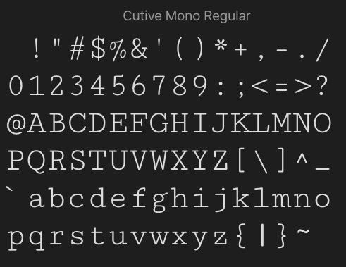

-   designer: Vernon Adams

-   tags:

    -   free

-   urls:
    -   <https://github.com/vernnobile/CutiveFont> [0.9]
    -   <https://fonts.google.com/specimen/Cutive+Mono> [0.7]

## [D2 Coding](https://github.com/naver/d2codingfont)

-   designer: Naver Corp.

-   language/script: Korean

-   tags:

    -   open source
    
    -   coding-focused

## [DaddyTimeMono](https://github.com/BourgeoisBear/DaddyTimeMono)

-   designer: Jason Stewart

-   tags:

    -   open source
    
    -   coding-focused

## [Dank Mono](https://dank.sh/)

-   tags:

    -   paid
    
    -   script italic
    
    -   ligatures

## [Dark Courier](http://www.rolandstroud.com/Fonts-1.html)

-   tags:

    -   implementation of Courier

-   urls:
    -   <ftp://ftp.hp.com/pub/printers/software/lj611en.exe> [1]

## [DEC Terminal](https://gitlab.freedesktop.org/xorg/font/bitstream-75dpi)

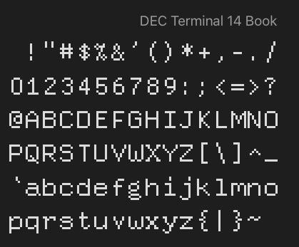

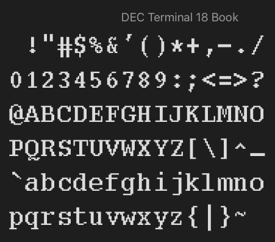

-   notes: Fonts used on DECstation/VAXstation hardware

-   tags:

    -   bitmap

-   urls:
    -   <https://gitlab.freedesktop.org/xorg/font/bitstream-100dpi> [1]

## [DEC Terminal Modern](https://goblin.strangled.net/)

-   designer: Dan Mecklenburg, Jr.

-   notes: Based on the font on the DEC VT220.

-   old urls:

    -   http://www.vtxemu.com/download.html

-   urls:
    -   <https://github.com/codewar65> [0.9]
    -   <https://www.dafont.com/dec-terminal-modern.font> [0.5]

## DEC VT330

-   notes:

    A collection of .pcf fonts available on HP systems and/or VMS
    Referenced in https://www.itec.suny.edu/scsys/vms/ovmsdoc073/v73/6470/6470pro_004.html
    Filenames are as follows, in case you can find them:
    -   VT33018.PCF
    -   VT33036.PCF
    -   VT330_BOLD18.PCF
    -   VT330_BOLD36.PCF
    -   VT330_BOLD_DBLWIDE18.PCF
    -   VT330_BOLD_NARROW18.PCF
    -   VT330_BOLD_NARROW36.PCF
    -   VT330_BOLD_WIDE18.PCF
    -   VT330_DBLWIDE18.PCF
    -   VT330_NARROW18.PCF
    -   VT330_NARROW36.PCF
    -   VT330_WIDE18.PCF

## [Decima Mono](http://www.tipografiaramis.com/decima-mono.html)

-   cost: $39 per weight; $340 for complete family

-   designer: Ramiz Guseynov

-   foundry: TipografiaRamis

-   notes: font used on fivethirtyeight.com

-   see also:

    -   Centima Mono

-   updated: 2020-05-11

-   urls:
    -   <http://www.tipografiaramis.com/decima-mono-pro.html> [1]
    -   <http://www.tipografiaramis.com/decima-mono-round.html> [1]
    -   <https://www.myfonts.com/fonts/tipografiaramis/decima-mono/> [0.7]

## [Deja Vu Sans Code](https://github.com/SSNikolaevich/DejaVuSansCode)

-   notes: Adds programming ligatures.

-   tags:

    -   open source
    
    -   fork of Bitstream Vera / Deja Vu Sans Mono
    
    -   ligatures
    
    -   coding-focused

## [Deja Vu Sans Mono](http://dejavu-fonts.org/wiki/Main_Page)

-   fork of: Bitstream Vera Sans Mono

-   notes:

    Deja Vu Sans Mono is the granddaddy of all Bitstream Vera Sans
    Mono forks, adding a wider range of characters atop Bitstream\'s
    original.

-   tags:

    -   open source
    
    -   coding-focused
    
    -   monospace variant of a proportional font

-   urls:
    -   <https://dejavu-fonts.github.io/> [1]
    -   <https://en.wikipedia.org/wiki/Deja Vu_fonts> [0.1]

## [DF Staple Mono](https://www.myfonts.com/fonts/dutchfonts/df-staple-mono/)

-   designer: Ko Sliggers

-   foundry: Dutchfonts

-   tags:

    -   paid
    
    -   cute

## [DIN Monospace](https://www.parachutefonts.com/typefaces/allfonts/din-monospace)

-   cost: €49.00 per weight; €395.00 complete family

-   foundry: Parachute Fonts

-   updated: 2020-04-25

## [DIN Mono Pro](https://www.parachutefonts.com/typefaces/allfonts/din-mono-pro)

-   cost: €65.00 per weight; €585.00 complete family

-   foundry: Parachute Fonts

-   updated: 2020-04-25

## [Dina](https://www.donationcoder.com/Software/Jibz/Dina/)

-   designer: Jørgen Ibsen

-   tags:

    -   free

-   urls:
    -   <http://www.dcmembers.com/jibsen/download/61/> [1]

## [Disket Mono](https://www.webdesignbites.com/2020/05/05/disket-mono-free-font/)

-   designer: Mariano Diez; Denis Ignatov

-   license: free for personal and commercial use

-   tags:

    -   display

-   updated: 2020-05-06

-   urls:
    -   via <https://www.reddit.com/r/fonts/comments/ge3eyh/disket_mono_free_font/> [-1] [via]

## [Dispatch Mono](https://store.typenetwork.com/foundry/occupant/series/dispatch)

-   designer:

    -   designer: Cyrus Highsmith
    
    -   foundry: Occupant Fonts

-   tags:

    -   paid

## [Doire](https://www.myfonts.com/fonts/everson/doire/)

-   designer: Michael Everson

-   foundry: Evertype

-   tags:

    -   paid
    
    -   unreadable
    
    -   novelty

-   urls:
    -   via <http://www.cfcl.com/vlb/h/fontmono.html> [-1] [via]

## [Dossier](https://www.myfonts.com/fonts/tabular-type-foundry/dossier/)

-   cost: Individual Styles from $29.99; Complete family of 16 fonts: $299.99

-   designer: William Dwiggins, Toshi Omagari

-   foundry: Tabular Type Foundry

-   tags:

    -   novelty
    
    -   quirky

-   updated: 2020-03-15

## [DPCustomMono2](http://www.lowing.org/fonts/)

-   notes: DPCustomMono2 is used for proofreading.

## [Droid Sans Mono](http://damieng.com/blog/2007/11/14/droid-sans-mono-great-coding-font)

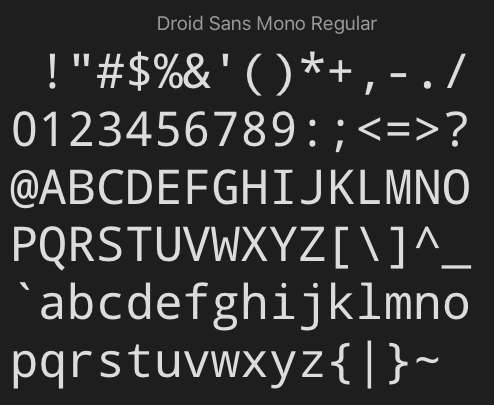

-   designer: Steve Matteson

-   foundry: Ascender

-   see also: Noto Mono

-   tags:

    -   open source

-   urls:
    -   <https://fonts.google.com/specimen/Droid+Sans+Mono> [0.7]
    -   <https://en.wikipedia.org/wiki/Droid_fonts> [0.1]

## [Droid Sans Mono Slashed/Dotted](http://www.cosmix.org/software/)

## [Droid Sans Mono ZeroMod](https://github.com/AlbertoDorado/droid-sans-mono-zeromod)

-   notes: Two variants, one with a dotted zero, and one with a slashed zero.

## [DSE Typewriter](https://webonastick.com/fonts/dse-typewriter/)

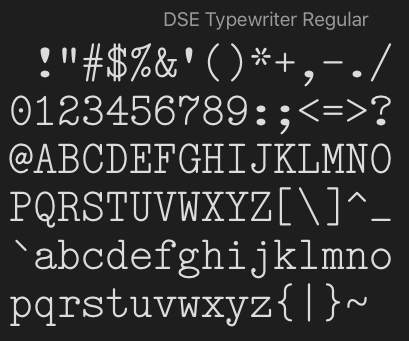

-   author: Darren Embry (the author of this list!)

-   description: A pre-war typewriter styled font you can use for coding.

-   license: SIL OFL 1.1

-   tags:

    -   coding focused
    
    -   classic traditional typewriter font

-   updated: 2002-04-25

-   urls:
    -   <https://github.com/dse/dse-typewriter-font> [0.9]

## [EB Jessica](https://www.myfonts.com/fonts/erik-bertell/eb-jessica/)

-   designer: Erik Bertell

-   tags:

    -   paid
    
    -   novelty

## [Eco Coding](https://www.myfonts.com/fonts/s-core/eco-coding/)

-   description:

    Eco Coding is a sans-serif monospaced font, especially designed
    for programmers. This font is optimized for programming (coding)
    environment. Eco Coding's neutral and open shapes will make your
    eyes comfortable to read any source codes and text on
    screen. The appearance of Eco Coding is neutral, but it has
    distinctive shapes enhance legibility and readability on screen.

-   updated: 2021-03-21

## [Edlo](https://github.com/ehamiter/Edlo)

-   designer: Eric Hamiter

-   notes:

    fork of Aurulent Sans, with programmer-friendly fixes to
    distinguish certain characters.

-   tags:

    -   open source

## [EF Techno Script](https://www.myfonts.com/fonts/ef/techno-script-ef/)

-   foundry: Elsner+Flake

-   tags:

    -   paid
    
    -   classic traditional typewriter font

## [Effects Eighty](https://fontlibrary.org/en/font/effects-eighty)

-   designer: Peter Hull

-   tags:

    -   open source
    
    -   dot matrix

## [Efont](http://www.lowing.org/fonts/)

## [Envy Code R](http://damieng.com/blog/2007/08/19/envy-code-r-preview-6-released-with-visual-studio-italics)

-   designer: Damien Guard

-   tags:

    -   free to use only
    
    -   coding-focused

-   urls:
    -   <https://damieng.com/blog/2008/05/26/envy-code-r-preview-7-coding-font-released> [1]

## [EnvyPN](https://github.com/Tecate/bitmap-fonts/tree/master/bitmap/envypn-font)

## [Erica Type](http://www.peter-wiegel.de/ErikaType.html)

-   designer: Peter Wiegel

-   tags:

    -   free
    
    -   classic traditional typewriter font

-   urls:
    -   <https://www.dafont.com/erika-type.font> [0.5]

## [Espresso Mono](http://theoveranalyzed.net/2015/8/31/espressoapp-and-hack-a-typeface-designed-for-source-code)

-   see also: Hack

-   tags:

    -   fork of Bitstream Vera Sans Mono
    
    -   coding-focused

-   urls:
    -   <https://github.com/jmazzi/dotfiles/blob/master/.fonts/EspressoMonoRegular.ttf> [0.9]

## [Everson Mono](https://www.evertype.com/emono/)

-   foundry: Evertype

-   tags:

    -   free

-   urls:
    -   via <http://www.cfcl.com/vlb/h/fontmono.html> [-1] [via]

## [Excalibur Monospace](http://www.cfcl.com/vlb/h/fontmono.html)

## [Excellent](https://lineto.com/typefaces/excellent)

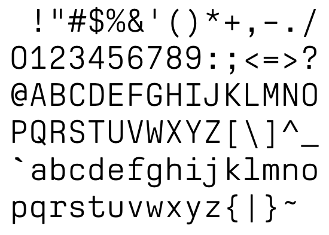

-   foundry: Lineto

-   tags:

    -   paid

## [F25 Bank Printer](http://www.f25.cc/index.php?F25_Fonts:Monospaced:F25_Bank_Printer)

-   designer: Volker Busse

-   foundry: F25 Digital Typeface Design

-   license: free for personal use

-   updated: 2020-05-11

-   via:

    -   https://fontsarena.com/blog/free-modern-typewriter-fonts/

## [F25 Cella](http://www.f25.cc/index.php?F25_Fonts:Monospaced:F25_Cella)

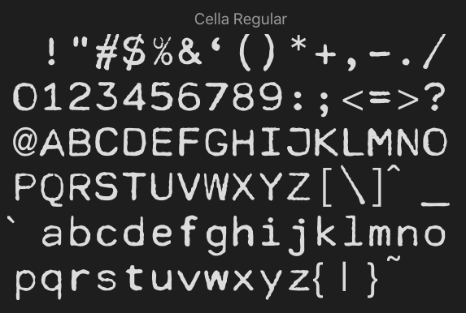

-   designer: Volker Busse

-   foundry: F25 Digital Typeface Design

-   license: free for personal use

-   tags:

    -   distressed

-   updated: 2020-05-11

-   via:

    -   https://fontsarena.com/blog/free-modern-typewriter-fonts/

## [F25 Typewriter Condensed](http://www.f25.cc/index.php?F25_Fonts:Monospaced:F25_Typewriter_Condensed)

-   designer: Volker Busse

-   foundry: F25 Digital Typeface Design

-   license: free for personal use

-   updated: 2020-05-11

## [F25 Blackletter Typewriter](http://www.f25.cc/index.php?F25_Fonts:Monospaced:F25_Blackletter_Typewriter)

-   designer: Volker Busse

-   foundry: F25 Digital Typeface Design

-   license: free for personal use

-   updated: 2020-05-11

## [F25 Telegraphem](http://www.f25.cc/index.php?F25_Fonts:Monospaced:F25_Telegraphem)

-   availability: unknown

-   designer: Volker Busse

-   foundry: F25 Digital Typeface Design

-   license: unknown

-   updated: 2020-05-11

## [F25 Artisan12](http://www.f25.cc/index.php?F25_Fonts:Monospaced:F25_Artisan12)

-   designer: Volker Busse

-   foundry: F25 Digital Typeface Design

-   license: free for personal use

-   updated: 2020-05-11

## [F25 DaisyWheel](http://www.f25.cc/index.php?F25_Fonts:Monospaced:F25_DaisyWheel)

-   designer: Volker Busse

-   foundry: F25 Digital Typeface Design

-   license: free for personal use

-   updated: 2020-05-11

## [Fabrikat Mono](https://www.hvdfonts.com/fonts/fabrikat-mono)

-   designer: Hannes von Döhren; Christoph Koeberlin

-   foundry: HVD Fonts

-   tags:

    -   paid

-   urls:
    -   <https://www.myfonts.com/fonts/hvdfonts/fabrikat-mono/> [0.7]

## [Fairfax](http://www.kreativekorp.com/software/fonts/fairfax.shtml)

-   designer: Rebecca Bettencourt

-   tags:

    -   free

## [Fairfax HD](http://www.kreativekorp.com/software/fonts/fairfaxhd.shtml)

-   designer: Rebecca Bettencourt

-   tags:

    -   free

## [Fairfax Serif](http://www.kreativekorp.com/software/fonts/fairfax.shtml)

-   designer: Rebecca Bettencourt

-   tags:

    -   free

## [Fantasque Sans Mono](https://github.com/belluzj/fantasque-sans)

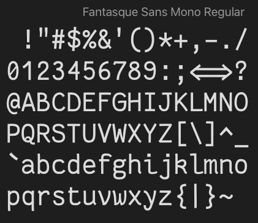

-   designer: Jany Belluz

-   tags:

    -   open source
    
    -   if you like Comic Sans
    
    -   ligatures

-   urls:
    -   <https://fontlibrary.org/en/font/fantasque-sans-mono> [0.8]

## [Feggolite Mono](http://www.cfcl.com/vlb/h/fontmono.html)

## [Felt Pen](http://www.cfcl.com/vlb/h/fontmono.html)

## [FF Attribute Mono](https://catalog.monotype.com/family/fontfont/ff-attribute-mono)

-   foundry: FontFont

-   updated: 2021-03-21

## [FF Elementa](https://www.myfonts.com/fonts/fontfont/elementa-pro/)

-   designer: Mindaugas Strockis

-   foundry: FontFont

-   tags:

    -   paid

## [FF Fago Monospaced](https://www.myfonts.com/fonts/fontfont/fago-monospace/)

-   designer: Ole Schäfer

-   foundry: FontFont

-   tags:

    -   paid

## [FF Magda Clean Mono](https://www.myfonts.com/fonts/fontfont/ff-magda-clean-mono/)

-   designer: Cornel Windlin

-   foundry: FontFont

-   tags:

    -   paid

## [FF Nexus Typewriter](https://www.myfonts.com/fonts/fontfont/nexus-typewriter/)

-   designer: Martin Majoor

-   foundry: FontFont

-   tags:

    -   paid

## [FF Trixie](https://www.myfonts.com/fonts/fontfont/ff-trixie/)

-   designer: Erik van Blokland

-   foundry: FontFont

-   notes: The grand-daddy of all grunge/distressed typewriter faces.

-   tags:

    -   paid

## [Fifteen](https://fontlibrary.org/en/font/fifteen)

-   designer: Zeimusu

-   see also: Quinze

-   tags:

    -   open source
    
    -   dot matrix
    
    -   coding-focused

## [Fira Code](https://github.com/tonsky/FiraCode)

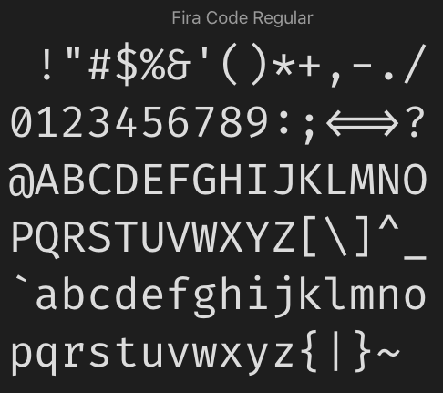

-   notes: adds ligatures to Fira Mono

-   tags:

    -   open source
    
    -   ligatures
    
    -   coding-focused

## [Fira Mono](https://www.mozilla.org/en-US/styleguide/products/firefox-os/typeface)

-   tags:

    -   open source
    
    -   coding-focused

-   urls:
    -   <http://www.google.com/fonts/specimen/Fira+Mono> [0.6]
    -   <http://www.fontsquirrel.com/fonts/fira-mono> [0.5]

## [Misc Fixed](https://gitlab.freedesktop.org/xorg/font/misc-misc)

-   tags:

    -   bitmap

## [Misc Fixed 6x13](http://underpop.online.fr/l/linux-console-fonts-for-windows-in-ttf-and-fon/)

-   notes:

    TTF fonts.
    
    For 6x13, regular and bold bitmaps, and an honest to goodness vector font.

-   tags:

    -   coding-focused
    
    -   bitmap

-   urls:
    -   <https://github.com/staberas/project-singularity/blob/master/%20project-singularity/Project%20Singularity%20GL/data/Misc-Fixed.ttf> [0.9]

## [Misc Fixed 6x13, 7x14, 9x15, 10x20](https://monkey.org/~marius/beautiful-fixed-width-fonts-for-osx.html)

-   notes: `.dfont` files for macOS née OSX.

-   tags:

    -   coding-focused
    
    -   bitmap

## [Fixedsys](http://www.moviecorner.de/en/font-fixedsys-ttf/description.html)

-   tags:

    -   bitmap

-   urls:
    -   <https://en.wikipedia.org/wiki/Fixedsys> [0.1]

## [Fixedsys Excelsior](http://www.fixedsysexcelsior.com/)

-   tags:

    -   bitmap

## [Fixedsys Excelsior with Ligatures](https://github.com/kika/fixedsys)

-   tags:

    -   ligatures
    
    -   bitmap

## [Flexi IBM VGA](https://int10h.org/blog/2018/05/flexi-ibm-vga-scalable-truetype-font/)

-   author: VileR

## [FreeMono](https://www.gnu.org/software/freefont/)

-   clone of: Courier

-   notes: FreeMono is part of the GNU FreeFont collection, also known as Free UCS Outline Fonts

-   tags:

    -   implementation of Courier

## [Galexica Mono (novelty)](http://www.identifont.com/show?9A6)

-   tags:

    -   novelty

-   urls:
    -   via <http://www.cfcl.com/vlb/h/fontmono.html> [-1] [via]

## [Gemeli Mono](https://www.productiontype.com/family/gemeli_mono)

-   cost: desktop €200; desktop and web €335

-   foundry: Production Type

-   updated: 2020-04-24

-   urls:
    -   <https://fonts.adobe.com/fonts/gemeli-mono> [0.7]

## [Generic Mono](http://programmingfonts.org/post/107484861287/generic-mono-a-generic-monospaced-font)

-   urls:
    -   <http://luc.devroye.org/fonts-75172.html> [1]

## [Glass TTY VT220](http://svo.2.staticpublic.s3-website-us-east-1.amazonaws.com/glasstty/)

-   notes: Based on the font on the DEC VT220.

-   urls:
    -   <http://sensi.org/~svo/glasstty/> [1]

## [Glovis](https://www.myfonts.com/fonts/nonpareille/glovis/)

## [GNUTypewriter](https://fontlibrary.org/en/font/gnutypewriter)

-   tags:

    -   distressed

## [Gohu](http://font.gohu.org/)

-   tags:

    -   bitmap

-   urls:
    -   <https://github.com/zhenruyan/codefont/tree/master/lib/gohu/koemaeda> [0.9] [ttf]

## [Go Mono](https://blog.golang.org/go-fonts)

-   tags:

    -   coding-focused

## [Greenwood Pro](https://www.myfonts.com/fonts/protimient/greenwood/)

## [GNU Unifont](http://unifoundry.com/unifont.html)

-   tags:

    -   coding-focused

-   urls:
    -   <https://en.wikipedia.org/wiki/GNU_Unifont> [0.1]

## [Grid15](https://kraemer.link/fonts/en/Grid15.html)

-   designer: Joshua Krämer

-   notes:

    -   not available yet?

-   tags:

    -   coding focused

-   updated: 2020-03-15

## [GT Alpina Typewriter](https://www.grillitype.com/typeface/gt-alpina)

-   cost: https://www.grillitype.com/shops/gt-alpina

-   description:

    GT Alpina proudly calls itself a workhorse serif, but delights
    in playing with the very meaning of that concept. It reaches
    into the grab bag of typographic history to resurrect shapes
    some may falsely see as too expressive, resulting in a
    meticulous family melding these distinct shapes with a pragmatic
    execution.

-   designer: Reto Moser

-   foundry: Grilli Type

-   updated: 2020-03-15

## [GT America Mono](https://www.grillitype.com/typeface/gt-america)

-   tags:

    -   paid

## [GT Pressura Mono](https://www.grillitype.com/typeface/gt-pressura)

-   tags:

    -   paid

## [GwdTE 437](http://www.lowing.org/fonts/)

## [Hack](https://github.com/chrissimpkins/Hack)

-   fork of: Deja Vu Sans Mono

-   tags:

    -   fork of Bitstream Vera / Deja Vu Sans Mono
    
    -   coding-focused

## [Hasklig](https://github.com/i-tu/Hasklig)

-   fork of: Source Code Pro, with ligatures

-   tags:

    -   ligatures
    
    -   coding-focused

## [Haskplex](https://github.com/huytd/haskplex-font)

-   based on: Hasklig and IBM Plex Mono.  It is just Hasklig regular and IBM Plex Mono italic.

-   designer: IBM

-   tags:

    -   coding-focused

## [Heimat Mono](http://www.atlasfonts.com/typefaces/heimat-mono/)

-   designer: Atlas Font Foundry

-   urls:
    -   <https://fonts.adobe.com/fonts/heimat-mono> [0.7]
    -   <https://www.myfonts.com/fonts/atlas-font-foundry/heimat-mono/> [0.7]

## [Helvetica Monospaced](https://www.myfonts.com/fonts/linotype/helvetica-monospaced/)

-   tags:

    -   monospace variant of a proportional font

## [Hermit](https://pcaro.es/p/hermit/)

-   author: Pablo Caro

-   description:

    Hermit is a monospace font designed to be clear, pragmatic and
    very readable. Its creation has been focused on
    programming. Every glyph was carefully planned and calculated,
    according to defined principles and rules. For this reason,
    Hermit is coherent and regular.

-   license: SIL OFL 1.1

-   tags:

    -   coding-focused

-   updated: 2020-12-03

-   urls:
    -   <https://github.com/pcaro90/hermit> [0.9]

## [Hyperfont](https://en.wikipedia.org/wiki/HyperFont)

-   urls:
    -   via <http://www.lowing.org/fonts/> [-1] [via]

## [iA Writer Mono](https://ia.net/writer/blog/a-typographic-christmas)

-   foundry: iA

-   license: SIL OFL 1.1

-   updated: 2020-04-25

-   urls:
    -   <https://github.com/iaolo/iA-Fonts> [0.9]

## [IBM Courier](https://gitlab.freedesktop.org/xorg/font/ibm-type1)

-   description:

    IBM's digital implementation of Courier, originally made
    available as a PostScript Type 1 font under a permissive license
    with MIT and the X Consortium.
    
    Conversions to TrueType, OpenType, SVG, WOFF, and WOFF2 are
    provided.

-   license: https://github.com/dse/ibm-courier/blob/master/COPYRIGHT

-   tags:

    -   implementation of Courier

-   updated: 2021-03-20

-   urls:
    -   <https://github.com/dse/ibm-courier> [0.9]

## [IBM Fonts](https://farsil.github.io/ibmfonts/)

-   description:

    A collection of monospaced, bitmap fonts in BDF format that
    origin from IBM text mode and system fonts. They include
    extended latin, greek, cyrillic and hebrew scripts and several
    extra characters, for a total of 782 glyphs each. The fonts are
    in BDF 2.1 format and fully compatible with applications that
    make use of either Xft or XLFD.

-   updated: 2021-03-21

## [IBM Plex Mono](https://www.ibm.com/plex/)

-   license: SIL OFL 1.1

-   tags:

    -   coding focused

-   updated: 2020-04-25

-   urls:
    -   <https://github.com/IBM/plex> [0.9]
    -   <https://fonts.google.com/specimen/IBM+Plex+Mono> [0.7]

## [Inconsolata](http://levien.com/type/myfonts/inconsolata.html)

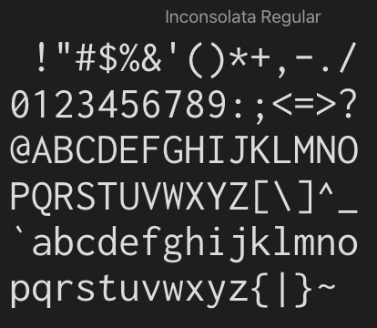

-   license: SIL OFL 1.1

-   tags:

    -   coding-focused

-   updated: 2020-04-25

-   urls:
    -   <https://github.com/google/fonts/tree/master/ofl/inconsolata> [0.9]
    -   <https://fonts.google.com/specimen/Inconsolata> [0.7]

## [Inconsolata-LGC (adds cyrillics, bold, and italic)](https://github.com/DeLaGuardo/Inconsolata-LGC)

-   tags:

    -   coding-focused

## [Inconsolata-dz (adds straight quotes)](https://www.pronoy.in/2017/01/07/inconsolata-dz-adds-straight-quote-marks-to-inconsolata/)

-   tags:

    -   coding-focused

## [Inconsolata-g (adds dotted zero to Inconsolata-dz)](http://leonardo-m.livejournal.com/77079.html)

-   tags:

    -   coding-focused

## [Inconsolata Hellenic](http://www.cosmix.org/software/)

-   urls:
    -   <https://github.com/cosmix/Inconsolata-Hellenic> [0.9]

## [Ingrid Mono](https://www.myfonts.com/fonts/jorg-schmitt/ingrid-mono/)

-   designer: Jörg Schmitt

## [Input Mono](http://input.fontbureau.com/)

-   designer: David Jonathan Ross

-   foundry: Font Bureau

-   license:

    -   free of charge for private use; priced for public-facing use
    
    -   https://input.fontbureau.com/download/

-   tags:

    -   coding-focused

-   updated: 2020-04-25

## [Intimo Two](https://www.myfonts.com/fonts/fw-alias/intimo/two/)

## [Iosevka](https://be5invis.github.io/Iosevka/)

-   tags:

    -   ligatures
    
    -   coding-focused

-   urls:
    -   <https://github.com/be5invis/Iosevka> [0.9]

## [Iosevka Slab](https://be5invis.github.io/Iosevka/)

-   urls:
    -   <https://github.com/be5invis/Iosevka> [0.9]

## [Italian Typewriter](https://www.myfonts.com/fonts/flanker/italian-typewriter/)

-   tags:

    -   classic

## [ITC Souvenir Monospaced](https://www.myfonts.com/fonts/linotype/itc-souvenir-monospaced/)

-   tags:

    -   monospace variant of a proportional font

-   urls:
    -   <https://www.myfonts.com/fonts/itc/souvenir-monospaced/> [0.7]

## [JetBrains Mono](https://www.jetbrains.com/lp/mono/)

-   tags:

    -   free
    
    -   ligatures

-   urls:
    -   <https://github.com/JetBrains/JetBrainsMono> [0.9]

## [JetJane Mono](http://www.cfcl.com/vlb/h/fontmono.html)

## [Julia Mono](https://juliamono.netlify.app/)

-   author: cormullion

-   description:

    JuliaMono is a monospaced typeface designed for programming in
    the Julia Programming Language and in other text editing
    environments that require a wide range of specialist and
    technical Unicode characters. It was intended as an experiment
    to be presented at the 2020 JuliaCon conference in Lisbon,
    Portugal (which of course was held online instead).

-   updated: 2020-12-03

## [jxyahei](https://github.com/zhenruyan/codefont/blob/master/readme_en.md)

## [Karben 105 Mono](https://www.talbottype.co.uk/typefaces/karben-105-mono/)

-   designer: Talbot Type

## [Karben 205 Mono](https://www.talbottype.co.uk/typefaces/karben-205-mono/)

-   designer: Talbot Type

## [Kawkab Mono](https://fontlibrary.org/en/font/kawkab-mono)

## [Kepler-452b](https://github.com/weirdoonthebus/Kepler)

-   designer: Sam Murphey

-   license: SIL OFL

-   tags:

    -   vectrex font vibe

-   updated: 2020-03-31

## [Kettler](https://processtypefoundry.com/fonts/kettler/)

-   cost: https://processtypefoundry.com/fonts/kettler/purchase-options

-   description:

    Kettler is a simple monospaced font named in tribute to designer
    Howard ‘Bud’ Kettler, whose ubiquitous Courier is found on
    computers everywhere. A subtle blend of utilitarian slabs serifs
    and modern curves, Kettler is ideal for tabular information but
    is also comfortable in display and headline use.

-   updated: 2021-03-21

## [Klartext Mono](http://www.fontswithlove.com/fwl/klartext-mono-fontfamily)

-   urls:
    -   <https://www.fontsquirrel.com/fonts/klartext-mono> [0.5]

## [Larabiefont](http://typodermicfonts.com/larabiefont/)

-   urls:
    -   <http://www.larabiefonts.com/> [1]
    -   via <http://www.cfcl.com/vlb/h/fontmono.html> [-1] [via]

## [Latin Modern Mono](http://www.gust.org.pl/gust/projects/e-foundry/latin-modern)

-   designer: Donald Knuth

-   see also:

    -   CMU Typewriter

-   tags:

    -   free
    
    -   implementation of Computer Modern Typewriter Text

-   urls:
    -   <https://www.fontsquirrel.com/fonts/latin-modern-mono> [0.5]

## [Lavender](https://github.com/kori/lavender-font)

-   description:

    This is a console font that is heavily inspired by Sun Gallant
    Demi and the XNU console font.

-   designer: Luiz de Milon

-   license: SIL OFL 1.1

-   tags:

    -   coding focused
    
    -   bitmap font

-   updated: 2020-02-29

## [League Mono](https://www.theleagueofmoveabletype.com/league-mono)

-   tags:

    -   coding-focused

-   urls:
    -   <https://github.com/theleagueof/league-mono> [0.9]

## [Lekton](http://www.google.com/fonts/specimen/Lekton)

-   urls:
    -   <http://www.fontsquirrel.com/fonts/lekton> [0.5]

## [Less Perfect DOS VGA](http://laemeur.sdf.org/fonts/)

## [Letter Gothic](https://fonts.adobe.com/fonts/letter-gothic)

-   tags:

    -   classic typewriter font

## [Lettera Mono](https://lineto.com/typefaces/lettera-mono)

-   foundry: Lineto

-   tags:

    -   paid

## [LH Mono Slab](https://coliss.com/articles/freebies/freebies-font-by-lufthamn-studio.html)

## [Liberation Mono](https://fedorahosted.org/liberation-fonts/)

-   urls:
    -   <https://www.fontsquirrel.com/fonts/liberation-mono> [0.5]

## [Linefeed](https://typodermicfonts.com/linefeed/)

-   description:

    Linefeed is a monospaced font inspired by computer band printers
    of the 1960s and 1970s. A row of hammers, one for each column
    hit the paper, pushing it into the ribbon and against the
    character image on a continuously revolving steel
    band. Extraneous characters would have slowed down a band
    printer so most were limited to capitals, numerals and a little
    punctuation. This was one of the most common computer fonts of
    the 1960s and 1970s. It could be seen on driver’s licences,
    magazine subscription labels, report cards, invoices and car
    dealership window stickers. This once ubiquitous typeface now
    includes lowercase letters, more punctuation and accents.

-   tags:

    -   paid
    
    -   chainprinter

-   updated: 2021-03-21

-   urls:
    -   <http://www.myfonts.com/fonts/typodermic/linefeed/> [0.7]

## [Linux Console Fonts for Windows](http://web.archive.org/web/20110830193159/http://www.ank.com.ar/fonts/)

## [Linux Libertine Mono](http://www.linuxlibertine.org/)

-   urls:
    -   <https://fontlibrary.org/en/font/linux-libertine> [0.8]

## [LispM](https://github.com/unjordy/LispM-Font)

## [Lotion](https://font.nina.coffee/)

-   designer: Nina Belikova

-   license: SIL OFL 1.1

-   updated: 2021-03-21

-   urls:
    -   <https://gitlab.com/nefertiti/lotion-dist> [1]

## [LTC Remington Typewriter](http://new.myfonts.com/fonts/lanston/ltc-remington-typewriter/)

-   tags:

    -   paid
    
    -   classic traditional typewriter font

## [Lucida Console](https://docs.microsoft.com/en-us/typography/font-list/lucida-console)

-   urls:
    -   <https://lucidafonts.com/> [1]
    -   <https://en.wikipedia.org/wiki/Lucida> [0.1]

## [Lucida Typewriter Bitmap Fonts](https://gitlab.freedesktop.org/xorg/font/bh-lucidatypewriter-75dpi)

-   tags:

    -   bitmap

-   urls:
    -   <https://gitlab.freedesktop.org/xorg/font/bh-lucidatypewriter-100dpi> [1]

## [Lucida Typewriter](https://lucidafonts.com/)

-   urls:
    -   <https://en.wikipedia.org/wiki/Lucida> [0.1]

## [Lucida Typewriter EF](https://lucidafonts.com/)

-   urls:
    -   <https://www.myfonts.com/fonts/ef/lucida-typewriter/> [0.7]
    -   <https://en.wikipedia.org/wiki/Lucida> [0.1]

## [Lucida Sans Typewriter](https://docs.microsoft.com/en-us/typography/font-list/lucida-sans-typewriter)

-   tags:

    -   coding-focused

-   urls:
    -   <https://lucidafonts.com/> [1]
    -   <https://en.wikipedia.org/wiki/Lucida> [0.1]

## [Luculent](http://eastfarthing.com/luculent/)

-   tags:

    -   coding-focused

## [Luxi Mono](https://gitlab.freedesktop.org/xorg/font/bh-type1)

-   urls:
    -   <https://gitlab.freedesktop.org/xorg/font/bh-ttf> [1]
    -   <https://www.fontsquirrel.com/fonts/luxi-mono> [0.5]
    -   <https://en.wikipedia.org/wiki/Luxi_fonts> [0.1]

## [M+ 1m](https://mplus-fonts.osdn.jp/about-en.html)

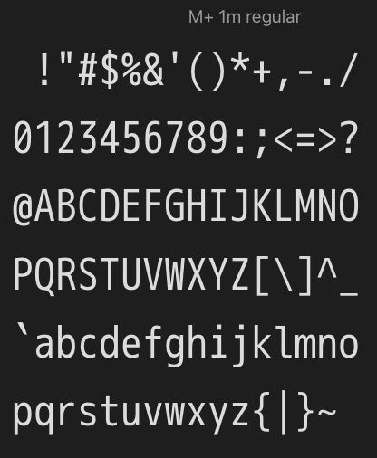

-   tags:

    -   coding-focused

## [M+ 1mn](https://mplus-fonts.osdn.jp/about-en.html)

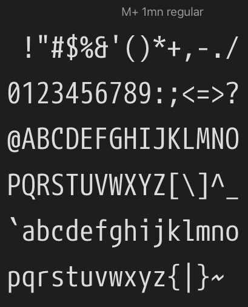

-   tags:

    -   coding-focused

## [M+ 2m](https://mplus-fonts.osdn.jp/about-en.html)

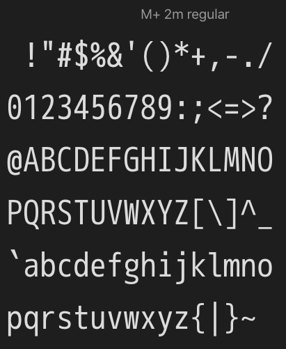

-   tags:

    -   coding-focused

## [Maison Mono](https://www.milieugrotesque.com/specimen/maison/)

## [Maison Neue Mono](https://www.milieugrotesque.com/specimen/maison-neue/)

## [Marista](https://www.myfonts.com/fonts/zephyris/marista/)

-   notes:

    inspired by classic cursive faces
    one weight is free

## [Menlo](https://en.wikipedia.org/wiki/Menlo_(typeface))

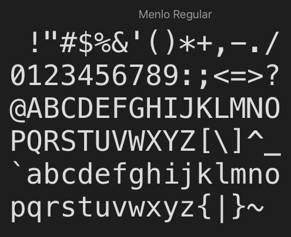

-   fork of: Deja Vu Sans Mono

-   tags:

    -   fork of Bitstream Vera / Deja Vu Sans Mono

## [Mensch](http://robey.lag.net/2010/06/21/mensch-font.html)

-   tags:

    -   coding-focused

## [Meslo LG](https://localfonts.eu/freefonts/programming-fonts/meslo-lg-m/)

-   description:

    Meslo LG is a customized version of Apple's Menlo font
    that adds additional line spacing and alters the
    vertical alignment of the asterisk.

-   fork of: Menlo, itself a fork of Deja Vu Sans Mono, in turn a fork of Bitstream Vera Sans Mono

-   tags:

    -   coding-focused
    
    -   fork of Bitstream Vera / Deja Vu Sans Mono

-   updated: 2021-03-21

-   urls:
    -   <https://github.com/andreberg/Meslo-Font> [0.9]

## [Metrickal](https://github.com/robey/metrickal-typeface)

## [Mingray Mono](https://www.myfonts.com/fonts/rekord/mingray-mono/)

-   designer: Rekord

## [Mitigate](https://www.myfonts.com/fonts/typodermic/mitigate/)

## [Modd](http://nikolas.us.to/jmkfonts/)

-   see also: Neep

-   updated: 2020-05-09

-   urls:
    -   <https://github.com/nikolas/jmk-x11-fonts> [0.9]

## [Monaco](ftp://ftp.apple.com/developer/Tool_Chest/Core_Mac_OS_Tools/MPW_etc./Miscellaneous/MPW_Font.sit.hqx)

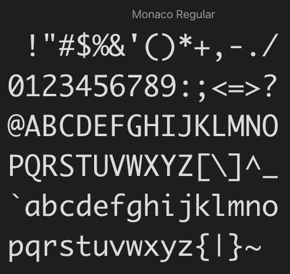

-   urls:
    -   <http://en.wikipedia.org/wiki/Monaco_(typeface)> [0.1]

## [Mono](https://lineto.com/typefaces/mono)

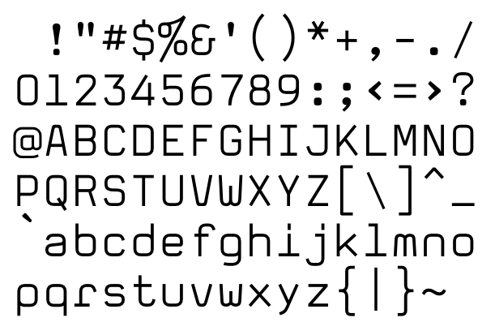

-   foundry: Lineto

-   tags:

    -   paid

## [Mono Condensed](https://www.myfonts.com/fonts/paratype/mono-condensed/)

-   designer: ParaType

## [Mono LH](https://www.ffonts.net/Mono-LH.font)

## [Mono Spatial](https://www.dafont.com/mono-spatial.font)

## [Monocto](https://www.myfonts.com/fonts/lafonts/monocto/)

## [Monoela](https://www.myfonts.com/fonts/interfont/monoela/)

## [Monofur](https://www.dafont.com/monofur.font)

## [Monoid](https://larsenwork.com/monoid/)

-   tags:

    -   ligatures
    
    -   coding-focused

## [Monoist](https://hanken.co/products/monoist)

## [MonoLisa](https://monolisa.dev/)

-   cost: personal edition $59; professional edition $279

-   designer: Marcus Sterz, Andrey Okonetchnikov, and Juho Vepsäläinen

-   tags:

    -   coding focused

-   updated: 2020-03-16

## [Mononoki](http://madmalik.github.io/mononoki/)

-   tags:

    -   coding-focused

-   urls:
    -   <https://github.com/madmalik/mononoki> [0.9]

## [MonoOne](https://github.com/zlsa/monoOne)

-   description: Predecessor to Mononoki

-   tags:

    -   free

## [Monospace](https://www.fontspace.com/monospace-font-f13274)

-   urls:
    -   <https://en.wikipedia.org/wiki/Monospace_(typeface)> [0.1]

## [Monospace 821](https://www.fonts.com/font/bitstream/monospace-821)

-   tags:

    -   paid
    
    -   monospace variant of a proportional font

-   urls:
    -   <https://www.myfonts.com/fonts/bitstream/monospace-821/> [0.7]
    -   <https://www.linotype.com/1085320/monospace-821-family.html> [0.7]

## [MonosapceTypewriter](https://www.fontsquirrel.com/fonts/MonospaceTypewriter)

## [Monosten](https://www.colophon-foundry.org/typefaces/monosten/)

## [Monostep](https://www.myfonts.com/fonts/yokkmokk/monostep/)

-   designer: YOKKMOKK

## [Monotype Typewriter](https://www.fonts.com/font/monotype/typewriter)

-   notes: Regular, Elite, and Gothic

-   tags:

    -   classic

-   urls:
    -   <https://catalog.monotype.com/family/monotype/typewriter> [1]

## [Monte Carlo](http://www.bok.net/MonteCarlo/)

## [More Perfect DOS VGA](http://laemeur.sdf.org/fonts/)

## [MS Gothic](https://charlesleifer.com/blog/monospace-font-favorites/)

## [MS Mincho](http://www.lowing.org/fonts/)

## [MVB Fantabular](https://www.myfonts.com/fonts/mvbfonts/mvb-fantabular/)

## [MVB Fantabular Sans](https://www.myfonts.com/fonts/mvbfonts/mvb-fantabular-sans/)

## [Nanum Gothic Coding (Korean)](https://www.freekoreanfont.com/nanum-gothic-coding-free-download/)

-   tags:

    -   coding-focused

-   urls:
    -   <http://dev.naver.com/projects/nanumfont/> [-0.5] [original]

## [Native](https://fortfoundry.com/pages/native)

-   designer: Fort Foundry

## [NB Architekt](https://neubauberlin.com/project/nb-architekt-otf-std/)

-   cost: €199.00

-   foundry: Neubau

-   udpated: 2020-03-31

-   urls:
    -   <https://neubauladen.com/product/nb-architekt-edition/> [1] [purchase]

## [NB Typewriter](https://neubauladen.com/product/nb-typewriter-pro-edition/)

-   cost: €69.00

-   foundry: Neubau

-   updated: 2020-03-31

## [Neep](http://nikolas.us.to/jmkfonts/)

-   designer: Jim Knoble

-   license: GPL2

-   tags:

    -   coding focused
    
    -   bitmap font

-   updated: 2020-05-09

-   urls:
    -   <https://github.com/nikolas/jmk-x11-fonts> [0.9]

## [Nimbus Mono L (URW)](https://git.ghostscript.com/?p=urw-core35-fonts.git;a=summary)

-   foundry: URW++

-   tags:

    -   implementation of Courier

-   urls:
    -   <https://www.fontsquirrel.com/fonts/nimbus-mono> [0.5]
    -   <https://en.wikipedia.org/wiki/Nimbus_Mono_L> [0.1]

## [Nitti](https://www.boldmonday.com/typeface/nitti/)

-   tags:

    -   paid

## [NK57 Monospace](https://localfonts.eu/freefonts/traditional-cyrillic-free-fonts/nk57-monospace/)

## [Normafixed](http://www.cfcl.com/vlb/h/fontmono.html)

## [NotCourierSans](http://openfontlibrary.org/en/font/notcouriersans)

-   urls:
    -   <https://www.fontsquirrel.com/fonts/notcouriersans> [0.5]

## [Noto Mono](https://www.google.com/get/noto/)

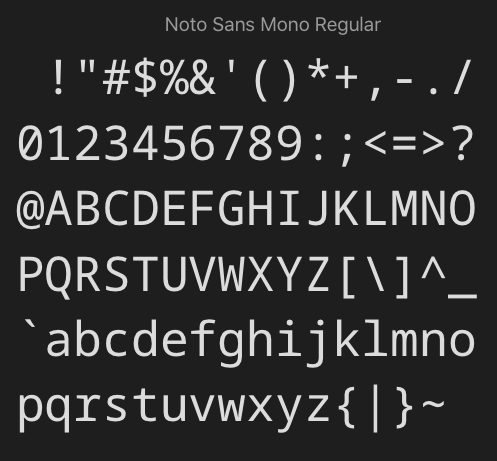

-   based on: Droid Sans Mono

## [Nova Mono](https://fonts.google.com/specimen/Nova+Mono)

-   tags:

    -   coding-focused

## [NuSans Mono](http://www.cfcl.com/vlb/h/fontmono.html)

## [OCR-A](https://osdn.net/projects/tsukurimashou/releases/56948)

-   foundry: American Type Founders

-   notes: Many free implementations are available; see the Wikipedia article.

-   standardized:

    -   ANSI X3.17-1981
    
    -   ISO 1073-1:1976
    
    -   DIN 66008

-   tags:

    -   classic monospace font

-   urls:
    -   <https://typekit.com/fonts/ocr-a> [0.7]
    -   <https://en.wikipedia.org/wiki/OCR-A> [0.1]

## [OCR-B](https://osdn.net/projects/tsukurimashou/releases/56948)

-   designer: Adrian Frutiger

-   standards:

    -   ISO 1073-2:1976 (E)

-   tags:

    -   classic monospace font

-   urls:
    -   <https://typekit.com/fonts/ocr-b> [0.7]
    -   <https://en.wikipedia.org/wiki/OCR-B> [0.1]

## [OCRJ](https://www.myfonts.com/fonts/testpilot/ocrj/)

-   designer: Test Pilot Collective

## [Odisseia](https://www.myfonts.com/fonts/niramekko/odisseia/)

## [Office Code Pro](https://github.com/nathco/Office-Code-Pro)

-   notes: includes changes \"made specifically for text editors and coding environments\"

-   tags:

    -   open source
    
    -   fork of Source Code Pro
    
    -   coding-focused

## [Oloron Program](http://www.fontmenu.com/site/_program.html)

-   notes: Punctuation characters are bold.

-   tags:

    -   ugly

## [Olympiad](https://int10h.org/blog/2016/03/olympiad-ibm-prototype-fonts-unearthed/)

-   author: VileR

## [Onuava](http://www.cfcl.com/vlb/h/fontmono.html)

## [OpenDyslexic](https://opendyslexic.org/)

-   tags:

    -   programmer/coder oriented font?

-   urls:
    -   <https://en.wikipedia.org/wiki/OpenDyslexic> [0.1]

## [OpenGenera fonts](https://archive.org/download/SymblicsOpenGenera)

-   notes:

    Extract the contents of `opengenera2.tar.bz2`.
    The `sys.sct/x11/fonts/bdf/genera` directory contains a bunch
    of BDF fonts.
    
    cptfont.bdf is pretty much this font:
    https://github.com/unjordy/LispM-Font
    
    List of fonts (not all are monospace):
    
    - 13fgb.bdf.~3~*
    - 16fg.bdf.~3~*
    - 18fg.bdf.~3~*
    - 20vr.bdf.~3~*
    - 25fr3.bdf.~3~*
    - 31vr.bdf.~3~*
    - 40vr.bdf.~3~*
    - 40vshd.bdf.~3~*
    - 43vxms.bdf.~3~*
    - 5x5.bdf.~3~*
    - 5x5b.bdf.~3~*
    - 5x5br.bdf.~3~*
    - 5x5r.bdf.~3~*
    - abacus.bdf.~3~*
    - apl14.bdf.~3~*
    - arr10.bdf.~3~*
    - arrow.bdf.~3~*
    - arrows10.bdf.~3~*
    - bigfnt.bdf.~3~*
    - bigfntb.bdf.~3~*
    - bigfntbi.bdf.~3~*
    - bigfnti.bdf.~3~*
    - bigvg.bdf.~3~*
    - blkf10.bdf.~3~*
    - boxfont.bdf.~3~*
    - cha.bdf.~3~*
    - chas.bdf.~3~*
    - clar.bdf.~3~*
    - clar12.bdf.~3~*
    - clar14.bdf.~3~*
    - clarb.bdf.~3~*
    - clre14.bdf.~3~*
    - cpt-cm10.bdf.~3~*
    - cpt-cm12.bdf.~3~*
    - cpt-hl10.bdf.~3~*
    - cpt-tr10i.bdf.~3~*
    - cptfont.bdf.~3~*
    - cptfontb.bdf.~3~*
    - cptfontbi.bdf.~3~*
    - cptfontc.bdf.~3~*
    - cptfontcb.bdf.~3~*
    - cptfontcc.bdf.~3~*
    - cptfonti-german.bdf.~3~*
    - cptfonti.bdf.~3~*
    - cptfontr.bdf.~3~*
    - cptfrak.bdf.~3~*
    - cyr12.bdf.~3~*
    - cyrillic8.bdf.~3~*
    - dutch14.bdf.~3~*
    - dutch14b.bdf.~3~*
    - dutch14bi.bdf.~3~*
    - dutch14i.bdf.~3~*
    - dutch20.bdf.~3~*
    - dutch20b.bdf.~3~*
    - dutch20bi.bdf.~3~*
    - dutch20i.bdf.~3~*
    - edsymbol12.bdf.~3~*
    - einy4.bdf.~3~*
    - einy5.bdf.~3~*
    - einy6.bdf.~3~*
    - einy7.bdf.~3~*
    - einy8.bdf.~3~*
    - eurex12i.bdf.~3~*
    - eurex21i.bdf.~4~*
    - eurex24i.bdf.~4~*
    - gach10.bdf.~3~*
    - gach10b.bdf.~3~*
    - gach10r.bdf.~3~*
    - gach12.bdf.~3~*
    - gach12r.bdf.~3~*
    - gacha10.bdf.~3~*
    - gacha12.bdf.~3~*
    - gacha14.bdf.~3~*
    - gacha8.bdf.~3~*
    - gates.bdf.~3~*
    - gates3.bdf.~3~*
    - gats3a.bdf.~3~*
    - german-cptfont.bdf.~3~*
    - german-cptfonti.bdf.~3~*
    - german-fix8.bdf.~3~*
    - hand.bdf.~3~*
    - hebrew12.bdf.~3~*
    - hebrew8.bdf.~3~*
    - helvetica10.bdf.~3~*
    - helvetica10b.bdf.~3~*
    - helvetica12.bdf.~3~*
    - helvetica12b.bdf.~3~*
    - helvetica14.bdf.~3~*
    - helvetica18.bdf.~3~*
    - helvetica18b.bdf.~3~*
    - helvetica8.bdf.~3~*
    - helvetica9.bdf.~3~*
    - hipo10.bdf.~3~*
    - hippo10.bdf.~3~*
    - hippo12.bdf.~3~*
    - hippo18.bdf.~3~*
    - hippo8.bdf.~3~*
    - hl10.bdf.~3~*
    - hl10b.bdf.~3~*
    - hl10bi.bdf.~3~*
    - hl10i.bdf.~3~*
    - hl12.bdf.~3~*
    - hl12b.bdf.~3~*
    - hl12b1.bdf.~3~*
    - hl12bi.bdf.~3~*
    - hl12br.bdf.~3~*
    - hl12i.bdf.~3~*
    - hl14.bdf.~3~*
    - hl14b.bdf.~3~*
    - hl14bi.bdf.~3~*
    - hl14i.bdf.~3~*
    - hl18.bdf.~3~*
    - hl18b.bdf.~3~*
    - hl18bi.bdf.~3~*
    - hl18i.bdf.~3~*
    - hl18r.bdf.~3~*
    - hl6.bdf.~3~*
    - hl7.bdf.~3~*
    - hl7b.bdf.~3~*
    - hl7bi.bdf.~3~*
    - hl7i.bdf.~3~*
    - hl8.bdf.~3~*
    - hl8b.bdf.~3~*
    - hl8bi.bdf.~3~*
    - hl8i.bdf.~3~*
    - jess11.bdf.~3~*
    - jess11b.bdf.~3~*
    - jess11bi.bdf.~3~*
    - jess11i.bdf.~3~*
    - jess13.bdf.~3~*
    - jess13b.bdf.~3~*
    - jess13i.bdf.~3~*
    - jess14.bdf.~3~*
    - jess14b.bdf.~3~*
    - jess14gb.bdf.~3~*
    - jess14i.bdf.~3~*
    - jessf13.bdf.~3~*
    - key-test-mouse.bdf.~3~*
    - lub14.bdf.~3~*
    - mastr.bdf.~3~*
    - mat10a.bdf.~3~*
    - math10.bdf.~3~*
    - math12.bdf.~3~*
    - math16.bdf.~3~*
    - medfnb.bdf.~3~*
    - medfnt.bdf.~3~*
    - medfntb.bdf.~3~*
    - medfntbi.bdf.~3~*
    - medfnti.bdf.~3~*
    - mets.bdf.~3~*
    - metsi.bdf.~3~*
    - mona33.bdf.~3~*
    - mona66.bdf.~3~*
    - mouse.bdf.~3~*
    - musc10.bdf.~3~*
    - narrow.bdf.~3~*
    - newfnt.bdf.~3~*
    - oeng25.bdf.~3~*
    - oeng50.bdf.~3~*
    - pignose8.bdf.~3~*
    - plnk16.bdf.~3~*
    - prt12b.bdf.~3~*
    - s30chs.bdf.~3~*
    - s35ger.bdf.~3~*
    - sail12.bdf.~3~*
    - scrawl.bdf.~3~*
    - ship.bdf.~3~*
    - sigma20.bdf.~3~*
    - smt10.bdf.~3~*
    - smt10a.bdf.~3~*
    - smt14.bdf.~3~*
    - st10.bdf.~3~*
    - st6.bdf.~3~*
    - st8.bdf.~3~*
    - stipple.bdf.~3~*
    - swiss12-ccaps.bdf.~3~*
    - swiss12b-ccaps.bdf.~3~*
    - swiss20.bdf.~3~*
    - swiss20b.bdf.~3~*
    - swiss20bi.bdf.~3~*
    - swiss20i.bdf.~3~*
    - symbol10.bdf.~3~*
    - symbol12.bdf.~3~*
    - symbolics50.bdf.~3~*
    - tally.bdf.~3~*
    - template64.bdf.~3~*
    - timesroman10.bdf.~3~*
    - timesroman12.bdf.~3~*
    - timesroman12e.bdf.~3~*
    - timesroman14.bdf.~3~*
    - timesroman18.bdf.~3~*
    - tiny.bdf.~3~*
    - tnto14.bdf.~3~*
    - tntob.bdf.~3~*
    - tog.bdf.~3~*
    - tonto.bdf.~3~*
    - tr10.bdf.~3~*
    - tr10b.bdf.~3~*
    - tr10bi.bdf.~3~*
    - tr10i.bdf.~3~*
    - tr12.bdf.~3~*
    - tr12b.bdf.~3~*
    - tr12b1.bdf.~3~*
    - tr12bi.bdf.~3~*
    - tr12br.bdf.~3~*
    - tr12i.bdf.~3~*
    - tr14.bdf.~3~*
    - tr14b.bdf.~3~*
    - tr14i.bdf.~3~*
    - tr18.bdf.~3~*
    - tr18b.bdf.~3~*
    - tr8.bdf.~3~*
    - tr8b.bdf.~3~*
    - tr8bi.bdf.~3~*
    - tr8i.bdf.~3~*
    - tr9.bdf.~3~*
    - tvfont.bdf.~3~*
    - tvfontb.bdf.~3~*
    - tvfontbi.bdf.~3~*
    - tvfontbr.bdf.~3~*
    - tvfontcb.bdf.~3~*
    - tvfonti.bdf.~3~*
    - tvfontr.bdf.~3~*
    - vt100.bdf.~3~*

-   urls:
    -   <https://github.com/minombreesjeff/LISP_machines/tree/master/opengenera2/sys.sct/x11/fonts/bdf/genera> [0.9]

## [Operator Mono](http://www.typography.com/fonts/operator/overview/)

-   tags:

    -   paid

## [Opti](https://proggyfonts.net/proggy-opti/)

-   see also: Proggy

## [Orator](https://www.myfonts.com/fonts/adobe/orator/)

-   tags:

    -   classic typewriter font

## [Osaka Regular-Mono](http://www.cfcl.com/vlb/h/fontmono.html)

-   notes: (comes with macOS)

## [Overpass Mono](http://overpassfont.org)

-   tags:

    -   coding-focused

-   urls:
    -   <https://github.com/RedHatBrand/Overpass> [0.9]

## [Oxygen Mono](https://github.com/vernnobile/oxygenFont)

-   designer: Vernon Adams

-   tags:

    -   free
    
    -   coding-focused

-   urls:
    -   <http://www.google.com/fonts/specimen/Oxygen+Mono> [0.6]
    -   <http://www.fontsquirrel.com/fonts/oxygen-mono> [0.5]

## [Panic Sans](https://github.com/chrissimpkins/codeface/tree/master/fonts/panic-sans)

## PCMyungjo

-   notes: (comes with MacOS)

## [Perfect DOS VGA 437](https://www.dafont.com/perfect-dos-vga-437.font)

## [Pet Me](http://www.kreativekorp.com/software/fonts/c64.shtml)

-   designer: Rebecca Bettencourt

-   notes: Commodore PET/64 fonts

-   tags:

    -   free

## [PF Din Mono](https://www.myfonts.com/fonts/parachute/pf-din-mono/)

## [Pitch](https://klim.co.nz/retail-fonts/pitch/)

-   tags:

    -   paid
    
    -   classic typewriter font

## [Pixel Carnage](https://proggyfonts.net/pixel-carnage/)

-   tags:

    -   dot matrix

-   urls:
    -   <https://www.dafont.com/pixelcarnage.d870> [0.5]

## [PixSymbols Courex](http://www.myfonts.com/fonts/pixymbols/courex/)

## [Platelet](http://www.cfcl.com/vlb/h/fontmono.html)

## [Plotter Mono](https://www.typotheque.com/fonts/plotter_mono)

-   cost: €64/font; €152/family

-   description:

    Plotter is a massive type family that explores the world of
    technical drawings and architectural plans. Each subfamily
    reflects the characteristics of the various tools that inspired
    the project, tools from an age when technical diagrams were
    drawn and lettered by hand, and draftsmen needed a simple,
    efficient way to produce legible text that met established
    norms. Plotter has the simplified monolinear strokes with round
    terminals produced by technical pens, its letters reduced to
    their most basic stencilform elements: stems, arms, curves and
    diagonals.

-   updated: 2021-03-21

## [Pointfree](http://www.dafont.com/pointfree.font)

-   tags:

    -   if you like Comic Sans

## [Polli Sans Mono](https://www.myfonts.com/fonts/will-albin-clark/polli-sans/)

-   description:

    Polli Sans is a sans serif geometric font, designed with both
    proportional and fixed-width styles in mind.
    
    Polli is great for large scale display purposes and small scale
    copy. The proportional’s curvy form makes it super useful for
    title type, and the detailed technical fixed-width sub-family is
    perfect for any informative body of text.
    
    Polli is designed as an homage to common type practices of the
    early 21st centric corporate America. Borrowing from friendly
    styles you’ve seen before but with contemporary challenging
    elements.

-   designer: Will Albin-Clark

-   updated: 2021-03-21

-   urls:
    -   via <https://www.reddit.com/r/typography/comments/hbm95l/polli_sans_polli_mono_free_sans_serif_typeface/> [-1] [via]

## [Powerline Fonts](https://github.com/powerline/fonts)

-   tags:

    -   coding-focused

## [PR Number 3](http://www.kreativekorp.com/software/fonts/apple2.shtml)

-   designer: Rebecca Bettencourt

-   notes: Apple II font

-   tags:

    -   free

## [Print Char 21](http://www.kreativekorp.com/software/fonts/apple2.shtml)

-   designer: Rebecca Bettencourt

-   notes: Apple II font

-   tags:

    -   free

## [Pragmata and Pragmata Pro](http://www.fsd.it/fonts/pragma.htm)

-   tags:

    -   coding-focused
    
    -   ligatures (Pragmata Pro)

## [Essential PragmataPro](https://www.myfonts.com/fonts/fsd/pragmata-pro/)

-   tags:

    -   coding-focused

## [Press Start 2P](https://fontlibrary.org/en/font/press-start-2p)

-   urls:
    -   <https://fonts.google.com/specimen/Press+Start+2P> [0.7]

## [Prestige (Elite)](http://www.myfonts.com/fonts/urw/prestige-elite/)

-   designer: Clayton Smith

-   tags:

    -   paid
    
    -   classic typewriter font

-   urls:
    -   <http://www.myfonts.com/fonts/adobe/prestige-elite/> [0.7]
    -   <https://en.wikipedia.org/wiki/Prestige_Elite> [0.1]

## [Print Out](http://www.cs.princeton.edu/~bwk/202/summer.reconstructed.pdf)

-   notes:

    Shipped with the Linotron 202
    based on Excelsior
    Reconstructed in a reconstruction of the Bell Labs Vacation memo

-   urls:
    -   <http://www.cs.princeton.edu/~bwk/202/> [1]

## [Profont](http://tobiasjung.name/profont/)

-   tags:

    -   coding-focused

## [Proggy](http://www.proggyfonts.net/)

## [Proggy Clean](http://www.proggyfonts.net/)

-   tags:

    -   coding-focused

## [Proggy Square](http://www.proggyfonts.net/)

## [Proggy Small](http://www.proggyfonts.net/)

## [Proggy Tiny](http://www.proggyfonts.net/)

## [Proggy Vector](http://www.proggyfonts.net/)

-   tags:

    -   coding-focused

## [PT Mono](http://paratype.com/public/)

-   tags:

    -   coding-focused

-   urls:
    -   <http://www.google.com/fonts/specimen/PT+Mono> [0.6]
    -   <http://www.fontsquirrel.com/fonts/pt-mono> [0.5]

## [The Ultimate Oldschool PC Font Pack (PX Plus family)](http://int10h.org/oldschool-pc-fonts/)

-   author: VileR

-   description:

    The world's biggest collection of classic text mode fonts,
    system fonts and BIOS fonts from DOS-era IBM PCs and compatibles
    - preserving raster typography from pre-GUI times
    
    You may have seen the term "PxPlus" bandied about.  It's one
    of the variants of these fonts, a more popular one.

-   license: CC BY-SA 4.0

-   updated: 2021-03-21

## [QuickType Mono](http://www.cfcl.com/vlb/h/fontmono.html)

## [Quinze](https://fontlibrary.org/en/font/quinze)

-   see also: Fifteen

-   tags:

    -   coding-focused

## [Raize](http://www.raize.com/devtools/tools/rzfont.asp)

-   urls:
    -   via <http://www.lowing.org/fonts/> [-1] [via]

## [Range Mono](https://www.myfonts.com/fonts/griffin-moore/range-mono/)

## [Rational TW](https://www.myfonts.com/fonts/rene-bieder/rational-tw/)

## [Recursive Mono](https://www.recursive.design/)

-   description:

    Recursive Mono & Sans is a variable font family for code & UI
    (work in progress!)

-   foundry: Arrow Type

-   license: SIL OFL 1.1

-   updated: 2021-03-21

-   urls:
    -   <https://github.com/arrowtype/recursive> [0.9]

## [Relative Mono](https://www.colophon-foundry.org/typefaces/relative/)

## [Replica Mono](https://lineto.com/typefaces/replica-mono)

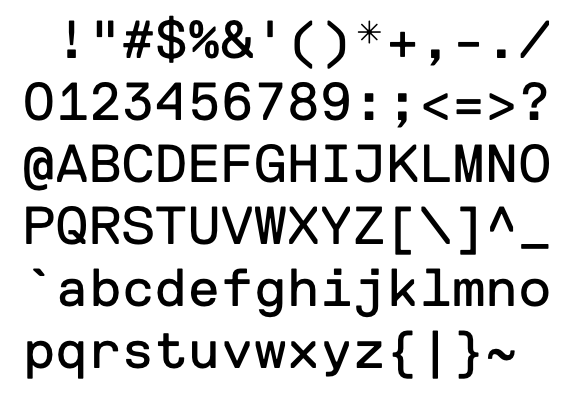

-   foundry: Lineto

-   tags:

    -   paid

## [Resolution](https://www.myfonts.com/fonts/emil-kozole/resolution/)

## [RF Rostin](https://www.myfonts.com/fonts/russian-fonts/rf-rostin/)

## [Roboto Mono](https://fonts.google.com/specimen/Roboto+Mono)

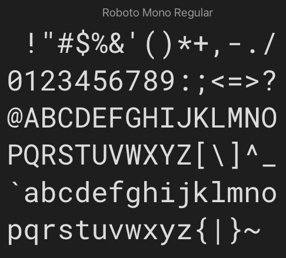

-   tags:

    -   coding-focused
    
    -   monospace variant of a proportional font

## [romfont](https://github.com/spacerace/romfont)

-   author: Stec Dose

-   description:

    I have diassembled and/or searched BIOS and VGA-ROMs for fonts
    and extracted these. Also I have written a few tools to support
    this job. All extracted fonts and screenshots are available
    here. I have written a big table to show what is covered. Also
    had a look and wrote about fonts of open source BIOSes/source
    available.

-   tags:

    -   bitmap fonts

-   updated: 2020-05-13

## [Rubik Mono One](https://fonts.google.com/specimen/Rubik+Mono+One)

## [RX100](https://www.fontshare.com/fonts/rx-100)

-   cost: free for personal and commercial use

-   foundry: Indian Type Foundry

-   license: ITF EULA https://www.fontshare.com/terms

-   updated: 2021-03-24

## [Sabir Mono](https://localfonts.eu/freefonts/traditional-cyrillic-free-fonts/sabir-mono/)

## [Sarasa Gothic](https://github.com/be5invis/Sarasa-Gothic)

-   notes: CJK programming font based on Iosevka and Source Han Sans

## [SaxMono (\"Tile\")](https://www.fontsquirrel.com/fonts/saxMono)

-   tags:

    -   classic typewriter font

## [Sauna Mono Pro](https://www.myfonts.com/fonts/underware/sauna-mono-pro/)

-   tags:

    -   neato

## [Schumaker Misc](https://gitlab.freedesktop.org/xorg/font/schumacher-misc)

-   tags:

    -   bitmap

## [Screenwriter\'s Typewriter Fonts Pro](http://www.vintagetype.com/screenwriters/)

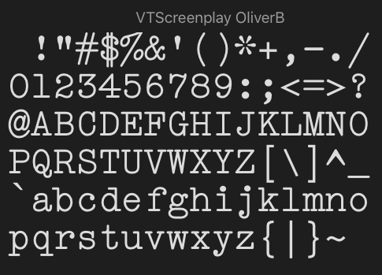

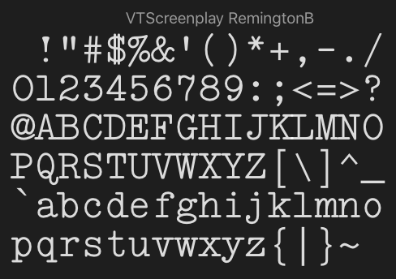

-   notes:

    Vintage Type Foundary was Mark Alan Thomas, an artist from Santa
    Barbara, CA.
    
    Its web site was http://www.vintagetype.com/ but that\'s domain
    parked now.
    
    Mark\'s web site was http://www.markalanthomas.com/ but that\'s
    domain parked too.
    
    His Flickr is at https://www.flickr.com/people/markalanthomas/
    
    He had a squarespace at http://maralatho.squarespace.com/
    
    Email address was/is vintype@gmail.com vintagetype@mac.com
    
    List of Fonts:
      - VTScreenplay Remington
      - VTScreenplay Oliver
      - VTScreenplay Smith
      - VTScreenplay Underwood
    
    [1] https://www.literatureandlatte.com/forum/viewtopic.php?t=41122&start=45

-   tags:

    -   paid
    
    -   classic traditional typewriter font

-   urls:
    -   <http://luc.devroye.org/fonts-27181.html> [1]
    -   <http://web.archive.org/web/20160207162012/http://vintagetype.com/Vintage_Type.html> [1]
    -   <http://web.archive.org/web/20150909202226/http://www.vintagetype.com/Vintage_Type_-_Pro_Typewriter_Fonts.html> [1]

## [Script 12 Pitch](http://www.cfcl.com/vlb/h/fontmono.html)

-   notes: (that classic cursive typewriter font)

-   tags:

    -   classic traditional typewriter font

## [Segoe UI Mono](https://docs.microsoft.com/en-us/typography/font-list/segoe-ui)

-   urls:
    -   <https://www.myfonts.com/fonts/ascender/segoe-ui-mono/> [0.7]
    -   <https://en.wikipedia.org/wiki/Segoe> [0.1]

## [Selectric](https://www.fontspring.com/fonts/indian-summer-studio/selectric)

-   cost: $45

-   foundry: Indian Summer Studio

-   tags:

    -   classic traditional typewriter font

-   updated: 2020-03-15

## [SF Mono](https://developer.apple.com/fonts/)

-   notes:

    Monospaced version of San Francisco, Apple\'s corporate system
    font.
    
    Comes with Terminal.app and Xcode.app for use with them.
    
    San Francisco is not to be confused with the decorative
    \"ransom note\" bitmap typeface known as \"San Francisco\" that
    was distributed with the original Macintosh.
    
    - Licensed only for creating UI mockups.

-   tags:

    -   limited license
    
    -   coding-focused

-   urls:
    -   <https://en.wikipedia.org/wiki/San_Francisco_(sans-serif_typeface)> [0.1]

## [SGI Screen](https://bitbucket.org/tarkasteve/sgi-screen-ttf/src)

-   urls:
    -   <https://njr.sabi.net/2015/11/01/sgi-screen-fonts-converted-for-os-x/> [1] [macos conversion]

## [Share Tech Mono](https://fonts.google.com/specimen/Share+Tech+Mono)

-   tags:

    -   coding-focused

## [Sheldon](http://www.lowing.org/fonts/)

## [Simple](https://lineto.com/typefaces/simple)

-   foundry: Lineto

-   tags:

    -   paid

## [SK Modernist Mono](http://seankanedesign.com/work/sk-modernist)

-   tags:

    -   coding-focused

## [Skurier](https://www.myfonts.com/fonts/nowak/skurier/)

-   designer: GRIN3 (Nowak)

-   tags:

    -   cute

## [Skyhook Mono](https://www.fontsquirrel.com/fonts/skyhook-mono)

## [Small Type Writing](https://www.dafont.com/smalltypewriting-medium.font)

-   notes: (a narrow Courier-like)

-   see also: Courier

## [Smith Premier NF](http://www.myfonts.com/fonts/nicksfonts/smith-premier-nf/)

-   tags:

    -   paid
    
    -   classic traditional typewriter font

## [Sometype Mono](http://monospacedfont.com/)

-   tags:

    -   coding-focused

## [Sony Misc](https://gitlab.freedesktop.org/xorg/font/sony-misc)

-   tags:

    -   bitmap

## [Source Code Pro](https://github.com/adobe-fonts/source-code-pro)

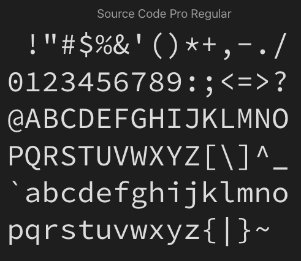

-   tags:

    -   coding-focused

## [Space Mono](https://fonts.google.com/specimen/Space+Mono)

-   tags:

    -   novelty
    
    -   ugly as sin
    
    -   Seriously, if you use this font I will beat you up.
    
    -   I would rather use ITC Souvenir Monospaced.

## [Speedy](https://proggyfonts.net/speedy/)

-   see also: Proggy

## [Spleen](https://www.cambus.net/spleen-monospaced-bitmap-fonts/)

-   tags:

    -   bitmap

-   urls:
    -   <https://github.com/fcambus/spleen> [0.9]

## Spot Mono

## [Squareshooter Mono](http://www.lowing.org/fonts/)

## [String Literal 437](http://fontsgeek.com/fonts/String-Literal-437-Medium)

-   urls:
    -   <https://www.ffonts.net/String-Literal-437-Medium.font.download> [1]

## [Sudo](https://www.kutilek.de/sudo-font/)

-   urls:
    -   <https://github.com/jenskutilek/sudo-font> [0.9]

## [Sun Gallant Demi](https://github.com/illumos/illumos-gate/blob/master/usr/src/uts/common/io/12x22.c)

-   notes: Sun's good old Unix workstation console font.

## [Superstudio](https://lineto.com/typefaces/superstudio)

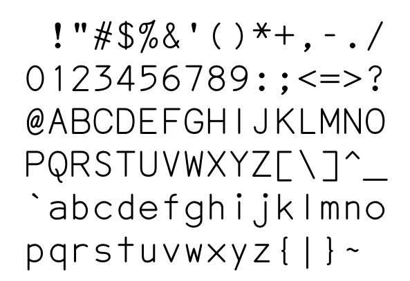

-   foundry: Lineto

-   tags:

    -   paid

## [SV Basic Manual](https://www.dafont.com/sv-basic-manual.font)

-   tags:

    -   mildly distressed
    
    -   line printer

## [Tabular](https://www.myfonts.com/fonts/indian-type-foundry/tabular/)

-   designer: Indian Type Foundry

## [Tamsyn](http://www.fial.com/~scott/tamsyn-font/)

-   urls:
    -   <https://sunaku.github.io/tamsyn-1.7b-font-review.html> [1]

## [Tamsyn-Modified](https://charlesleifer.com/blog/monospace-font-favorites/)

## [Tamzen](https://github.com/sunaku/tamzen-font)

-   based on: tamsyn

## [Teamhair](http://www.cfcl.com/vlb/h/fontmono.html)

## [Telegrama](https://www.fontsquirrel.com/fonts/telegrama)

## [Telegrama Raw](https://www.fontsquirrel.com/fonts/Telegrama)

-   tags:

    -   dot matrix

## [Telegramo](https://www.myfonts.com/fonts/volcano/telegramo/)

-   designer: Volcano Type

## [Terminal/VGA Font](http://www.lowing.org/fonts/)

## [Terminus](http://terminus-font.sourceforge.net/)

-   tags:

    -   https://files.ax86.net/terminus-ttf

-   urls:
    -   <https://files.ax86.net/terminus-ttf/> [1] [ttf conversion]

## [Termsyn](https://charlesleifer.com/blog/monospace-font-favorites/)

## [Tewi](https://github.com/lucy/tewi-font)

-   tags:

    -   bitmap

## [TeX Gyre Cursor](http://www.gust.org.pl/projects/e-foundry/tex-gyre/cursor/index_html)

-   notes: based on URW Nimbus Mono L

-   tags:

    -   implementation of Courier

-   urls:
    -   <https://www.fontsquirrel.com/fonts/tex-gyre-cursor> [0.5]
    -   <http://www.fontsquirrel.com/fonts/TeX-Gyre-Cursor> [0.5]

## [Thermo](https://lineto.com/typefaces/thermo)

-   foundry: Lineto

-   tags:

    -   paid

## [TheSansMono](https://www.lucasfonts.com/fonts/the-sans/mono)

-   cost:

    -   from €45 to €60 for single weights; from €111 to €364 for complete families
    
    -   https://www.lucasfonts.com/fonts/packages/the-sans/mono

-   designer: Lucas de Groot, designer of Consolas

-   updated: 2020-04-25

## [TI92PlusPC](http://ufonts.com/fonts/ti92pluspc.html)

-   urls:
    -   <https://web.archive.org/web/20040214132157/http://www.tamuk.edu/math/scott/stars/tutorial.htm> [1]
    -   <https://github.com/sterpe/ti92plus> [0.9]

## [Tired of Courier](https://www.fonts.com/font/ingrimayne-type/tired-of-courier/volume)

-   cost:

    -   $25 for 8 fonts at https://www.myfonts.com/fonts/ingrimayne/tiredofcourier/
    
    -   $25 for 6 fonts at https://www.fonts.com/font/ingrimayne-type/tired-of-courier/volume
    
    -   $25 for 6 fonts at https://www.linotype.com/316996/tired-of-courier-family.html?site=valuepacks

-   designer: Robert Schenk

-   foundry: Ingrimayne Type

-   updated: 2020-04-25

-   urls:
    -   <https://www.myfonts.com/fonts/ingrimayne/tiredofcourier/> [0.7]
    -   <https://www.linotype.com/316996/tired-of-courier-family.html> [0.7]

## [Topaz-8](http://www.lowing.org/fonts/)

## [Triplicate](http://practicaltypography.com/triplicate.html)

-   see also: Prestige

-   tags:

    -   classic typewriter font

## [Triskweline](http://www.cfcl.com/vlb/h/fontmono.html)

## Triumph Durabel

-   notes:

    According to [1], this is the font that the popular grungy
    typewriter font FF Trixie is based on.
    
    [1] https://www.creativebloq.com/typography/best-typewriter-fonts-10135084

## [TT2020](https://ctrlcctrlv.github.io/TT2020/docs/)

-   notes:

    In response to a few rather obvious examples of poor typewriter
    font realism in recent movies, Fredrick Brennan created TT2020.
    
    Styled after early 20th-century typewriter faces, TT2020
    includes a clean variant as well as a variety of distressed
    variants.  Each variant comes with nine slightly different
    variants of each character, from which one is pseudo-randomly
    chosen when rendered, adding a degree of realism not likely
    hithertofore seen in typewriter fonts.
    
    Another example of a typeface that pseudo-randomly chooses from
    a number of variants of each character is Neue, the corporate
    font used by The New School <https://www.newschool.edu/>.
    
    TT2020 includes upright and italic variants.

## [Tye Paloon](https://www.fontspace.com/font-monkey/tye-paloon)

## [Typewalk Mono 1915](https://www.myfonts.com/fonts/typocalypse/typewalk-mono-1915/)

-   designer: Typocalypse

## [Typewriter Condensed](https://fontsarena.com/wp-content/uploads/2018/11/typewriter_condensed.zip)

## [Ubuntu Monospace](https://design.ubuntu.com/font/)

-   designer: Dalton Maag

-   foundry: Ubuntu

-   license:

    -   Ubuntu Font License
    
    -   https://ubuntu.com/legal/font-licence

-   tags:

    -   coding-focused

-   updated: 2020-04-25

-   urls:
    -   <https://fonts.google.com/specimen/Ubuntu+Mono> [0.7]

## [Unica77 Mono](https://lineto.com/typefaces/unica77-mono)

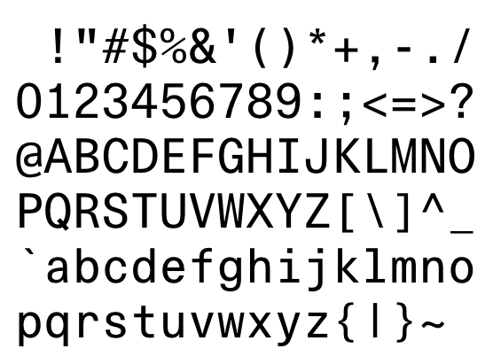

-   foundry: Lineto

-   tags:

    -   paid

## [Univers Next Typewriter](https://www.myfonts.com/fonts/linotype/univers-next-typewriter/)

-   cost: $35 for each of four weights; $99 for all four

-   designer: Adrian Frutiger

-   foundry: Linotype

-   tags:

    -   monospace variant of a proportional font

-   updated: 2020-03-15

## [UnixPC](https://github.com/brandon-rhodes/unixpc-font-bdf)

-   tags:

    -   free
    
    -   bdf
    
    -   bitmap

## [Unotype](http://www.cfcl.com/vlb/h/fontmono.html)

## [UNSCII](http://pelulamu.net/unscii/)

-   description:

    Unscii is a set of bitmapped Unicode fonts based on classic
    system fonts. Unscii attempts to support character cell art well
    while also being suitable for terminal and programming use.

-   designer: Viznut

-   tags:

    -   {bitmap, dot matrix, terminal} font

-   updated: 2020-12-03

## [Valentine](https://lineto.com/typefaces/valentine)

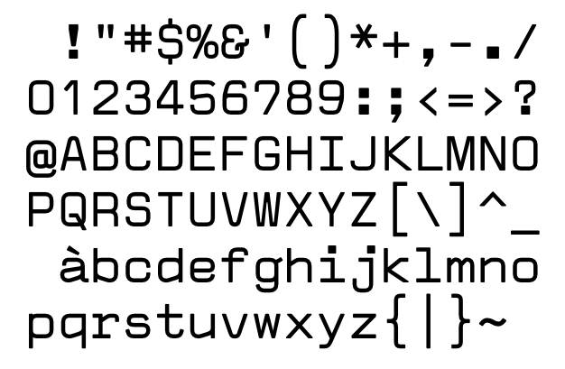

-   foundry: Lineto

-   tags:

    -   paid

## [Verily Serif Mono](https://www.fontsquirrel.com/fonts/verily-serif-mono)

-   description:

    Verily Serif Mono is derived from Bitstream Vera Serif with the
    same proportions as Bitstream Vera Sans Mono. Only the primary
    ASCII characters have been modified; I have no plans at the
    moment to modify the extended character set or to do a bold
    version.
    (from the author)

-   designer: Stephen G. Hartke, designer of Aurulent Sans Mono

-   license:

    Verily Serif Mono is released under the Vera license, with the
    exception that the name does not need to be changed from
    “Verily.” Verily is so named since I have seen many posts asking
    whether a Bitstream Vera Serif Mono font exists; verily, it does
    now.
    (from the author)

-   updated: 2020-04-25

-   urls:
    -   <https://www.dafont.com/verily-serif-mono.font> [0.5]

## [Victor Mono](https://rubjo.github.io/victor-mono/)

-   tags:

    -   ligatures
    
    -   free

## [Vidilex](http://www.cfcl.com/vlb/h/fontmono.html)

## [Vin Mono Pro](https://www.fontspring.com/fonts/mint-type/vin-mono-pro)

-   foundry: Mint Type

-   via:

    -   https://fontsarena.com/blog/free-modern-typewriter-fonts/

## [Vivala Code](https://www.myfonts.com/fonts/johannes-hoffmann/vivala-code/)

-   designer: Johannes Hoffmann

-   tags:

    -   coding-focused

## [VLNL TP Kurier Callig Regular](https://www.myfonts.com/fonts/vetteletters/vlnl-tp-kurier/callig-regular/)

## [VT323](https://fedoraproject.org/wiki/VT323_Fonts)

-   notes: Based on the font on the DEC VT320.

-   tags:

    -   terminal font

-   urls:
    -   <https://fonts.google.com/specimen/VT323> [0.7]

## [WenQuanYi Zen Hei Mono](http://wenq.org/wqy2/index.cgi?ZenHei%28en%29)

-   updated: 2021-03-21

-   urls:
    -   <https://en.wikipedia.org/wiki/WenQuanYi> [0.1]
    -   via <> [-1] [via]

## [WenQuanYi Micro Hei Mono](http://wenq.org/wqy2/index.cgi?MicroHei%28en%29)

-   updated: 2021-03-21

-   urls:
    -   <https://en.wikipedia.org/wiki/WenQuanYi> [0.1]
    -   via <> [-1] [via]

## [Whois Mono](https://github.com/raphaelbastide/Whois-mono)

## [WikisourceMono](https://github.com/wikisource/WikisourceMono)

-   fork of: DPCustomMono2

-   license:

    -   free

## [Wire Type Mono](https://www.myfonts.com/fonts/thomas-kaeding/wire-type-mono/)

## [Wudoo](https://www.myfonts.com/fonts/vishnu-sathyan/wudoo/)

-   designer: Vishnu Sathyan

## [X11 Monospace Fonts](https://github.com/dse/x11-monospace-fonts-ttf)

-   notes:

    A work in progress to convert freedesktop/xorg fonts to .ttf
    for use in Windows and macOS née OSX.
    
    Including:
      - "B&H Lucida Typewriter"
      - Misc Fixed (including 6x13 and 10x20)
      - Sony fonts
      - DEC Terminal (VAXstation/DECstation font)

## [xnufont](https://github.com/vladkorotnev/xnufont)

-   description: The console font from XNU/Darwin (Apple) kernel for Linux console.

-   designer: Akasaka Ryuunosuke

-   license: Apple Public Source License

-   tags:

    -   bitmap font

-   updated: 2020-02-29

## [Zolan Mono](http://www.myfonts.com/fonts/btn/zolan-mono-btn/)

-   cost: $12.99 per weight; $51.96 for complete family of four weights

-   designer: Stuart Sandler

-   foundry: Breaking the Norm

-   tags:

    -   novelty
    
    -   display

-   updated: 2020-05-13

## Fonts not having URLs yet

-   Courier MM Screenwriter
-   Courier Standard
-   DEC VT330
-   PCMyungjo
-   Spot Mono
-   Triumph Durabel

